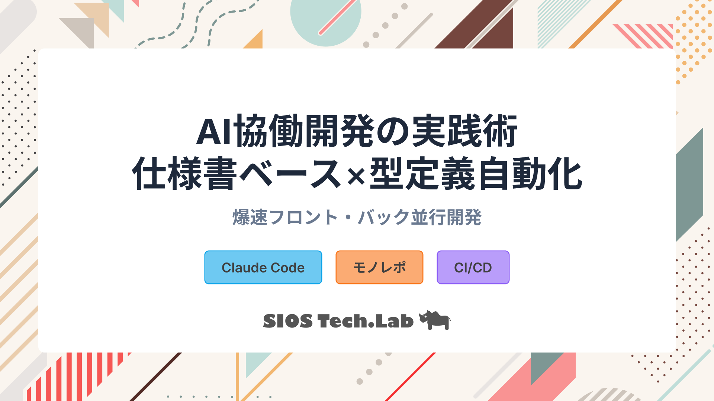
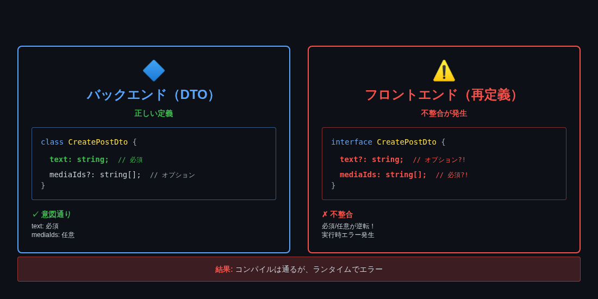
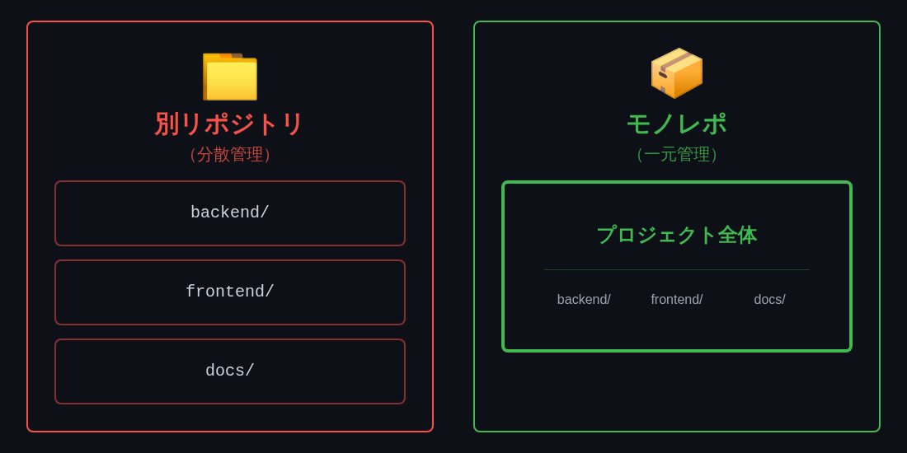
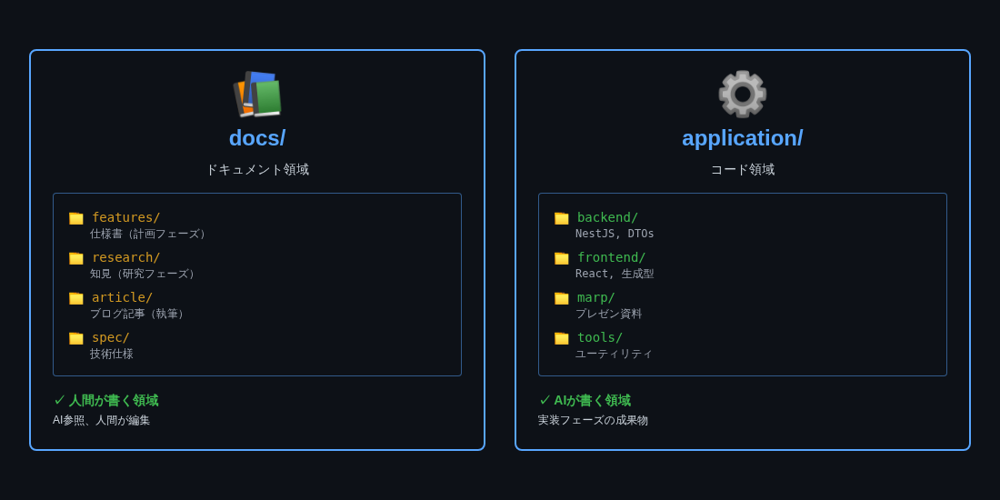
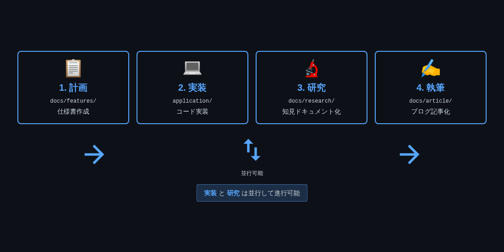
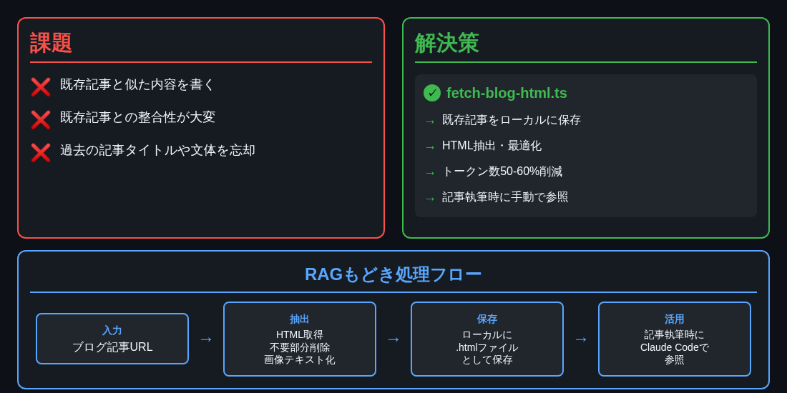

<!-- _class: cover -->



---

# 自己紹介

<!--_class: twoColumns-->

<div>


## 龍ちゃん:Tanaka Ryunosuke

### 領域

アプリ開発・CI/CD・コンテナ

### 経歴
- Figmaによるデザイン構築
- 社内業務改善AIシステム開発
- **技術記事200本執筆達成**
- AI協働開発による執筆効率化の実践

</div>

<div>


</div>

---

# 本日のゴール

<div class="highlight">
AI協働開発で「ハチャメチャなコード」を防ぎ、
効率的な開発環境を構築する
</div>

## 今日持ち帰っていただくこと

1. **AI開発の環境整備が成功の鍵** - 型定義・関数のパーツ化でコード品質を保つ
2. **Single Source of Truth** - DTOを唯一の型定義源とする設計思想
3. **パーツ提供の思想** - すべてを自動生成せず、必要なものだけ提供（shadcn/ui方式）
4. **実測データの説得力** - 47ファイル移行で70-79%効率化、バンドル20-30%削減

---

# 前提：仕様書ベースでの開発

このセミナーは、**計画ドキュメント（仕様書）をもとに実装する開発スタイル**を前提としています。

## なぜ仕様書が必要なのか

- **開発時間の短縮**: 1週間 → 2日（実測データ）
- **手戻りの削減**: 平均3-4回 → 平均1回
- **意思決定の明文化**: AIに技術選定を委ねる危険性を回避
- **品質保証**: 計画の品質が成果物の品質を決定

**参考記事**: [AI協働で仕様書アレルギー克服！開発時間を1週間→2日に短縮する実践法](https://tech-lab.sios.jp/archives/49148)

---

# Spec駆動開発の基礎：TDD

## TDD（Test-Driven Development）

<div class="box green">

**テストファーストで設計の安全網**
- **サイクル**: レッド → グリーン → リファクタリング
- **実績**: Microsoft 90%バグ削減
- **利点**: 保守性の高いコード、早期バグ発見
- **課題**: 学習コスト、テストコード保守

</div>

---

# Spec駆動開発の基礎：BDD

## BDD（Behavior-Driven Development）

<div class="box blue">

**ビジネス要件を自然言語で記述**
- **記法**: Gherkin（Given-When-Then構文）
- **対象**: 非技術者も理解可能な仕様
- **ツール**: Cucumber、SpecFlow
- **利点**: チーム間コラボレーション強化

</div>

---

# Spec駆動開発の基礎：DbC

## DbC（Design by Contract）

<div class="box yellow">

**契約による設計（Eiffel言語）**
- **3つの契約**: 事前条件・事後条件・不変条件
- **特徴**: ソフトウェア仕様をコード内に記述
- **検証**: ランタイムチェック可能
- **効果**: 責任範囲の明確化

</div>

---

# Spec駆動開発の基礎：SDD

## SDD（Specification-Driven Development）

<div class="box green">

**仕様ファーストで開発**
- **アプローチ**: 仕様から設計・実装・テストを導出
- **構造**: 要件・設計・実装の明確な分離
- **相性**: AI協働開発に最適
- **2025年**: GitHub、AWSが積極推進

</div>

---

# Spec駆動開発の基礎：Kiro

## Kiro（AWS）

<div class="box blue">

**エージェント型AI IDE**
- **提供**: AWS（2025年一般提供）
- **ワークフロー**: Spec → Design → Tasks → 実装
- **EARS記法**: 要件を構造化
- **Agent Hooks**: ファイル保存時に自動テスト生成
- **Property-Based Testing**: 仕様から自動テスト生成
- **トレーサビリティ**: コードと仕様の完全な紐付け

</div>

---

# Spec駆動開発の基礎：Spec Kit

## Spec Kit（GitHub）

<div class="box green">

**仕様駆動ツールキット**
- **提供**: GitHub（2023年～）
- **コマンド**: `/specify`、`/plan`、`/tasks`
- **対話型**: AIとの対話で仕様を定義
- **受入基準**: 明確な合格条件を自動生成
- **統合**: GitHub Copilotとシームレス連携

</div>

---

# Spec駆動開発の基礎：OpenAPI

## OpenAPI Specification

<div class="box yellow">

**API仕様の標準フォーマット**
- **提供**: OpenAPI Initiative（Linux Foundation）
- **最新版**: 3.1（JSON Schema互換）、3.2（2025年9月予定）
- **言語非依存**: どの言語でも利用可能
- **自動生成**: ドキュメント・SDK・テストコード
- **Single Source of Truth**: API設計の唯一の真実の源

</div>


---

# Spec駆動開発の基礎：本セミナーのアプローチ


## 特定ツールを使わない理由

- プロジェクトに応じた最適な手法選択 → どのツールが良いとかは皆様に任せる
- ツール依存を避ける
- 既存ワークフローへの適応

## 2025年のトレンド
- AI協働開発での**Spec駆動の重要性増大**

<div class="highlight">
今回はClaude Codeで特定のツールを使わず、雑多に作っていくことを対象
</div>


---

# セミナー構成

<style scoped>
table {
  background: none;
  border: none;
  border-radius: 0;
  width: 100%;
}
th {
  background-color: transparent;
}
td {
  background-color: transparent;
}
td:nth-child(3) {
  text-align: left;
}
</style>

| セクション | 時間 | 内容 |
|---|---|---|
| **前提** | 5分 | 仕様書ベース開発・3フェーズ開発手法 |
| **Part 1** | 10分 | AI開発の課題と環境整備（モノレポ含む） |
| **Part 2** | 15分 | 自動生成パイプライン構築 |
| **Part 3** | 10分 | パーツ化の最適化実践 |
| **まとめ** | 5分 | 実践への提案 |

---

<!-- _class: subTitle -->

# Part 1: 前提知識

## 仕様書ベース開発・3フェーズ開発手法

---

<!-- _class: diagram -->

# 3フェーズ開発手法の全体像


---

# なぜフェーズを分けるのか

## 従来のペアコーディング（Vibe Coding）の限界

<div class="box red">

**300文字で意図を伝えるのは文豪でも困難**
- AIが自由に解釈しすぎて、意図したものが作られない
- プロンプトが長くなりすぎてコンテキストを圧迫
- 「何を作るか」と「どう作るか」が混在

</div>

---

# フェーズ分離のメリット

## フェーズを分けることで役割を明確化

<div class="box green">

**3つのフェーズ**
- **計画フェーズ**: AIと共に「何を作るか」を考えさせる
- **実装フェーズ**: 仕様書を読み込ませてAIが実装
- **検証フェーズ**: 計画と実装の差分を分析 → **学び**を得る

</div>

---

<!-- _class: subTitle -->

# Part 1: AI開発の課題と環境整備

## モノレポ×パーツ化でハチャメチャなコードを防ぐ

---

# AIがハチャメチャなコードを出す3つの原因

<div class="box red">

## 原因1: 型定義を再定義してしまう
フロント・バックで独立に型定義を生成し、齟齬が発生

</div>

<div class="box red">

## 原因2: 生成物のクオリティ担保ができていない
型定義が曖昧、エラーハンドリングが不十分

</div>

<div class="box red">

## 原因3: コンテキストを忘れる
過去の実装を忘れ、一貫性のないコードが生成される

</div>

---

<!-- _class: diagram -->

# 具体例: 型定義の再定義による不整合



---

# AI開発の本質的な課題

## AIが情報を忘れてしまうリスク

<div class="box yellow">

参照している情報があっても、更新を無視して生成してしまう

</div>

## 具体的なリスク

- フロントとバックで型定義が異なる
- 既存の実装パターンを無視した新規実装
- 変更時に関連ファイルの更新を忘れる
- コンパイルエラーにならないため、発見が遅れる

---

# 解決策: 環境整備による制約の設計

## AIに「正しいパーツ」を提供する

<div class="box green">

**実現すること**
- 再定義を防ぐ仕組みを作る
- 人間もAIも迷わない設計
- 型定義を一元管理する

</div>

**ポイント**: AIに自由にコードを書かせるのではなく、**制約を導入する**

---

<!-- _class: diagram -->

# Single Source of Truth（人間もAIも迷わない設計）


---

# 人間とAIの役割分担


<div class="two-columns">
<div>

## 人間が注力すること

<div class="box blue">

**良質なパーツを作る or 設計する**
- 型定義（データソース）
- API関数の設計
- エラー型の定義
- パーツの品質管理

</div>

</div>
<div>

## AIに任せること

<div class="box green">

**パーツを組み立てる**
- 型を使った実装
- API関数の呼び出し
- UI コンポーネントの構築
- ビジネスロジックの実装

</div>

</div>
</div>

<div class="highlight">
パーツの質 = 成果物の質
</div>

---

# 技術的な実装: Before / After

<div class="two-columns">
<div>

### Before: すべてを自動生成

- フルスタックのコード生成
- 不要な機能も生成
- バンドルサイズ肥大化
- 一本の木から削り出す方式

</div>
<div>

### After: 必要なものだけ提供

- 型定義 + API関数のみ生成
- AIが組み立てる
- shadcn/uiと同じ思想
- パーツを組み立てる方式

</div>
</div>

**AIには「型・関数のパーツ」を提供し、組み立ては任せる**

---

# プロジェクト全体構成（4つのアプリケーション）

<style scoped>
table {
  background: none;
  border: none;
  border-radius: 0;
  width: 100%;
}
th {
  background-color: transparent;
}
td {
  background-color: transparent;
}
td:nth-child(3),td:nth-child(2)  {
  text-align: left;
}
</style>

| アプリケーション | 技術スタック | デプロイ先 |
|---|---|---|
| **Frontend** | Next.js 15, React 19 | Azure Static Web Apps |
| **Backend** | NestJS 11, Node.js 22 | Azure Web Apps |
| **X Scheduler** | Azure Functions v4 | Azure Functions |
| **MCP Functions** | Azure Functions v4 | Azure Functions |

**モノレポで一元管理** → AIに全体像を一度に提供

**参考記事**: [AIチャットで話すだけ!X予約投稿を完全自動化するシステム構築術](https://tech-lab.sios.jp/archives/49981)

---

<!-- _class: diagram -->

# なぜモノレポなのか（AI協業との相性）



---

# モノレポがAI協業に最適な理由

<div class="two-columns">
<div>

## 別リポジトリの課題

<div class="box red">

**コンテキストの分断**
- 別々のリポジトリ
- AIに全体像を伝えるのが困難
- 型定義の同期が手動作業
- 変更の影響範囲が追いにくい

</div>

</div>
<div>

## モノレポの利点

<div class="box green">

**コンテキストの一元管理**
- 1つのリポジトリで全体像を把握
- AIに一度に全体像を提供できる
- 型定義の自動同期が可能
- 変更の影響範囲が明確

</div>

</div>
</div>

---

<!-- _class: diagram -->

# docs/ と application/ の分離



---

# ディレクトリ分離の3つの利点

<div class="two-columns">
<div>

### docs/ (計画・知見)

<div class="box blue">

**計画フェーズ**
- 仕様書・設計書
- 機能要件の定義
- AIとの計画作業エリア

**知見収集**
- 調査・研究ドキュメント
- フロント・バック統括で収集
- 検証結果の蓄積

</div>

</div>
<div>

### application/ (実装)

<div class="box green">

**実装フェーズ**
- フロント・バックのコード
- ビルド成果物
- テストコード
- AIとの実装作業エリア

</div>

</div>
</div>

---

# フェーズ分離の実践的メリット

<div class="two-columns">
<div>

## 視覚・感覚的なわかりやすさ

<div class="box green">

**ディレクトリ = フェーズ**
- ディレクトリ構造がフェーズ分離を表現
- 今どのフェーズにいるか一目瞭然

</div>

</div>
<div>

## 横断的な作業が可能

<div class="box blue">

**1つの計画で複数アプリを編集**
- フロントもバックも同時に計画
- 統合的な視点で設計

**知見収集も統括的に**
- アプリ全体の情報を一箇所に集約
- 実装の振り返りを体系化

</div>

</div>
</div>

---

# CLAUDE.md階層構造の概要

## 9つのCLAUDE.mdファイルでコンテキスト管理

<div class="box blue">

**ルート CLAUDE.md** → プロジェクト全体像

**サブディレクトリ CLAUDE.md** → 各領域の詳細ルール
- `/docs/CLAUDE.md` - 計画フェーズルール
- `/application/backend/CLAUDE.md` - バックエンド開発ガイド
- `/application/frontend/CLAUDE.md` - フロントエンド開発ガイド
- など...

</div>

---

# CLAUDE.md階層構造の効果

<div class="box green">

## AIとの協業が劇的に改善

- AIが必要な粒度でコンテキストを取得
- 手動説明の削減（「どういうプロジェクト？」と聞かれない）
- フェーズごとの適切なルール提供
- 作業領域に応じた開発ガイドを自動適用

</div>

**詳細**: [モノレポ×AI協業環境構築術](https://tech-lab.sios.jp/archives/50109)

---

# モノレポがパイプライン構築の基盤となる理由

## Single Source of Truth: Backend DTOsを唯一の真実とする

<div class="highlight">
型定義の一元管理
モノレポ内でBackend → Frontendの型定義が自動同期
</div>

<div class="box green">

### AIへの明確な指示

- `/application/backend/`でDTO定義
- 自動生成で`/application/frontend/`に型提供
- AIは「自動生成されたファイルは触らない」ルールを守る

</div>

**この基盤の上にパイプラインを構築する**

---

<!-- _class: subTitle -->

# Part 2: 自動生成パイプラインの構築

## DTO → OpenAPI → 型・関数のパーツ化

---

<!-- _class: diagram -->

# パイプラインの全体像


---

# ステップ1: DTOを唯一の型定義源とする

## DTOクラスがすべての型定義のマスター

### 役割

- デコレーターから制約情報も自動抽出
- OpenAPI Specに自動変換
- すべての型定義の起点

### AIとの協業

AIはDTOクラスを編集するだけで、フロントエンドの型定義が自動更新されることを理解

---

# 重要: エラー型設計の必要性

<div class="highlight">
実体験から学んだ教訓
</div>

## なぜエラー型が重要なのか

自動生成パイプラインを構築しても、**エラー型を定義しなければ型安全性が崩壊する**

---

# 問題: エラー型が自動生成されない

## フロントエンド実装が破綻


<div class="box red">

**エラーレスポンスが`any`型になる**
- OpenAPI仕様からエラー型は自動生成されない
- フロントエンドでエラーハンドリングが`any`型に
- 実行時エラーが頻発
- IDEの補完が効かない
- AIもエラー型を推測できない

</div>

---

# 実際に起きた深刻な影響


<div class="box red">

**リンターエラーが大量発生**
- `any`型の使用でESLintエラー
- 型チェックが通らない
- コードレビューで指摘が増える

**エラーハンドリングが作れない**
- エラーの構造が不明
- どのフィールドにアクセスすべきか分からない
- AIに実装を依頼しても正しいコードが生成されない

</div>

---

# 解決: RFC 7807準拠の統一エラー型

<div class="box green">

**RFC 7807（Problem Details for HTTP APIs）準拠**
- type: エラーの種類を示すURI
- title: エラーの短い説明
- status: HTTPステータスコード
- detail: 詳細なエラーメッセージ
- timestamp: エラー発生時刻
- traceId: トレースID（デバッグ用）

</div>

---

# エラー型の実装方法

## 実装のポイント

<div class="box blue">

**各エンドポイントでエラー型を明示的に定義**
1. DTOクラスとしてエラーレスポンスを定義
2. OpenAPI仕様に含める
3. Orvalで型定義を自動生成
4. フロントエンドで型安全なエラーハンドリング

</div>

### 重要

エラー型を定義しないと、自動生成パイプラインの恩恵が半減する

---

# エラー型定義の効果

<div class="two-columns">
<div>

## Before: エラー型なし

<div class="box red">

**型安全性の崩壊**
```typescript
try {
  await api.createUser(data);
} catch (error: any) {
  // errorが何を持っているか不明
  console.error(error.message);
  // ↑ 実行時エラーの可能性
}
```

</div>

</div>
<div>

## After: エラー型あり

<div class="box green">

**型安全なエラーハンドリング**
```typescript
try {
  await api.createUser(data);
} catch (error: ApiError) {
  // errorの型が明確
  console.error(error.detail);
  // ↑ IDEの補完が効く
  // AIも正しいコードを生成
}
```

</div>

</div>
</div>

---

# 結論: 仕様書とDTOの品質が全て

<div class="highlight">
自動生成パイプラインの成否は、入力の品質で決まる
</div>

<div class="box blue">

**人間が注力すべきこと**
- 仕様書の作成（要件定義、エラーケース設計）
- DTOの設計（型定義、エラー型定義）

</div>

---

# レビューで品質を担保する

<div class="box red">

**DTOレビューは必須**
- 型定義とエラー型の確認
- OpenAPI仕様の妥当性検証

</div>

<div class="box green">

**AIは自動生成だけ担当**
- パイプラインは道具
- **品質は入力次第**

</div>

**結論**: ちゃんと仕様書も作ろう！DTOの質の担保（レビュー）をしっかりと！

---

# ステップ2: 型・関数のパーツ化（Orvalの役割）

## Orvalとは: OpenAPI仕様からTypeScriptコード自動生成

<div class="two-columns">
<div>

### 型定義ファイル

<div class="box blue">

- DTOと1対1対応
- Request/Response型
- エラー型も含む

</div>

</div>
<div>

### API呼び出し関数

<div class="box green">

- 型安全なAPI関数
- Axios関数として提供
- パーツとして利用

</div>

</div>
</div>

---

# ステップ3: AIへの通知と制御

## DO NOT EDITコメントの挿入

自動生成ファイルの先頭に警告コメント

## CLAUDE.mdでの明文化

- 自動生成ファイル（`lib/api/generated.ts`, `types/generated/`）
- 変更必要時は `backend/` の定義を修正 → `npm run generate:api` で再生成


<div class="box red">

## 注意
AIは無視する（約10-20%の確率）→ レビューで確認が必要

無視されてもめげない！これはめげない！！
</div>

---

<!-- _class: subTitle -->

# Part 3: パーツ化の最適化実践

## すべてを自動生成する罠と解決策

---

# なぜパーツ化が必要なのか

## 家具づくりの比喩で理解する

<div class="two-columns">
<div>

### Before: 一本の木から削り出す

<div class="box red">

**全自動生成の限界**
- 職人技が必要
  AIに全てを任せる = 高難度
- 失敗したらやり直し
- 一部の修正が困難
- 不要な部分も削り出す

</div>

</div>
<div>

### After: パーツを組み立てる

<div class="box green">

**パーツ提供の利点**
- 良質なパーツがあれば組み立ては簡単
- 一部の差し替えが容易
- 組み合わせの自由度
- 必要なパーツだけ使う

</div>

</div>
</div>

---

# Part 3の本質: 人間の判断が必要な領域


<div class="two-columns">
<div>

### AIに任せられないこと

<div class="box red">

**ツール選定を間違えてはいけない**
- どのツールを使うか
- どの設定が最適か
- 何を自動生成すべきか
- 何を手動で実装すべきか

</div>

</div>
<div>

### 人間が判断すべきこと

<div class="box blue">

**要件の理解と最適化**
- プロジェクトの要件理解
- パフォーマンス要件の見極め
- 最適なツール設定の選択
- まだギリギリ人間の仕事いっぱい

</div>

</div>
</div>

<div class="highlight">
ツール選定と設定は人間が頑張る部分
</div>

---

# パーツの質は人間次第


<div class="two-columns">
<div>

### 人間が責任を持つべきこと

<div class="box blue">

**パーツ設計の品質管理**
- 型定義の正確性
- エラー型の網羅性
- API設計の一貫性
- ドキュメント整備

</div>

</div>
<div>

### AIに任せられること

<div class="box green">

**パーツの組み立て**
- 型定義を使った実装
- API関数の呼び出し
- ボイラープレートコード
- 単純な繰り返し作業

</div>

</div>
</div>

<div class="highlight">
パーツの品質 = 成果物の品質
</div>


---

# 実例: 粗悪なパーツを作っていた失敗

## 初期設定: 全APIエンドポイントにSWRフック自動生成

<div class="box red">

**なぜ粗悪なパーツだったのか**
- 使わないフックまで自動生成（41個）
- バンドルサイズ肥大化・不要なオーバーヘッドが発生
- 「パーツ」というより「ゴミの山」

</div>

<div class="box yellow">

**反省点**
必要なものだけを高品質で提供することが重要。

</div>

---

# パーツ化の Before / After

<div class="two-columns">
<div>

## Before: 全自動生成

<div class="box red">

**問題点**
- 全エンドポイントSWRフック生成
- バンドルサイズ肥大化
- 不要なコードが大量

**自動生成フック数**: 41個

</div>

</div>
<div>

## After: 必要なものだけ

<div class="box green">

**改善点**
- 型定義 + Axios関数のみ生成
- SWRは必要な箇所のみ手動実装
- バンドルサイズ削減

**自動生成フック数**: 0個

</div>

</div>
</div>

---

<style scoped>
table {
  background: none;
  border: none;
  border-radius: 0;
  width: 100%;
}
th {
  background-color: transparent;
}
td {
  background-color: transparent;
}
td:nth-child(3),td:nth-child(2)  {
  text-align: left;
}
</style>


# 最適化された設定

## Orval設定の変更

**mode: "single"** → 直接エクスポート
**client: "axios-functions"** → パーツのみ生成（型定義 + Axios関数）

<div class="two-columns">
<div>

### Before: 全自動生成

<div class="box red">

- 自動生成フック数: **41個**
- バンドルサイズ: **100%**
- コード行数: **~2030行**

</div>

</div>
<div>

### After: パーツのみ生成

<div class="box green">

- 自動生成フック数: **0個**
- バンドルサイズ: **70-80%**
- コード行数: **~800行**

</div>

</div>
</div>

---

# パーツ提供の考え方（shadcn/uiとの類似性）


## shadcn/uiの成功と同じアプローチ

<div class="box green">

- コンポーネントをコピペして、必要に応じてカスタマイズ
- フルスタックのUIライブラリではなく、パーツ提供
- AI開発効率化の鍵

</div>

<div class="highlight">
すべてを自動生成するのではなく、
組み立てやすいパーツを提供
</div>

---

# 適材適所のアプローチ

<div class="two-columns">
<div>

## Read: カスタムSWRフック

<div class="box green">

- キャッシュ戦略
- 自動再検証
- データ共有

</div>

</div>
<div>

## CUD: 直接Axios

<div class="box blue">

- シンプル実装
- フォーム統合が容易
- 一回限りの操作

</div>

</div>
</div>

**結果**: 自動生成フック 41個 → 9個（必要な分だけ手動実装）

---

# パーツ化最適化の効果

<div class="box green">

**実測データ**
- 47ファイルの移行: 推定14-20時間 → 実績4.2時間（**70-79%効率化**）
- バンドルサイズ: 20-30%削減
- コード行数: 約60%削減

</div>

## なぜこれほど効率化できたのか

**Axiosの関数がパーツとして提供されていた**
- AIに実装を任せる際もスムーズに進行
- 型定義が自動生成されているため、型エラーで即座に問題検出

---

# AIがハチャメチャなコードを出さなくなった実体験

<div class="highlight">
再定義のリスクを排除
</div>

## 実感した変化

- 型定義の齟齬がなくなった
- フロントエンドで型定義ファイルが増殖しなくなった
- すっきりとしたコードで実装できるようになった

---

<!-- _class: subTitle -->

# まとめ・実践への提案

## 今日から始める自動化パイプライン

---

# 重要ポイントの整理


### 環境整備

1. モノレポ構成でAIに全体像を提供
2. CLAUDE.md階層構造でコンテキスト管理
3. docs/ と application/ の分離


### パイプライン

4. Single Source of Truth（DTO → OpenAPI → Frontend）
5. パーツ提供の思想（shadcn/ui方式）
6. エラー型設計で型安全性確保

---

# 段階的導入ステップ

## Step 1: 基本パイプラインの構築（1-2日）

1. Backend DTOクラス作成
2. OpenAPI生成設定
3. Orval設定（mode: "single", client: "axios-functions"）
4. エラー型定義

## Step 2: 既存コードの移行（規模による）

1. 小さな機能から移行開始
2. 効果を実感しながら拡大
3. チーム全体で共有

---

# よくある質問

<div class="box blue">

**Q: エラー型を定義しないとどうなりますか？**

A: エラーレスポンスが`any`型になり、実行時エラーが頻発します。IDEの補完も効かず、型安全性が失われます。

</div>

<div class="box blue">

**Q: バンドルサイズは本当に削減されますか？**

A: 実測で20-30%削減を確認しています。不要なSWRフックを生成しないことで、大幅な削減が実現できます。

</div>

---

# 今日から試せること

<div class="highlight">
まず「DTOクラス + エラー型定義」から始めましょう
</div>

## 小さく始める

1. 1つのAPIエンドポイントでDTOクラス作成
2. OpenAPI生成を試してみる
3. Orvalで型定義生成を確認
4. 効果を実感したら拡大

**重要**: 完璧を目指さず、小さく始めて効果を実感することが成功の鍵

---

<!-- _class: subTitle -->

# Appendix: 拡張版 4フェーズワークフロー

## さらなる効率化への道

---

# 拡張版: 4フェーズワークフロー



---

# 4フェーズ目: 記事化フェーズ

## 検証結果を知見として資産化

<div class="box green">

**RAGもどきでの効率化**
- トークン削減: 50-60%
- 記事執筆時間: 50%削減
- 検証結果の体系的な整理

</div>

**参考記事**: [検証→記事化で知見を資産化！Claude Code×RAGもどきでAI技術ブログ執筆を効率化](https://tech-lab.sios.jp/archives/50103)

---

# フェーズ3: 研究記録（/docs/research/）


<div class="box blue">

**目的**
- 設計思想と意思決定の記録
- アーキテクチャパターンの検証結果
- 実装完了後の振り返り

**記録内容**
- なぜその設計にしたのか
- どんな課題があって、どう解決したのか
- パフォーマンス、エッジケースの検証結果

</div>

---

# フェーズ4: 記事化（/docs/article/）


<div class="box green">

**変換プロセス**
1. `/docs/features/`（計画）
2. `/docs/research/`（検証）
3. `/application/`（実装）
4. ↓ 情報を抽出・整理
5. `research-doc.md`（調査資料）
6. ↓ 読者向けに再構成
7. `no1-article.md`（記事本文）

</div>

---

<!-- _class: diagram -->

# RAGもどき: 既存記事をローカルに保存



---

# 4フェーズワークフローの効果

<div class="two-columns">
<div>

## Before

- 記事執筆時間: **8時間**
- 調査時間: **2時間**
- 既存記事重複チェック: **手動30分**
- 記事品質: **バラバラ**

</div>
<div>

## After

- 記事執筆時間: **4時間**
- 調査時間: **1時間**
- 既存記事重複チェック: **5分**
- 記事品質: **一貫性90%**

</div>
</div>

**測定条件**: 中規模記事（800-1000行）での実測値

---

# 開発者の実感


<div class="box blue">

**Before**: 現象を後から眺めて「ブログ書くか」みたいな感じ

**After**: 検証の過程を全部ドキュメント化
- 何を考えてこうやってみたのか
- 実際どうなったのか
- 最初の予想と結論の違い

**結果**: 検証を明確な意識を持って行うようになった

</div>

<div class="highlight">
「検証した内容がそのままブログ化できる」
</div>


---

<!--_class: title-->

# ありがとうございました！

## 質問・ディスカッションタイム

**今日から始める環境整備で、AI協働開発を加速させましょう**

---

<!-- _class: subTitle -->

# Appendix: 参考ブログ・リソース

## 詳細情報はこちらから

---

# AI協業開発手法シリーズ

## 環境構築・ワークフロー

- **[モノレポ×AI協業環境構築術](https://tech-lab.sios.jp/archives/50109)**
  CLAUDE.md階層構造、モノレポとAI協業の相性、コンテキスト管理

- **[明日から始められる3フェーズ開発手法](https://tech-lab.sios.jp/archives/49140)**
  計画・実装・検証の3フェーズ詳細、フェーズ分離のメリット

- **[AI協働で仕様書アレルギー克服！開発時間を1週間→2日に短縮](https://tech-lab.sios.jp/archives/49148)**
  仕様書ベース開発の効果測定、手戻り削減の実測データ

- **[検証→記事化で知見を資産化！Claude Code×RAGもどき](https://tech-lab.sios.jp/archives/50103)**
  4フェーズワークフロー、RAGもどきシステム、記事執筆効率化

---

# 技術実装・パイプライン構築

## 自動生成パイプライン

- **[AI開発で型定義を同期！DTOからOpenAPI・Frontendまで完全自動化](https://tech-lab.sios.jp/archives/49157)**
  DTO → OpenAPI → Frontend型定義の自動生成、エラー型設計の重要性

- **[Orval設定最適化でバンドル20-30%削減！](https://tech-lab.sios.jp/archives/49591)**
  SWRフック自動生成からパーツ提供へ移行、47ファイル移行で70-79%効率化

## プロジェクト事例

- **[AIチャットで話すだけ!X予約投稿を完全自動化](https://tech-lab.sios.jp/archives/49981)**
  Azure Functions v4、Next.js 15 + NestJS 11、本セミナーの実例プロジェクト

---

# Spec駆動開発関連リソース

## ツール・フレームワーク

- **[AWS Kiro](https://aws.amazon.com/kiro/)** - エージェント型AI IDE（AWS、2025年一般提供）
- **[GitHub Spec Kit](https://github.blog/ai-and-ml/github-copilot/)** - 仕様駆動ツールキット（GitHub Copilot統合）
- **[OpenAPI Initiative](https://www.openapis.org/)** - API仕様の標準フォーマット（Linux Foundation）
- **[RFC 7807](https://tools.ietf.org/html/rfc7807)** - HTTP APIのエラー型標準（IETF）

## 使用技術

- **[Orval](https://orval.dev/)** - OpenAPI仕様からTypeScriptコード自動生成
- **[NestJS](https://nestjs.com/)** - Node.jsフレームワーク（DTO・OpenAPI生成）
- **[shadcn/ui](https://ui.shadcn.com/)** - パーツ提供思想のUIライブラリ

---

# さらに学ぶためのリソース

- **[SIOS Tech Lab（技術ブログ）](https://tech-lab.sios.jp/)**
  AI協業開発シリーズを連載中、実測データに基づく実践的な記事

- **[本セミナーのスライド](https://ryunosuke-tanaka-sti.github.io/claude_and_blog_seminar/)**
  本日の資料をWeb公開、SVG図解もすべて利用可能
