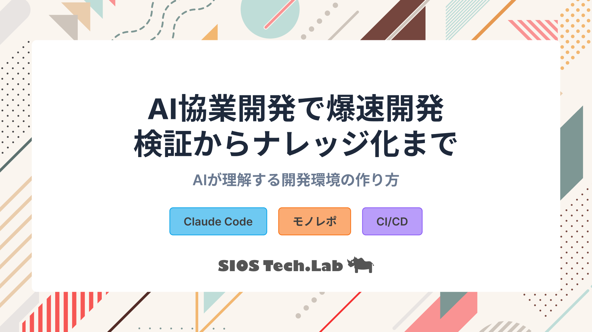
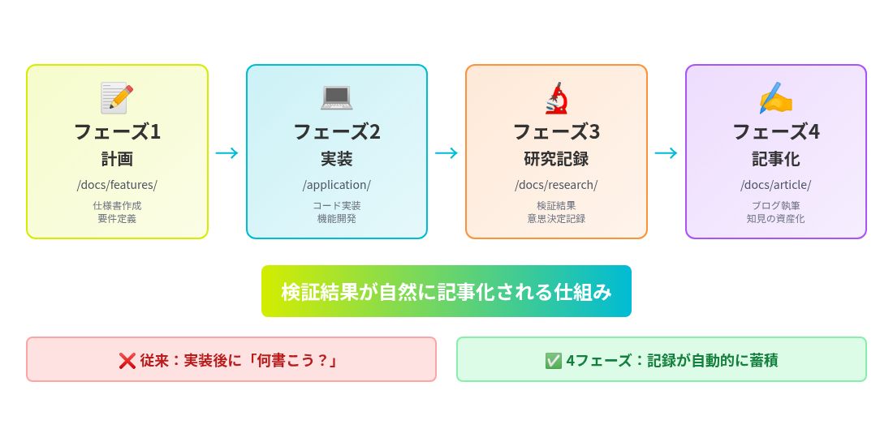
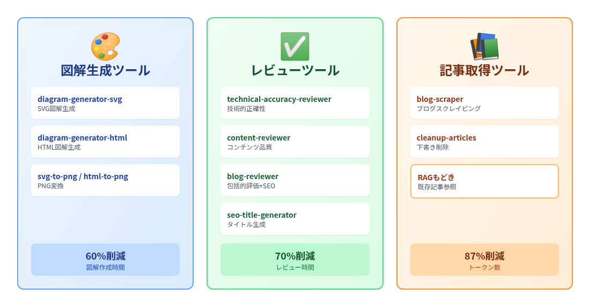
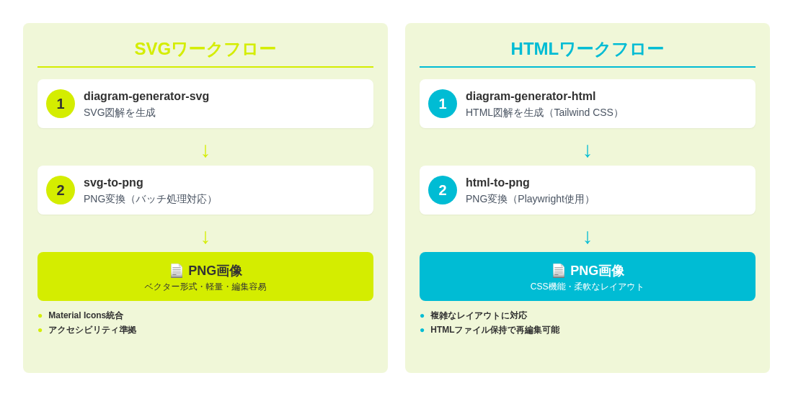

<!-- _class: cover -->



---

<!-- _class: title-->

# AI 協業開発

## 検証と執筆までをセットで行う環境

### モノレポ ×4 フェーズワークフローで知見を資産化

---

# 自己紹介

<!--_class: twoColumns-->

<div>

## 龍ちゃん:Tanaka Ryunosuke

### 領域

アプリ開発・CI/CD・コンテナ

### 経歴

- Figma によるデザイン構築
- 社内業務改善 AI システム開発
- **技術記事 200 本執筆達成**
- AI 協働開発による執筆効率化の実践

</div>

<div>


</div>

---

# 本日のゴール

<div class="highlight">
4フェーズワークフローで知見を資産化し、
記事執筆を効率化する方法を理解する
</div>

## 今日持ち帰っていただくこと

1. **4 フェーズワークフローの価値** - 検証結果が自然に記事化される仕組み
2. **研究フェーズの重要性** - 実装の意思決定と学びを記録することで記事執筆時間 50%削減
3. **RAG もどきの活用** - トークン削減 50-60%で既存記事との整合性を確保
4. **今日から実践できるステップ** - まず「研究記録」から始める

---

# 前提：仕様書ベースでの開発

このセミナーは、**計画ドキュメント（仕様書）をもとに実装する開発スタイル**を前提としています。

## なぜ仕様書が必要なのか

- **開発時間の短縮**: 1 週間 → 2 日（実測データ）
- **手戻りの削減**: 平均 3-4 回 → 平均 1 回
- **意思決定の明文化**: AI に技術選定を委ねる危険性を回避
- **品質保証**: 計画の品質が成果物の品質を決定

**参考記事**: [AI 協働で仕様書アレルギー克服！開発時間を 1 週間 →2 日に短縮する実践法](https://tech-lab.sios.jp/archives/49148)

---

# セミナー構成

| セクション | 時間  | 内容                                       |
| ---------- | ----- | ------------------------------------------ |
| **前提**   | 5 分  | 仕様書ベース開発の前提                     |
| **Part 1** | 5 分  | モノレポ：AI にコンテキストを提供する基盤  |
| **Part 2** | 10 分 | 4 フェーズワークフロー：検証から記事化まで |
| **Part 3** | 10 分 | 研究フェーズの実践：知見の記録方法         |
| **Part 4** | 8 分  | 記事化フェーズ：RAG もどきで効率化         |
| **まとめ** | 2 分  | 実践への提案                               |

---

<!-- _class: subTitle -->

# Part 1: モノレポ

## AI にコンテキストを提供する基盤

---

# プロジェクト全体構成（4 つのアプリケーション）

| アプリケーション  | 技術スタック          | デプロイ先            |
| ----------------- | --------------------- | --------------------- |
| **Frontend**      | Next.js 15, React 19  | Azure Static Web Apps |
| **Backend**       | NestJS 11, Node.js 22 | Azure Web Apps        |
| **X Scheduler**   | Azure Functions v4    | Azure Functions       |
| **MCP Functions** | Azure Functions v4    | Azure Functions       |

**モノレポで一元管理** → AI に全体像を一度に提供

**参考記事**: [AI チャットで話すだけ!X 予約投稿を完全自動化するシステム構築術](https://tech-lab.sios.jp/archives/49981)

---

# なぜモノレポなのか（AI 協業との相性）

<div class="two-columns">
<div>

## 別リポジトリの課題

<div class="box red">

**コンテキストの分断**

- 別々のリポジトリ
- AI に全体像を伝えるのが困難
- 型定義の同期が手動作業
- 変更の影響範囲が追いにくい

</div>

</div>
<div>

## モノレポの利点

<div class="box green">

**コンテキストの一元管理**

- 1 つのリポジトリで全体像を把握
- AI に一度に全体像を提供できる
- 型定義の自動同期が可能
- 変更の影響範囲が明確

</div>

</div>
</div>

---

# CLAUDE.md 階層構造の概要

## 9 つの CLAUDE.md ファイルでコンテキスト管理

<div class="box blue">

**ルート CLAUDE.md** → プロジェクト全体像

**サブディレクトリ CLAUDE.md** → 各領域の詳細ルール

- `/docs/CLAUDE.md` - 計画フェーズルール
- `/application/backend/CLAUDE.md` - バックエンド開発ガイド
- `/application/frontend/CLAUDE.md` - フロントエンド開発ガイド
- など...

</div>

---

# CLAUDE.md 階層構造の効果

<div class="box green">

## AI との協業が劇的に改善

- AI が必要な粒度でコンテキストを取得
- 手動説明の削減（「どういうプロジェクト？」と聞かれない）
- フェーズごとの適切なルール提供
- 作業領域に応じた開発ガイドを自動適用

</div>

**詳細**: [モノレポ ×AI 協業環境構築術](https://tech-lab.sios.jp/archives/50109)

---

# モノレポが次のステップの基盤となる

<div class="highlight">
モノレポでAIにコンテキストを提供する基盤が整った
</div>

<div class="box green">

**次のステップ**

この基盤の上で、4 フェーズワークフローを実践する

</div>

---

<!-- _class: subTitle -->

# Part 2: 4 フェーズワークフロー

## 検証から記事化までの流れ

---

# 4 フェーズワークフローの全体像



---

# なぜフェーズを分けるのか

## 従来のペアコーディング（Vibe Coding）の限界

<div class="box red">

**300 文字で意図を伝えるのは文豪でも困難**

- AI が自由に解釈しすぎて、意図したものが作られない
- プロンプトが長くなりすぎてコンテキストを圧迫
- 「何を作るか」と「どう作るか」が混在

</div>

---

# フェーズ分離のメリット

## フェーズを分けることで役割を明確化

<div class="box green">

**4 つのフェーズ**

- **フェーズ 1（計画）**: AI と共に「何を作るか」を考える → `/docs/features/`
- **フェーズ 2（実装）**: 仕様書を読み込ませて AI が実装 → `/application/`
- **フェーズ 3（研究記録）**: 検証結果と意思決定を記録 → `/docs/research/`
- **フェーズ 4（記事化）**: 研究記録をもとにブログ執筆 → `/docs/article/`

</div>

---

# 実際のプロジェクト構造（モノレポ）

```
workspace/
├── application/          # 実装コード（4つのアプリ）
│   ├── frontend/        # Next.js 15 + React 19
│   ├── backend/         # NestJS 11
│   ├── x-scheduler/     # Azure Functions
│   └── mcp-functions/   # Azure Functions
├── docs/                # 計画・知見
│   ├── features/        # 機能仕様書（フェーズ1）
│   ├── research/        # 実装レビュー（フェーズ3）
│   ├── article/         # 記事執筆（フェーズ4）
│   └── templates/       # テンプレート
├── CLAUDE.md            # ルートレベル設定
└── package.json         # モノレポ設定
```

---

# ディレクトリ分離の 3 つの利点

<div class="large-list">

1. **docs/ と application/ の役割分離**
2. **視覚・感覚的なわかりやすさ**
3. **横断的な作業が可能**

</div>

---

# 利点 ①: docs/ と application/ の役割分離

<div class="two-columns">
<div>

### docs/ (計画・知見)

<div class="box blue">

**計画・研究・記事化フェーズ**

- 仕様書・設計書
- 機能要件の定義
- 検証結果の記録
- AI との計画・研究作業エリア

</div>

</div>
<div>

### application/ (実装)

<div class="box green">

**実装フェーズ**

- フロント・バックのコード
- ビルド成果物
- テストコード
- AI との実装作業エリア

</div>

</div>
</div>

---

# 利点 ②: 視覚・感覚的なわかりやすさ

<div class="box green">

**ディレクトリ = フェーズ**

- ディレクトリ構造がフェーズ分離を表現
- 今どのフェーズにいるか一目瞭然

**例: ユーザー認証機能の開発**

- `docs/features/user-auth/` → 計画中
- `application/backend/src/auth/` → 実装中
- `docs/research/user-auth-review.md` → 検証中
- `docs/article/user-auth-article.md` → 記事執筆中

</div>

---

# 利点 ③: 横断的な作業が可能

<div class="box blue">

**1 つの計画で複数アプリを編集**

- フロントもバックも同時に計画
- 統合的な視点で設計

**知見収集も統括的に**

- アプリ全体の情報を一箇所に集約
- 実装の振り返りを体系化

</div>

---

# 各フェーズで何をするか

## フェーズ 1: 計画

<div class="box blue">

**決めること**

- 機能要件・型定義・データ構造

**決めないこと**

- ライブラリ選定・実装詳細・デザイン指定

**成果物**: `docs/features/[name]/spec.md`, `plan.md`

</div>

---

# 各フェーズで何をするか

## フェーズ 2: 実装

<div class="box green">

**CLAUDE.md で領域別ルール適用**

- `/application/backend/CLAUDE.md` - バックエンド開発ガイド
- `/application/frontend/CLAUDE.md` - フロントエンド開発ガイド

**AI が自律的にコード規約を守る**

</div>

---

# 各フェーズで何をするか

## フェーズ 3: 研究

<div class="box yellow">

**意思決定と学びを記録**

- 意思決定の記録
- 検証結果のまとめ
- 課題と解決策

</div>

---

# 各フェーズで何をするか

## フェーズ 4: 記事化

<div class="box blue">

**研究記録を読者向けに変換**

- 研究記録を基に執筆
- RAG もどきで既存記事参照
- 読者向けに再構成

</div>

---

# フェーズは行ったり来たりする

<div class="box green">

**実際のワークフロー例: ライブラリ調査**

1. **計画**: ライブラリを使っての処理を計画
2. **研究**: ライブラリの調査を研究資料としてまとめる
3. **計画**: その資料を基に計画を変更
4. **実装**: 実装
5. **研究**: 実装時に発生した問題を研究としてまとめる

**重要**: フェーズは一方通行ではなく、柔軟に行き来する

</div>

---

# モノレポと 4 フェーズの組み合わせ

<div class="highlight">
モノレポが基盤、4フェーズがワークフロー
</div>

<div class="box green">

**次のステップ**

この基盤とワークフローの上で、研究フェーズの実践を学ぶ

</div>

---

<!-- _class: subTitle -->

# Part 3: 研究フェーズの実践

## 知見の記録方法

---

# フェーズ 3: 研究記録の目的

<div class="box blue">

**設計思想と意思決定の記録**

- なぜその設計にしたのか
- どんな課題があって、どう解決したのか
- パフォーマンス、エッジケースの検証結果

**記録内容**

- アーキテクチャパターンの検証結果
- 実装完了後の振り返り
- 最初の予想と結論の違い

</div>

---

# 研究記録に記載する内容

<div class="two-columns">
<div>

### 記載すべき内容

<div class="box green">

- **設計思想**: なぜこの設計にしたのか
- **検証結果**: パフォーマンス測定、エッジケース
- **課題と解決策**: どう解決したか
- **意思決定の記録**: 最初の予想と結論の違い

</div>

</div>
<div>

### 記載しない内容

<div class="box red">

- 実装の詳細なコード説明
- チュートリアル的な手順
- コードのコピペ
- 読者向けの文章

</div>

</div>
</div>

**ポイント**: 記事化のための「材料」を記録する

---

# 研究記録の構成例

```markdown
# 研究記録: [機能名]

## 設計思想

なぜこの設計にしたのか...

## 検証結果

パフォーマンス測定結果...

- Before: XX ms
- After: YY ms

## 課題と解決策

どんな課題があって、どう解決したか...

## 最初の予想と結論の違い

- 予想: XXXX だと思っていた
- 結論: 実際には YYYY だった
```

---

# 研究記録の効果

<div class="box green">

**定量的な効果**

- 記事執筆時間: 50%削減
- トークン削減: 調査資料が整理されているため効率的
- 記事品質: 一貫性 90%

**定性的な効果**

- 実装の意思決定が明確に
- 検証を明確な意識を持って行うように
- 時間が経っても振り返りが容易

</div>

---

# Before/After: 開発者の実感

<div class="box red">

**Before**: 現象を後から眺めて「ブログ書くか」みたいな感じ

- 実装から時間が経つと、なぜその設計にしたか忘れる
- 記事執筆時に情報を集めるのが大変
- 何を書けばいいか分からない

</div>

<div class="box green">

**After**: 検証の過程を全部ドキュメント化

- 何を考えてこうやってみたのか → 実際どうなったのか
- 最初の予想と結論の違い

**結果**: 検証を明確な意識を持って行うようになった

</div>

---

# 研究フェーズが記事化の鍵

<div class="highlight">
「検証した内容がそのままブログ化できる」
</div>

<div class="box green">

**次のステップ**

研究記録をもとに、記事化フェーズで効率的にブログを執筆する

</div>

---

<!-- _class: subTitle -->

# Part 4: 記事化フェーズ

## 執筆を支援するツール群

---

# フェーズ 4: 記事化の流れ

<div class="box blue">

**変換プロセス**

1. `/docs/features/`（計画） - 仕様書
2. `/docs/research/`（検証） - 研究記録
3. `/application/`（実装） - コード
4. ↓ 情報を抽出・整理
5. `research-doc.md`（調査資料） - 材料を集約
6. ↓ 読者向けに再構成
7. `article.md`（記事本文） - ブログ記事

</div>

---

# 執筆フェーズを支援するツール群



---

# 🎨 図解生成ツール（4 種類）



---

# 図解生成の実例

<div class="box yellow">

**従来の課題**

- 図解作成に時間がかかる（1 図あたり 30-60 分）
- デザインツールの習得が必要
- 修正・調整が面倒

</div>

<div class="box green">

**Skills 使用後**

- プロンプトで指示するだけ（1 図あたり 5-10 分）
- デザインは AI に任せる
- HTML ファイル保持で再編集可能

</div>

**使用例**: 「4 フェーズワークフローのフロー図を作って」→ 自動生成

---

# ✅ レビューツール（4 種類の Agent）

<div class="two-columns">
<div>

**technical-accuracy-reviewer**

- 技術的正確性チェック
- セキュリティリスク評価（OWASP Top 10）
- バージョン情報の妥当性確認
- **使用タイミング**: 初稿完成直後

**content-reviewer**

- コンテンツ品質評価
- 構成と可読性チェック
- **使用タイミング**: 執筆中（何度でも）

</div>
<div>

**blog-reviewer**

- 技術ブログ価値（100 点満点）
- SEO 価値（100 点満点）
- タイトル・メタディスク生成（3 パターン）
- **使用タイミング**: 公開前の最終確認

**seo-title-generator**

- SEO タイトル生成（3 パターン）
- SPARK フレームワーク準拠
- **使用タイミング**: タイトルだけ改善

</div>
</div>

---

# 4 段階のレビュープロセス

<div class="box blue">

1. **technical-accuracy-reviewer**（初稿完成時）

   - 技術的正確性とセキュリティを最初に確認・Critical/High 項目を修正

2. **content-reviewer**（執筆中、何度でも）

   - コンテンツ品質を向上・改善提案を実装

3. **blog-reviewer**（公開前）

   - 包括的評価 ・SEO 改善（タイトル・メタディスク案を選択）

4. **seo-title-generator**（必要に応じて）
   - タイトルのみ再検討
   </div>

---

# 📚 記事取得ツール（2 種類）

<div class="two-columns">
<div>

**blog-scraper**（CLI Tool & Skill）

- 弊社ブログ記事をスクレイピング
- HTML → Markdown 変換
- トークン数削減（平均 87%）
- YAML frontmatter 付きで保存

**自動発火条件**:

- SIOS Tech Lab の URL を提供
- 「記事を取得して」と依頼

</div>
<div>

**cleanup-articles**（CLI Tool）

- 公開済みブログに対応する下書きを削除
- タイトルベースのマッチング
- `*article*.md`のみ削除
- Dry-run モード対応

**使い方**:

```bash
# Dry-run
uv run cleanup-articles --dry-run

# 実際に削除
uv run cleanup-articles
```

</div>
</div>

---

# 既存記事を活用した執筆体制

<div class="box blue">

**人力 RAG = 既存記事を参照しながら執筆**

続き記事や関連記事を書く際に、過去の記事を参照して整合性を保つ仕組み

</div>

**よくある課題:**

- 続き記事を書く際、前回の内容を思い出せない
- 既存記事との整合性を取るのが面倒
- 似たような内容を書いてしまう

**解決策:** 既存記事を Claude に参照させながら執筆

---

# 人力 RAG の実際のフロー

## 1. 既存記事の一覧確認

```bash
ls docs/data/ai-tech-writing/
ls docs/data/ai-development-methodology/
```

## 2. 記事執筆時に既存記事を参照

```
以下の既存記事を参照して、新しい記事を執筆してください：

@docs/data/ai-development-methodology/tech-lab-sios-jp-archives-50109.md
@docs/data/ai-tech-writing/tech-lab-sios-jp-archives-50103.md

調査資料：
@docs/research/[feature-name]-review.md
```

---

# ツールの役割：トークン数を削減

<div class="box yellow">

**課題**: Web 上の記事を参照するとトークン消費が大きい

</div>

<div class="box green">

**解決策**: `blog-scraper`でローカルに保存

- 既存記事を HTML→Markdown に変換して保存（`docs/data/`）
- トークン数削減：**87%削減**（平均）
- 必要な記事だけを選んで Claude に渡せる

</div>

---

# 人力 RAG のメリット

<div class="box green">

**3 つのメリット**

1. **既存記事との整合性確保** - 同じ用語・表現を使える
2. **記事執筆時間 50%削減** - 参照記事から構成を学べる
3. **重複チェックが簡単** - ローカルで grep 検索可能

</div>

**参考記事**: [検証 → 記事化で知見を資産化！Claude Code× 人力 RAG](https://tech-lab.sios.jp/archives/50103)

---

# 4 フェーズワークフローの効果

<div class="two-columns">
<div>

## Before

- 記事執筆時間: **8 時間**
- 調査時間: **2 時間**
- 既存記事重複チェック: **手動 30 分**
- 記事品質: **バラバラ**

</div>
<div>

## After

- 記事執筆時間: **4 時間**
- 調査時間: **1 時間**
- 既存記事重複チェック: **5 分**
- 記事品質: **一貫性 90%**

</div>
</div>

**測定条件**: 中規模記事（800-1000 行）での実測値

---

# 開発者の実感

<div class="highlight">
「検証した内容がそのままブログ化できる」
</div>

<div class="box green">

**知見が自然に蓄積**

- 実装と同時にドキュメント化
- 検証結果を体系的に整理
- 記事執筆のハードルが下がる

</div>

---

<!-- _class: subTitle -->

# まとめ・実践への提案

## 今日から始める 4 フェーズワークフロー

---

# 重要ポイントの整理

## 環境整備

1. モノレポ構成で AI に全体像を提供
2. CLAUDE.md 階層構造でコンテキスト管理
3. docs/ と application/ の分離

## ワークフロー

4. 4 フェーズで知見を資産化（計画 → 実装 → 研究記録 → 記事化）
5. 研究フェーズで意思決定と学びを記録
6. RAG もどきで既存記事を活用

---

# 今日から試せること

<div class="highlight">
まず「研究記録」から始めましょう
</div>

## 小さく始める

1. 実装時に「なぜそうしたか」をメモする習慣
2. 検証結果を簡単に記録（箇条書きで OK）
3. 小さく始めて効果を実感
4. 徐々に記事化にチャレンジ

**重要**: 完璧を目指さず、段階的に改善していくことが成功の鍵

---

# 参考ブログ・リソース

## AI 協業開発手法シリーズ

- **[モノレポ ×AI 協業環境構築術](https://tech-lab.sios.jp/archives/50109)**
  CLAUDE.md 階層構造、モノレポと AI 協業の相性

- **[3 フェーズ開発手法](https://tech-lab.sios.jp/archives/49140)**
  計画・実装・検証の 3 フェーズ詳細

- **[AI 協働で仕様書アレルギー克服](https://tech-lab.sios.jp/archives/49148)**
  開発時間を 1 週間 →2 日に短縮

- **[検証 → 記事化で知見を資産化](https://tech-lab.sios.jp/archives/50103)**
  4 フェーズワークフロー、RAG もどきシステム

---

# ありがとうございました！

## 質問・ディスカッションタイム

**今日から始める研究記録で、知見を資産化しましょう**

<div class="box green">

**本日のスライド**

https://ryunosuke-tanaka-sti.github.io/claude_and_blog_seminar/

</div>
