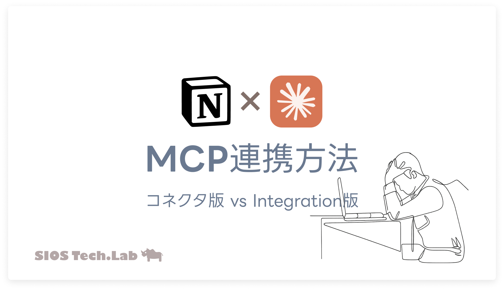
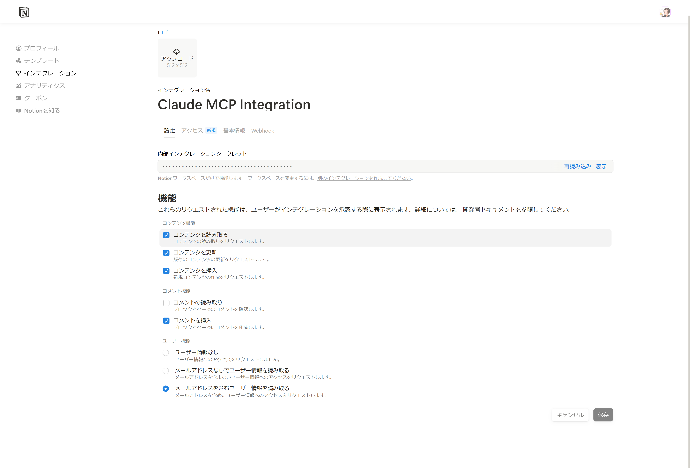

# Claude×Notion MCP実装術｜コネクタ版とIntegration版の選び方解説

大ジャンル: Claude
作成日時: 2025年7月26日 12:07
ステータス: 公開済み
最終更新日時: 2025年7月27日 16:14
AI 要約: ClaudeとNotion MCPを接続する方法を2つ紹介。コネクタ版は簡単に設定できるが、ワークスペース全体にアクセス可能で、Integration版は細かいアクセス制御が可能。Node.js環境の準備や接続手順を詳述し、AIフレンドリーなNotion環境の構築に向けた今後の展望も述べられている。

Claude×Notion MCP接続方法を2パターン解説。簡単なコネクタ版から細かい制御のIntegration版まで、実践的セットアップ手順を網羅



## はじめに

ども！最近Claude ProでAI開発にどっぷりハマっている龍ちゃんです。先日、Claudeにブログ記事を評価してもらったら「2025年としてはこのブログ普通っすね！むしろ遅れてるぐらいっす」って辛辣なコメントをもらっちゃいました。一方で、Gemini Deep Researchで同じ記事を評価したらべた褒めだったので、AIによる評価の違いって面白いですよね。

今回は、いよいよClaude DesktopとNotion MCPを接続して、AIによるドキュメント自動操作環境を構築していきます。

予測される効果として、「[**Claude×技術ブログで執筆環境が激変！次世代AI協働ワークフロー解説**](https://tech-lab.sios.jp/archives/48259)」こちらのブログで解説している内容がよりグレードアップされると期待しています。

## 事前準備：Node.js環境のセットアップ

まずは、Notion MCPサーバーを動作させるためのNode.js環境を準備しましょう。既にNode.jsが入っている方は、バージョン確認から始めてください。

### Node.js未インストールの場合：Voltaで管理

Node.jsが入っていない方には、[Volta](https://volta.sh/)での管理をおすすめします（完全に個人的な趣味ですが…）。お好きな管理ツールを使っていただいて構いません。

### Voltaのインストール（Windows）

```bash
# 管理者権限で実行
curl https://get.volta.sh | bash
```

### Node.jsのインストール

```
# LTS版をインストール
volta install node

# バージョン確認
node --version
npm --version
```

### 既存環境の確認

Node.js v18以上が必要です。以下のコマンドで確認してください：

```
# Command PromptまたはPowerShellで実行
node --version
npm --version
```

### Notion MCPサーバーの動作確認

以下のコマンドで、Notion MCPサーバーがインストールできるかテストします：

```
# 動作確認テスト
npx -y @notionhq/notion-mcp-server --help
```

正常に動作すればヘルプが表示されます。Ctrl+Cでプロセスを終了してください。

## 接続方法の比較と選択

### 💡 **補足：Notion公式のHosted MCP Serverについて**

[2025年7月より、Notion公式がHosted MCP Serverも提供開始しました！](https://developers.notion.com/docs/mcp)

**Hosted MCP Server（リモート版）の特徴**

- OAuth認証でワンクリック接続
- AI向けに最適化されたMarkdown形式でのデータ提供
- サーバー管理不要
- Notionがクラウドでホスト
- ワークスペース全体への完全アクセス

ただし、**現在報告されている課題**：

- [Gemini CLI等のMCPクライアントとの互換性問題](https://github.com/makenotion/notion-mcp-server/issues/69)
- 細かいアクセス制御ができない（ワークスペース全体のみ）

### なぜローカル実装（npx経由）を推奨するのか

Notion公式のHosted MCP Serverも魅力的ですが、現在以下の理由でローカル実装をおすすめします：

| 方法 | 設定難易度 | プラン制限 | アクセス制御 | 安定性 | 推奨ユーザー |
| --- | --- | --- | --- | --- | --- |
| **コネクタ版（Remote）** | ⭐ | 公式未明記 | ワークスペース全体 | ⭐⭐ | 簡単設定重視 |
| **Integration版（Local）** | ⭐⭐⭐ | なし | ページ単位 | ⭐⭐⭐⭐ | 制御重視 |
| **Hosted MCP** | ⭐⭐ | 公式未明記 | ワークスペース全体 | ⭐⭐ | 最新技術試行 |
- ✅ **全プラン対応**: 無料版でも利用可能
- ✅ **細かい制御**: ページ単位でアクセス権限設定
- ✅ **安定動作**: Node.js環境があれば確実に動作（今更感もあるけども…）
- ✅ **カスタマイズ**: 必要に応じて機能拡張可能
- ✅ **互換性**: 各種MCPクライアントで動作確認済み

**そのため、確実性と柔軟性を重視してnpx経由での実装方法をご紹介します。**

## 方法1：Notionコネクタでの簡単接続

Claude Desktopの[コネクタ機能](https://www.anthropic.com/news/connectors-directory)を使用する方法です。これはAnthropicが推奨する公式ツールで、ブラウザ上でMCP認証を簡単に完了できます。


### 接続手順

1. Claude Desktop → 設定 → コネクタ
2. 「カスタムコネクターを追加」をクリック
3. 「Notion」を検索・選択
4. 自動的に認証ページが開くので、認証を完了

**⚠️ 重要な注意点**

コネクタ版では**ワークスペース全体**に接続されるため、Claudeからワークスペース内のすべての情報にアクセス可能になります。機密情報が含まれる場合は、次の「Notion Integration版」をご検討ください。

### トラブルシューティング

MCPの接続が何度か失敗する場合は、コネクタから切断をして再度認証を行ってください。

## 方法2：Notion Integration作成してMCP接続

こちらの方法では、NotionのAPIを使用してMCPを構築し、アクセス権限を細かく制御できます。特定のページのみにアクセスを限定したい場合におすすめです。

こちらの方法に関しては[Notion公式が記事としてまとめています](https://github.com/makenotion/notion-mcp-server)。

### Integration作成

1. [Notion Integrations](https://www.notion.so/profile/integrations)にアクセス
2. 「New integration」をクリック
3. 以下を設定：
    - **Name**: Claude MCP Integration
    - **Workspace**: 使用するワークスペースを選択
    - **Capabilities**: デフォルトのまま（Read content, Update content, Insert content）



### Integration Token取得

作成後、「Internal Integration Secret」を取得してください。`ntn_` で始まるトークン（例：`ntn_abc123def456...`）が表示されます。

**⚠️ セキュリティ注意**

このトークンは機密情報です。安全に保管し、他人と共有しないでください。

### ページへのアクセス権限付与

1. Notionで任意のページを開く
2. 右上の「...」メニュー → 「接続を追加」
3. 作成したIntegrationを選択して接続

この手順により、指定したページのみにMCPからのアクセスが制限されます。


### 設定ファイルの場所確認

Claude Desktopから設定ファイルにアクセスする方法が最も簡単です：

1. Claude Desktop → 設定（Settings）
2. 開発者（Developer）タブ
3. 「Edit Config」ボタンをクリック

**参考：ファイルパス**

- Windows: `%APPDATA%\Claude\claude_desktop_config.json`

ファイルが存在しない場合は新規作成してください。


### 設定ファイルの作成・編集

以下の内容で設定ファイルを作成・編集します：

```
{
  "mcpServers": {
    "notionApi": {
      "command": "npx",
      "args": [
        "-y",
        "@notionhq/notion-mcp-server"
      ],
      "env": {
        "OPENAPI_MCP_HEADERS": "{\"Authorization\":\"Bearer ntn_your_token_here\",\"Notion-Version\":\"2022-06-28\"}"
      }
    }
  }
}
```

**重要**: `ntn_your_token_here` を Step 2で取得した実際のIntegration Tokenに置き換えてください。

## 動作確認

### Claude Desktopの再起動

1. Claude Desktopを完全に終了（システムトレイからも終了）
2. Claude Desktopを再起動


### 接続テスト

Claude Desktopで以下のプロンプトを試してください：

```
Notionのワークスペースに接続できているか確認してください。利用可能なページがあれば一覧を表示してください。
```

### 実際にページを操作してみる

```
「テストページ」という名前で新しいページを作成して、簡単な内容を追加してください。
```

成功すれば、Claude経由でNotionページが作成・編集されます！

## どれを選ぶべきか

実際に複数の方法を試してみて感じた違いをお話しします。

- **これからNotion×Claudeを始める方**: コネクタ版がおすすめ（プラン制限の詳細は公式発表を確認）
- **細かいアクセス制御が必要・確実性重視**: Integration版一択
- **開発者・他AIツールも検討中**: Integration版でMCPサーバー構築
- **最新技術を試したい方**: Hosted MCP Server（[互換性問題](https://github.com/makenotion/notion-mcp-server/issues/69)承知の上で）

## 今後の展望：AIフレンドリーなNotion環境構築

現在の私のNotion環境は、残念ながらAIフレンドリーとは言えません。今後は以下の改善を検討しています：

- AIが効率的にアクセスできるページ構造への再編
- よく使用するページの階層浅化
- AI専用ワークスペースの構築

皆さんも、AIパートナーとしてClaudeを活用する際は、Notionの構造も合わせて最適化していくことをおすすめします。

## まとめ

今回の記事では、Claude ProとNotion MCPを接続するための複数の方法を紹介しました。コネクタ版は簡単に始められる一方、Integration版はより細かい制御が可能です。どの方法を選ぶにしても、AIとNotionの連携によって情報管理と創造性が大きく向上するでしょう。ぜひ皆さんも試してみてください！