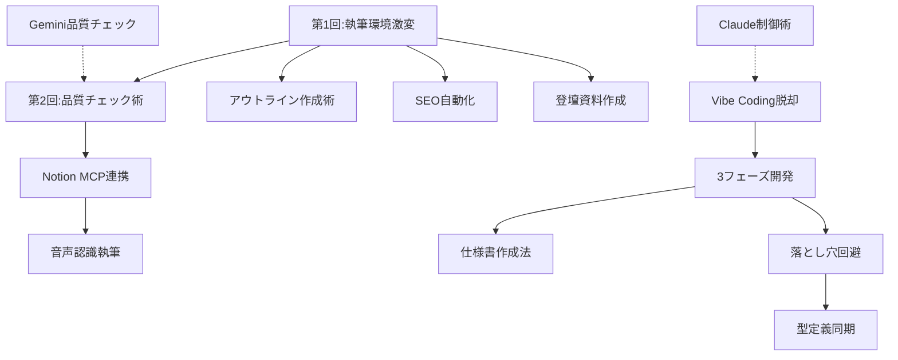

# SIOS Tech Lab ブログアーカイブ - 分類と関係性

このディレクトリには、SIOS Tech Labのブログ記事のHTMLアーカイブが保存されています。

## 📊 ブログ分類

### 1. Claude × 技術ブログシリーズ（執筆環境改革）
AI（Claude）を活用した技術ブログ執筆の効率化と品質向上に関する包括的なシリーズ

#### 🔹 基盤記事
- **48259**: Claude×技術ブログで執筆環境が激変！次世代AI協働ワークフロー解説
  - シリーズ第1回の導入記事、全体構想を提示

#### 🔹 実践・手法記事
- **48406**: Claude技術ブログ品質向上の試行錯誤｜3段階チェックで安定【プロンプト実践】
  - シリーズ第2回、品質チェックの具体的手法（文体統一、技術的正確性、アウトライン評価）
- **48538**: Claude活用アウトライン作成術：対話型vs抽出型の実践比較【2025最新】
  - アウトライン作成の2つのアプローチを詳細比較
- **48417**: SEOなんもわからんけんClaudeに丸投げしたらストレスフリーになった話
  - タイトル・メタディスクリプション生成の自動化

#### 🔹 ツール連携・環境構築
- **48397**: Claude×Notion MCP実装術｜コネクタ版とIntegration版の選び方解説
  - NotionとClaude Desktopの連携方法を2パターンで解説
- **48431**: Notion×MCP×音声認識でブログを3倍速執筆！技術者向け効率化ワークフロー解説
  - 音声入力による執筆効率化、4段階ワークフロー

#### 🔹 品質管理・検証
- **48196**: 【実践解説】技術ブログ品質チェック術｜Gemini Deep Researchで5分検証
  - AIを第一読者として品質チェックする手法

#### 🔹 図解・ビジュアル制作
- **48411**: ClaudeでMermaid図作成を自動化！2時間→5分の劇的時短術【Live Editor活用】
  - 技術ブログの図解作成効率化

#### 🔹 登壇資料作成への応用
- **48479**: 【ブログ→登壇資料】Claude×Marpで80時間を11時間に短縮した方法
  - ブログ記事を登壇資料に変換する実践的手法

---

### 2. Claude Code開発シリーズ
Claude Codeを使った実際の開発手法と課題解決

#### 🔹 開発手法・フレームワーク
- **49140**: Claude Code革命！3フェーズ開発で効率的な開発：計画→実装→検証術
  - 3フェーズ開発手法の提唱（基盤記事）
- **49148**: AI協働で仕様書アレルギー克服！開発時間を1週間→2日に短縮する実践法
  - 計画フェーズの詳細、仕様書作成の具体的手法
- **49154**: Claude Code仕様書ベースでハマる6つの落とし穴！失敗回避の備忘録
  - 実装時の注意点と失敗パターンの共有

#### 🔹 問題解決・最適化
- **49136**: 「適当にプロンプト投げるだけ」を卒業！Vibe Coding脱却術：【Claude Code】
  - Vibe Codingの問題点と解決策、実践的Tips集
- **49157**: AIと爆速開発！Next.js×Nest.js型定義同期の自動生成パイプライン構築術
  - 型定義の不整合問題への具体的解決策

#### 🔹 自動化・システム構築
- **49116**: Claude API×GitHub Actions完全自動化でコスト60%削減！ブログ投稿システム構築術
  - ブログからSNS投稿文生成の自動化システム、コスト最適化

#### 🔹 未分類（2025年9～10月の最新記事）
- **49591**: Orval SWRの自動生成をやめた理由 – SWRの本質を見失っていた話
- **49594**: AI協働開発の落とし穴回避！3ヶ月で実証した計画ドキュメントの価値

---

### 3. Claude制御・プロンプト技術
- **48160**: Claude調教術｜暴走パターンを制御する3つのプロンプトテクニック
  - 過剰なArtifact生成、スレッド肥大化、人間追いつけない問題への対処法

---

## 🔗 記事間の関係性

### シリーズ内の参照関係

### 相互参照している記事

1. **48406**（品質チェック）→ **48196**（Gemini Deep Research）を参照
2. **48431**（音声認識）→ **48397**（Notion MCP）の環境構築を前提
3. **49148**（仕様書作成）→ **49140**（3フェーズ開発）の計画フェーズを詳述
4. **49154**（落とし穴）→ **49140**、**49148**、**49157**を相互参照
5. **49136**（Vibe Coding脱却）→ **49140**、**49148**、**49154**、**49157**を参照

### 時系列による進化

1. **2025年7月**: Claude×技術ブログシリーズ開始（48160, 48196, 48259）
2. **2025年7月中旬**: ツール連携・環境構築記事（48397, 48411, 48417）
3. **2025年7月後半**: 実践応用記事（48431, 48479, 48538）
4. **2025年8月**: 品質向上の試行錯誤（48406）
5. **2025年9月**: Claude Code開発手法の体系化（49116, 49136, 49140, 49148, 49154, 49157）
6. **2025年10月**: 最新の実証結果（49591, 49594）

---

## 📈 トピック別の重要度

### 🔥 コア記事（必読）
- **48259**: シリーズ全体の導入
- **49140**: 3フェーズ開発手法
- **49136**: Vibe Codingの問題点

### 💡 実践テクニック
- **48406**: 3段階品質チェック
- **48417**: SEO自動化
- **48411**: Mermaid図作成
- **49148**: 仕様書作成

### 🛠 環境構築
- **48397**: Notion MCP連携
- **49116**: GitHub Actions自動化

### ⚠️ トラブルシューティング
- **48160**: Claude暴走制御
- **49154**: 開発の落とし穴
- **49591**: Orval SWRの教訓

---

## 📝 著者情報

**龍ちゃん** - SIOS Technology 技術ブロガー
- 2022年10月から技術ブログ執筆開始
- 3年で200本以上の記事を執筆
- Claude・AI活用による執筆効率化のパイオニア

## 🔄 更新履歴

- 2025年7月: Claude×技術ブログシリーズ開始
- 2025年9月: Claude Code開発手法の体系化
- 2025年10月: 最新記事追加（49591, 49594）