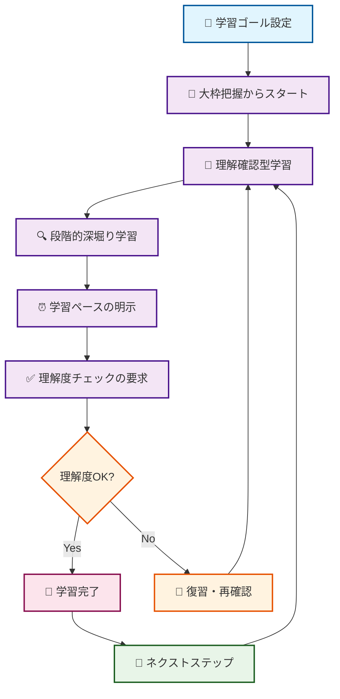

# Claude調教術｜暴走パターンを制御する3つのプロンプトテクニック

大ジャンル: Claude
作成日時: 2025年7月2日 16:38
ステータス: 公開済み
最終更新日時: 2025年7月5日 16:54
AI 要約: Claudeの制御には、明確な指示が重要で、過剰なArtifact生成やスレッド肥大化を防ぐためのプロンプトテクニックが必要です。人間主導の学習プロセスを取り入れることで、効率的にAIを活用できます。

[b13584d4-be26-4bef-b848-56edfdf7fb4a_Claude調教術.pdf](b13584d4-be26-4bef-b848-56edfdf7fb4a_Claude%E8%AA%BF%E6%95%99%E8%A1%93.pdf)

```
Claude制御の実践ガイド。過剰Artifact生成・スレッド肥大化・人間主導学習の3テクニックをプロンプトエンジニアリング視点で解説。Goal設定や成果物否定、段階的学習法で効率的AI活用を実現

```


# 挨拶

ども！最近はClaudeの制限を見ると嬉しくなっちゃう龍ちゃんです。最近は日常作業をプロンプト化して、効率化を模索しています。割と毎日触っているので、それなりにストレスも抱えてブログを書けるぐらいにはナレッジが溜まりましたね。

今回は、Claudeに感謝を持ちつつ「もうちょっとこうして！」という不安を解消するためのプロンプトテクニックについてまとめていこうと思います。

# よくあるClaude暴走パターン

Claude使ってて「もう！」って思ったことありませんか？以下、僕が普段困っているClaudeあるあるをまとめました。

> 前提として人間側が投げるプロンプトが雑であるところが原因になります。
> 

## パターン1：過剰なArtifact生成問題

気づいたら大規模なArtifactが作られるなんてことありませんか？これはよくある「Claude君止まって！案件」ですね。実際に僕が出会った暴走例を以下に示します。

**典型例**

```
ユーザー：「Chakra UIのモーダルでJSON文字列を表示したい」
Claude：「Chakra UIのモーダルでJSON文字列を表示する方法をご紹介します。」

→ 高機能もりもりモーダルの作成

```

**期待していたもの**

- 50行程度のシンプルなコード
- Chakra UIの基礎的なモーダルでJSON文字列を表示する方法

**現実**

- 300行弱の実践的なコード
- 高機能モーダル（表示切替機能）
- 高機能モーダル（コピー機能）
- 高機能モーダル（編集機能）

---

**その他の構造化暴走例**

- **勝手に体系化**：「プロジェクト管理のコツある？」→ 階層化された管理手法分類
- **勝手にステップ化**：「転職活動どうしよう」→ 12段階の転職完全ロードマップ
- **勝手にチェックリスト化**：「会議の準備って何する？」→ 50項目の準備チェックリスト

普通に質問として聞きたいだけなのに、なぜか教科書レベルの資料を作られてしまう現象です。

---

## パターン2：スレッド肥大化問題

まだ聞きたいことがあったのに、「スレッドの上限に達しました、別スレッドでお願いします」と言われたことありませんか？Artifactがv22なんて更新地獄を味わったことなど、気になることを聞いているとスレッドの容量がパンパンになって、Claudeの動作もなんだか遅くなっている…なんてことありませんか？

**典型的な流れ**

1. 軽い質問をする
2. Claudeが詳細な回答 + アーティファクト生成
3. 「もうちょっと詳しく」と追加質問
4. さらに詳細な資料が追加される
5. やり取りが膨大になる
6. スレッド上限に到達してリセット
7. 文脈が失われて振り出しに戻る

**あるあるシーン**

```
ユーザー：「このコードどう思う？」
Claude：改善版コード + 詳細解説を生成

ユーザー：「エラーハンドリングも追加して」
Claude：完全版コード + エラー対応ガイドを生成

ユーザー：「テストも書いて」
Claude：テストコード + テスト戦略文書を生成

...（10往復後）
システム：「スレッド上限に達しました」

```

---

## パターン3：人間追いつけない問題

「昨今のAIの問題は、人間の理解が追い付いていないから一番のボトルネックは人間の頭」って投稿をXで見かけた気がするんですけど、これ結構好きなんですよね。実際にWebSearch系の機能がついてから、ネットに接続できるようになったじゃないですか。あれから調べもの系はClaudeかGeminiに任せたほうが精度高いんですよね。その情報を確認しますけど、読み込ませて質問ベースで聞いちゃうほうが早いんです。こりゃ困ったなってところですね。

**ボトルネックは人間の頭**

Claudeの処理速度 vs 人間の理解速度のギャップが生む問題。

**典型例**

```
ユーザー：「新サービスのアイデア考えて」
Claude：（10秒で）
- 詳細な事業計画
- 市場分析レポート
- 技術仕様書
- マーケティング戦略
- 収益予測

人間：「えーっと...まず何から読めば...」（理解に30分）

```

**よくあるパターン**

- **情報過多で頭パンク**：求めた以上の情報量で思考停止
- **判断材料が多すぎて決められない**：選択肢を増やしすぎて逆に困る
- **完璧すぎて修正しにくい**：隙のない提案で改善点が見つからない

Claudeが優秀すぎて、人間側の処理が追いつかない現象です。

---

## 共通する課題

これらの暴走パターンに共通するのは：

1. **過剰な解決志向**：問題を見つけると完璧に解決しようとする
2. **文脈の読み違い**：軽い質問を重要なタスクと誤解
3. **成果物化癖**：何でもアーティファクトにしたがる
4. **完璧主義**：中途半端よりも完全版を作りたがる

いろいろ分析してみましたが、結局のところ人間側のプロンプトがあいまいってところに落ち着くんですよね。というかそこを頑張らないと人間がいる意味がないといいますか…技術として向上していく必要があるなって話です。

AIが優秀になるにつれて、「何を求めているのか」「どのレベルの回答が欲しいのか」を明確に伝えるスキルが重要になってきています。つまり、プロンプトエンジニアリングが日常的な必須スキルになっているということですね。

そんなわけで、普段使っているプロンプトテクニックといえるほどでもないですが、暴走を抑えることができるプロンプトを紹介していきます。

次の章からは、実際にプロンプトテクニックを紹介していきます。

---

# Claude制御テクニック集

Claudeの暴走は「Claudeが悪い」のではなく、**100%人間側のプロンプトが曖昧**なのが根本原因。明確な指示で適切にコントロールしましょう。

## 基本原則：「Claudeは優秀すぎるから、明確に指示する」

まず大前提です。Claudeはめちゃくちゃ賢いやる気満々な子です。そしてすごくいい子です。基本全工程だし、めちゃくちゃほめてくれます。でも、会社の先輩や同僚みたいに自分の思考の癖や理解しているレベルを理解はしてくれません。なので、めちゃくちゃ賢くてやる気のある赤子ぐらいに思ってるとちょうどよいです。

Claudeは曖昧な質問を見ると「きっと詳しく知りたいんだろう」と解釈して、全力で応えようとします。それが「暴走」に見える現象の正体です。

なので、トークン数を気にせずにプロンプトは詳細であるほど良いですね。多少の例を渡すFew-shotやone-shotなんて技術ありましたけど、あれはゴールを明確にするって良い手法ですよね。この辺は海外の論文を読んだりすると詳細な分析が流れてくるので、検索するとおもしろいですよ。

今回は、体感できる簡単なテクニックを解説していきます。

## 制御テクニック1：成果物制御テクニック

これはダイレクトにArtifact生成を制御するプロンプトになります。例で紹介した「Chakra UIのモーダルでJSON文字列を表示したい」では、大体はArtifact生成を進めますが、時にはチャット形式で返答することもあります。これは求めている形式を指定していないことで起きます。

### 根本原因

Claudeが勝手に「Goal」を定義して作ってしまう

- 「JavaScriptの関数について教えて」→ Claude「詳細なリファレンスが必要だ！」
- 「プロジェクト管理のコツある？」→ Claude「体系的なガイドを作ろう！」

### Goalの定義

簡単なのは、「Goalの定義」を行うことです。以下がテンプレートになります。

```bash
Chakra UIのモーダルでJSON文字列を表示したい
Goal：初心者でもわかるようにコード内にコメント多めで、コードサンプルArtifactを生成して

```

`Goal:` として最終的なゴールを示してあげることで、Claudeはそこに向かって走ってくれます。今回はサンプルなので、簡単なゴール設定になっています。ただ、最終的な成果物の制限を追加することで向かってくれます。効果測定のために別のプロンプトを張ってみますね。

```bash
Chakra UIのモーダルでJSON文字列を表示したい
Goal：初心者でもわかるようにコード内にコメント多めで、マークダウン形式でコード解説付きArtifactを生成して

```

こちらでマークダウンファイルが作成されます。一言表現を変えるだけで幅が変わります。

### 成果物の否定

こちらも効果的です。普段だとやってほしいことを書くじゃないですか？これはそちらとは逆ですね。やってほしくないことを伝えるのも効果的です。強い言葉であるほど意識してくれますね。この辺は、スレッドが長くなるほど効果が薄れていく感じは多少あります。過去の情報って忘れていくんですよね。

```
✅ 良い例：
「成果物を作らずに、考え方だけ教えて」
「Artifactは不要で、チャットで答えて」
「アプリ作成は不要、アドバイスだけお願いします」
「資料にしないで、会話として答えて」
「禁止事項：Artifact生成」

```

### 前提の共有

こちらは先ほど紹介した上の二つよりもさらにライトですが、普段使いとしては十分かもしれません。だんだん指示が友達に与えるみたいになっているのが良いんですよね。

```
✅ 良い例：
「3行くらいで説明して」
「要点だけお願いします」
「一言でどう思う？」
「概要だけざっくりと」
「普通に会話として答えて」

```

### 段階的アプローチ

これはおすすめです。「Goalの明確化」や「成果物の否定」や「前提の共有」のテクニックを文章として暗黙に伝えています。よく使うのは「ステップバイステップ」ですね。

```
✅ 良い例：
「まずは概要だけ教えて、詳しく知りたくなったら追加で質問するから」
「まず一言で説明して、分からなかったら詳しく聞くよ」
「基本だけ教えて、応用は後で」
「ステップバイステップで」

```

### 龍ちゃんおすすめプロンプト

個人的に設定しているシステムプロンプトを共有しますね。ブログの校閲として使っているClaudeなんですが、これを設定しておくと精度が爆上がりしました。

```bash
情報を作成をする前に具体的なプランを明示して許可を取ってから実行をしてください。

許可が出るまで生成はしないでください。

明確な指示がない場合は、文章の校閲をしてほしいと解釈してください。

```

---

## 制御テクニック2：会話継続テクニック

スレッドの上限まで達成したことがある方は、もうClaude沼にどっぷりと浸かっていますね。素晴らしいことです。でも、スレッド上限に達してしまって、また前提の共有からなんてやってられないですよね。Claudeはメモリ機能がないので、スレッドではまた別のClaudeとお話することになります。関係値を一から作る必要があります（ぴえんである）。

そんな時に使えるテクニックについて紹介します。

### 引継ぎ資料作成 → 新スレッド移行

これはスレッドがパンパンになる直前にやっておくとマジで助かります。スレッドの内容をPDFで出力させてしまい、それを新規スレッドの初回に入力として与えることで疑似的にスレッドの会話を継続させることができます。

```
✅ 良い例：
「今までの議論を引継ぎ資料にまとめて。新しいスレッドでその資料をベースに続きをやりたい」
「現時点の作業までで決定したことを引継ぎ資料として作成して」

```

### AI間役割分担によるトークン分散

これは、そもそもスレッドの上限に達しないようにするテクニックです。処理を事前に人間側で分散しておき、その段階ごとにスレッドを分けて中間ファイルを生成させておきます。最終的な成果物ファイルを生成する前に段階を踏ませることで、スレッド内のトークン数を分散させます。

```
✅ 良い例：

調査用 Claude:「xxxxxxxxに関する調査をしてマークダウン形式でまとめて」

プロンプト生成用 Claude:「添付したファイルをもとに〇〇〇生成用プロンプトを生成して」

生成用 Claude:「添付ファイルからよろしく～」

```

### Artifactベースの新規Artifact作成

これは生成されたものをベースに新規のArtifactを生成することで、対象とするArtifact自体を軽量化する手法です。Artifactベースに新規のArtifactを作成する場合は以下の二つの目的で生成します。

- 軽量版Artifactを生成する：いらない要素をそぎ落とす
- 新規Artifactを生成する：大きくなりすぎたファイルを分割する

**軽量版**

大きいArtifactから内容を抽出して、軽量化することができます。Artifact生成でいらない要素がくっついてくることがたまにありますよね？それらをそぎ落とすことで、軽量化されます。Artifactの中身をセクションごとに分割することで、対象とするファイルの大きさを小さくすることもできます。

```
✅ 良い例：
「このアーティファクト重くなりすぎたから、軽量版で作り直して」
「要点だけに絞った簡易版を新しく作って」
「今の成果物をベースに、コンパクト版お願いします」

```

**新規Artifact**

```
✅ 良い例：
「今までの議論を踏まえて、新しいアーティファクトで整理し直して」
「別の成果物として、今回の結論をまとめて」
「前のは置いといて、新規で作り直そう」

```

### 段階的成果物更新

これは、小さなArtifactを段階的に更新する手法です。プロンプトでArtifact生成を止めておいて、「段階的に」と指示をすることで小さなArtifactに対して段階的更新をかけていきます。これの良い点は、Artifact生成を人間がちゃんと監視しているので、「なんか方向性が違う！」というのがすぐわかる点がよいですね！

```
✅ 良い例：
「成果物を少しずつ更新していこう」
「この部分だけ先に反映させて」
「一気に全部やらずに、段階的に進めよう」

```

---

## 制御テクニック3：ペース調整テクニック（人間主導の学習プロセス）

これはClaudeが出力したコードを正として使用するのではなく、**人間がペースを握って学習を進める**方法です。体感的には、Claudeが100%完璧なコードを出すケースは少ないですが、領域を限定して小さく出力させることで、より確実に動くコードを生成できます。

### 基本的な学習ステップ

1. **大枠を作成してもらう** - 全体像を把握
2. **特定の領域に対して深堀り質問** - 段階的に理解を深める
3. **わからない部分は説明を求める** - 疑問点を即座に解決
4. **理解度確認のために自分の言葉で例え話** - 学習の定着を図る

### 学習フロー図




## 制御テクニック3（実践例）：Kubernetesの学習過程

この手法を活用して、Kubernetesが一切わからない段階から、新規作成したDaemonSetを検証環境にデプロイできるレベルまで到達した実例をご紹介します。

### 1. 大枠把握からスタート

**入力例：**

```
k8sに関しては一ミリもわからないのですが、初心者が理解しておくべきポイントをまとめてください。

```

**出力例：**

```
Kubernetesの初心者向け重要ポイントをまとめます：

## Kubernetesとは何か
Kubernetesは、コンテナ化されたアプリケーションを自動的に管理・運用するためのオープンソースのプラットフォームです。「k8s」と略されることが多く、これは「k」と「s」の間に8文字あることから来ています。

## 基本概念
- **クラスター**: Kubernetesが管理するサーバー群全体
- **ノード**: 実際にアプリケーションが動く個々のサーバー
- **Pod**: アプリケーションの最小実行単位
- **デプロイメント**: Podの管理・配置を行う仕組み

~~~~~以下略~~~~~

```

### 2. 理解確認型学習

**入力例：**

```
ノードとDaemonSetとPodの理解から始めればよいかな？

```

**出力例：**

```
はい、それはとても良い学習順序です！

## なぜこの3つから始めるのが良いか
この3つの関係を理解すると、Kubernetesの基本的な構造が見えてきます：

- **ノード** → 物理的な土台（サーバーやコンピューター）
- **DaemonSet** → 管理の仕組み（「各ノードに1つずつ配置する」というルール）
- **Pod** → 実際に動くアプリケーション

## 学習の順序
1. まずノードを理解（土台）
2. 次にPodを理解（実際に動くもの）
3. 最後にDaemonSetを理解（管理の仕組み）

~~~~~以下略~~~~~

```

### 3. 段階的深堀り学習

**入力例：**

```
Podが最小構成なのは知っています。
PodがDockerのコンテナーって理解であってる？

```

**出力例：**

```
いえ、少し違います。Pod ≠ Dockerコンテナです。

## 正しい関係
PodはDockerコンテナを入れる箱のようなものです：

Pod（箱）
├── Container 1（メインアプリケーション）
├── Container 2（サイドカーコンテナ）※オプション
└── 共有リソース（ネットワーク、ストレージ）

## 重要なポイント
- 1つのPodに複数のコンテナを含めることができる
- 同じPod内のコンテナは同じネットワーク（IPアドレス）を共有
- 多くの場合、1Pod = 1Container として使用される

~~~~~以下略~~~~~

```

**続きの質問：**

```
Pod内にContainerがある関係なのね。Podとコンテナは同一のものではないけど、要素として共通点は多い印象かな
ただ、k8sの環境ではPodという概念で管理しているだけって感じ？

```

**出力例：**

```
まさにその通りです！とても良い理解ですね。

## あなたの理解は正確です
Pod ⊃ Containerの関係で、確かに機能的には似ている部分が多いです。

## なぜPodという概念が存在するのか
1. **複数コンテナの協調動作**: 1つのアプリケーションを複数の小さなコンテナで構成
2. **リソース共有**: 同じPod内のコンテナは簡単にデータをやり取りできる
3. **運用の単位**: Kubernetes では Pod単位でスケジューリング・管理

## 実際の開発では
90%以上のケースで「1Pod = 1Container」で運用されています。
Podは「コンテナを管理するための仕組み」と考えるのが適切です。

~~~~~以下略~~~~~

```

### 4. 理解度チェックの要求

**入力例：**

```
ノード上には複数のPodが含まれる可能性がある
Deploymentは管理しているクラスター全体で特定の数配置できる
DaemonSetはノードの数分だけPodをノード内に一つ配置できる
であってる？

```

**出力例：**

```
はい、完璧に正確です！

## あなたの理解 ✓
✓ **ノード上には複数のPodが含まれる可能性がある**
✓ **Deploymentはクラスター全体で特定の数配置できる**
✓ **DaemonSetはノードの数分だけPodをノード内に一つ配置できる**

## 図解で確認

```bash
クラスター全体
├── ノード1
│   ├── Pod A（Deployment管理）
│   ├── Pod B（Deployment管理）
│   └── Pod X（DaemonSet管理）← 各ノードに必ず1つ
├── ノード2
│   ├── Pod C（Deployment管理）
│   └── Pod Y（DaemonSet管理）← 各ノードに必ず1つ
└── ノード3
└── Pod Z（DaemonSet管理）← 各ノードに必ず1つ
```
## 使い分け
- **Deployment**: Webアプリケーションなど、必要な数だけ配置
- **DaemonSet**: ログ収集、監視エージェントなど、全ノードに配置が必要

~~~~~以下略~~~~~
```

### 5. ネクストステップ

**入力例：**

```
次はネームスペースについて勉強したい
```

## このテクニックの効果

### メリット

1. **学習者主導**: 自分のペースで理解を深められる
2. **段階的理解**: 一度に大量の情報を処理しなくて済む
3. **確実な定着**: 理解度を確認しながら進むため、知識が定着しやすい
4. **応用可能**: 様々な技術領域で応用できる

### 適用シーン

- 新しい技術の学習
- 複雑なシステムの理解
- コード理解とデバッグ
- 設計パターンの習得

## 実践のコツ

### 1. 質問の仕方

```
❌ 悪い例：「Kubernetesを教えて」
✅ 良い例：「Kubernetesの基本概念を3つに絞って教えて」

```

### 2. 理解度確認

```
❌ 悪い例：「わかりました」
✅ 良い例：「つまり、Podは家でコンテナは住人のような関係ですね？」

```

### 3. 段階的深堀り

```
❌ 悪い例：「すべて詳しく説明して」
✅ 良い例：「まずノードの概念から理解したい」

```

このテクニックを使うことで、AIを効果的な個人チューターとして活用し、確実にスキルアップを図ることができます。

# まとめ

今回は、Claudeの制御テクニックについて詳しく見てきました。最初は「Claude君止まって！」と思っていた暴走も、実は人間側のプロンプトが曖昧だったことが根本原因だったんですね。

## 今日から使える3つのポイント

### 1. **明確な指示が全ての基本**

Goal設定や成果物の否定、前提共有で明確に方向性を示すことが重要です。

### 2. **スレッド管理で効率的な会話継続**

引継ぎ資料作成→新スレッド移行や、AI間役割分担でスレッド上限問題を解決できます。

### 3. **人間主導の学習プロセス**

大枠把握→理解確認→段階的深堀り→理解度チェックの流れで、確実にスキルアップを図れます。

## おわりに

Claudeを「めちゃくちゃ賢くてやる気のある赤子」だと思って接すると、うまく付き合えるかもしれません。明確な指示を与えてあげることで、本当に強力なパートナーになってくれます。

この知識を活かして、より効率的なAI活用にチャレンジしてみてください！皆さんも、ぜひ自分なりのClaude調教術を編み出してみてくださいね。

それでは、良いClaude調教ライフを！