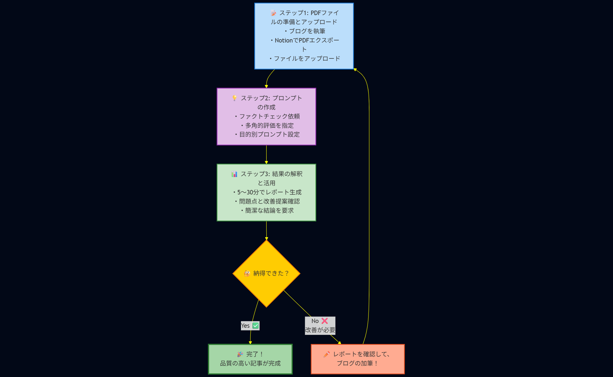

# 【実践解説】技術ブログ品質チェック術｜Gemini Deep Researchで5分検証

大ジャンル: Gemini
作成日時: 2025年7月5日 11:47
ステータス: 公開済み
最終更新日時: 2025年7月6日 22:33
AI 要約: AIを第一読者として活用することで、技術ブログの品質チェックを5分で行える手法を解説。Gemini Deep Researchを使用し、従来の手動確認に比べて効率的かつ正確な情報検証が可能になる。最終的な確認は人間が行うことが重要。

メタディスクリプション：
AIを第一読者に据える革新的手法で技術ブログの正確性を保証。Gemini Deep Researchによる3ステップ自動検証により、従来数時間の確認作業を5分に短縮。実際の企業活用事例とプロンプト例で即実践可能な品質向上術を解説。


## 1. ブログ公開前の「これで大丈夫？」を解決したい

ども！最近はAIを活用したブログ改善とかいろいろ取り組んでいる龍ちゃんです。皆さんもブログを書いた後、こんな不安を感じることありませんか？

- 「この技術情報、本当に正しいかな？」
- 「データが古くないかな？」
- 「読者にとって価値があるかな？」

やっぱ不安ですよね。ブログ書いてもこれが本当に正しいのかとか、情報が古くないかなぁとか。検証はもちろんするんですけど、それが正しいのかどうかという不安はなかなか消えてくれません。

従来の解決方法には人的リソースの観点から多くの問題があります。

- **手動でのファクトチェック** → 時間がかかりすぎる
- **専門家に相談** → コストと時間の問題
- **自分で調べ直す** → 見落としのリスクが高い

簡単なのは自分で調べてポチポチ見ながら「大丈夫かなぁ」と調べ直すことです。ですが、限界あるじゃないですか。

そこで今回提案したいのが、**AIを「第一読者」にする**という発想です。他のエンジニアとかに見てもらうのはやったほうがいいんですけど、なかなかできないじゃないですよね～。みんな忙しいですしww

そういうところってAIにやってもらえたらいいなぁって思って、ぶち込んでみたらいい感じにできたって流れです。

## 2. なぜGemini Deep Researchが第一読者に最適なのか

1番の理由は弊社でGoogle Workspaceの契約にGeminiがついてきたので、会社のドメインであれば有料プランを使い倒せるという点です。

実際、Web Searchがついているサービスはほかにもあります。Claude Proと比較したのですが5000KBのPDFを入力として与えたところ、Claudeではスレッドのトークン上限に引っかかりプロンプトを実行することができませんでした。GeminiのDeep Researchでは、動作し15分前後で200件弱のサイトを検索してレポートを作成してくれました。

### Deep Researchの特徴

Geminiのディープリサーチは、従来の検索とは全く異なる「エージェント型AI」の仕組みで動作します。

**3つのステップで自動調査**

1. **プラン作成**：複雑な質問を小さなタスクに分解
2. **情報収集**：数百のウェブサイトを並行して調査
3. **分析・統合**：収集した情報を批判的に評価してレポート作成

**技術的な特徴**

- 100万トークンのコンテキスト管理
- 反復的な検索プロセス
- 完全非同期処理（PCを閉じても継続）

詳細な技術仕様については、[Google公式のDeep Research解説](https://gemini.google/overview/deep-research/?hl=ja)をご覧ください。

### **他社AIツールとの比較**

| 項目 | **Gemini Deep Research** | **ChatGPT Deep Research** | **Claude Research** |
| --- | --- | --- | --- |
| **料金** | Google AI Pro: $20/月・Google AI Ultra: $250/月・無料版: あり | ChatGPT Plus: $20/月・ChatGPT Pro: $200/月・無料版: あり | Max Plan: $100-400/月・Pro: $20/月（近日対応予定）・無料版: なし |
| **無料版の機能** | 月数回の利用、Gemini 2.5 Flash使用・スプレッドシート・コードファイル不可 | 月5回のタスク・軽量版のみ・短めの回答 | 基本的なチャット機能のみ・研究機能利用不可 |
| **処理時間** | 標準: 5-10分、複雑なクエリ: より長時間 | 標準: 5-30分・平均: 15-20分 | 標準: 5-15分・複雑: 最大45分 |
| **検索規模** | 数百のウェブサイトを検索 | 数百のソース・（例：52ソース） | 数百のソース・+ 内部統合 |
| **レポート品質** | 6-12ページ、引用付き、Googleドキュメント出力対応 | 2,000-5,000語・構造化された形式 | 包括的レポート・複数引用スタイル対応 |
| **ファイルサイズ制限** | **100MB** (標準)、クラウドストレージ: 2GB | **512MB** (全フォーマット)・画像: 20MB | **30MB** (全フォーマット)・画像: 30MB |
| **同時アップロード** | **10ファイル** | 有料: **80ファイル**/3時間・無料: **3ファイル**/日 | **20ファイル**/会話 |
| **無料版ファイル機能** | PDF、DOC、画像のみ、スプレッドシート不可 | 同じファイルサイズ制限・3ファイル/日 | 10MBまで・基本分析のみ |
| **対応ファイル形式** | PDF、DOC、DOCX、TXT、画像（Pro: CSV、コードファイル追加） | TXT、PDF、画像、CSV、XLSX、DOCX | PDF、DOCX、CSV、TXT、画像、OCR機能あり |
| **強み** | Google統合、非同期処理・音声概要生成 | 高速処理、包括的分析・マルチフォーマット対応 | マルチエージェント並列処理・Googleワークスペース統合 |
| **弱み** | ファイル形式制限・処理時間長い | 事実の幻覚リスク・計算リソース集約的 | 地理的制限あり・高コスト |
| **適用場面** | ビジネス分析、市場調査・学術研究、コンテンツ作成 | 学術研究、投資分析・政策研究、競合分析 | 学術研究、市場分析・法的調査、科学研究 |
| **日本語対応** | **完全対応：**日本で利用可能・音声機能も日本語対応 | **利用可能：**但し英語版より品質劣る・文化的文脈の制限あり | **完全対応**・日本で利用可能・機能制限なし |

（7/5時点での最新情報のつもりです…）

- 参考リンク
    
    ### 公式サイト
    
    - **Google/Gemini**: [Gemini Deep Research公式](https://gemini.google/overview/deep-research/?hl=ja)、[Google AI Blog](https://blog.google/products/gemini/google-gemini-deep-research/)
    - **OpenAI**: [Deep Research FAQ](https://help.openai.com/en/articles/10500283-deep-research-faq)、[公式発表](https://openai.com/index/introducing-deep-research/)
    - **Anthropic**: [Claude Research発表](https://www.anthropic.com/news/research)、[プランページ](https://www.anthropic.com/news/max-plan)

### 第一読者にAIサービスが適している理由

1. **時間効率**：100～200件のサイトを相互参照して確認するのは人間がやると大規模な作業になります。Research系の機能を使うとプロンプトを投げて終了を待つだけ
2. **情報源の明示**：情報元を提示してくれるので、深く知りたい場合は参照元に当たることができる
3. **多角的な検証**：複数の視点から情報を検証
4. **最新情報へのアクセス**：リアルタイムの情報、ウェブサイトをリサーチしてあらゆるサイトから情報を参照

## 3. 実際にやってみよう：PDFから記事の品質をチェックする3ステップ

ここからは実際にPDFファイルを使った品質チェックの手順について書いていきます。全体の流れをフロー図で作ってみました。



### ステップ1：PDFファイルの準備とアップロード

まずですね、ブログを執筆します。ここ大事ですよね。ブログを書くんですよ。

僕はNotion使ってブログを書いてるんですけど、NotionでPDFでエクスポートします。PDFファイルを添付してDeep Researchに投げます。

対象としたファイルとしては1000〜5000KBまでのPDFであれば問題なく動作しました。Google Workspaceと連携したGeminiであればトグルボタンひとつでGoogle Driveとシームレスな連携をすることができます。Goolge Docsなどのドキュメントであればブラウザ内で完結させることができます。

### ステップ2：プロンプトの作成

PDFファイルをアップロードしたら、こんな感じでプロンプトを送ります：

```
添付した資料の内容をもとにファクトチェックして、技術的ブログとして多角的な評価から判断して
```

このプロンプトは簡素なプロンプトにしています。「ファクトチェック」は外部的リソースとの比較をさせる意図があります。「多角的評価」という言葉でGemini側に評価基準を委譲しています。

**目的別プロンプト例**：

- **技術記事の場合**：「技術仕様、API情報、コード例の正確性を重点的に」
- **差別化チェック**：「この他社の記事との差別化ってどういうところにあるんですか？」「この記事の強みってなんですか？」
- **公式リファレンス準拠**：「公式リファレンスのみを参照してベストプラクティスかどうか調査して」

### ステップ3：結果の解釈と活用

5〜30分経過後、詳細なレポート出てきます。詳細なレポートには、引用元が明記された詳細な調査レポートが出力されます。このレポートには、発見された問題点や改善提案が含まれて出力されることもあります。（もちろん全肯定の時もあるよ！）

一度リクエストすれば完了時に通知が飛んでくるので別作業をすることも大きな利点ですね。

その出てきたレポートをもとに「簡潔な結論出して」って言うと、改善すべき点があるかって聞くと、レポートから更に要約してくれます。レポートをもとにPDCAサイクルを回せます。

## 4. 【実体験】よくある判定ミスと対処法

ここでは実際に会った出力ミスについて紹介していきます。もちろんAIも間違うこともあります。

### レポートに対して納得がいかない

ハルシネーションってあるじゃないですか。簡単にいうとAIが嘘を吐くってやつなんですが、これはレポートと主張が噛み合わないという結果として現れます。

そういう時はブログに書かれている内容が不足しており、主張がAIにも伝わっていないか考慮不足があると解釈しています。

そういう時はブログ側を加筆することで対応しています。加筆時は再度調べ直して、情報を保管することでAIを納得させることができます。

### 「リンクがない」と言われた時の対処法

実際、PDF内にリンクを挟んでいたのですが、Geminiではリンクが挿入されていないという判定で公式リファレンスの挿入が推奨されました。

そういう時は1回聞き直すんですよね。「リンクは含まれていると思います。再度確認をしてください」って聞いたら再度PDFファイルを読み込み確認を行なってくれます。

### PDFが参照できませんでした

これは100%プロンプトが悪いですね。何をして欲しいのかが伝わっていない可能性があります。

こういう時はプロンプトを改修しましょう。またリサーチの計画を確認して意図が伝わっているか確認するのも一つの手になります。

### 「情報が古い」と指摘された時の確認方法

「情報が古いですね」って言われて、僕の情報が新しくて、Geminiが参照してた情報が古いってこともあったんで、そういう時は自分が参照した情報っていうのを送って「これが最新の情報じゃないですか」っていうの聞くと修正して謝ってくれます。

### 対処に重要な観点

こちらはAIに追加で知識を与える際に重要な観点になります。

- 再確認の依頼：「もう一度詳しく確認してください」
- 情報源の明示：重要なURLやリンクを直接共有
- 複数回のチェック：一度に全てを判定せず部分的に検証

## 5. 応用テクニック：さらに効果を高める使い方

プロンプトで効果を高める方法はたくさんあります。ですが、最終的に人間の目を入れることは絶対に忘れないでください。

### 複数の視点からの品質チェック

今回はファクトチェックと多角的視点という比較的曖昧な表現で調査を依頼しました。観点を限定して依頼することも可能です。

- SEO観点から
- トレンド観点から
- 公式リファレンスのみを参照して

重要としている観点をに重みを置いて調査することが可能です。観点の追加をすることで、自分が意図した方向性での調査を要求することができます。

### 競合記事との差別化チェック

技術ブログは差別化が大事だったりします。個人的には勉強したことは全て技術ブログとして出していいじゃないと思っています。

ブログのアウトラインレベルで記事を共有し、すでにネット上に同様の主張をしているドキュメントがないかの調査などに活用をすることができます。

### 継続的な品質管理

何度もレビューを依頼しても、嫌な顔をしないというのがAIサービスの良い点ですね。Deep Researchで検証をした内容から変更を加えて再度実行することで質が向上していきます。

最大で3度レビューを通せば、人間が見ても投稿としては問題ないレベルに達すると思います。

## 6. 知っておくべき注意点：Deep Researchの限界と対策

やっぱ注意点はもちろんあるんですよね。

### AIによる判断の限界を理解する

やはり大事なのはAIも人間もミスをするし嘘を吐くという点ですね。

間違うことがもちろんあるので、最終的にAIが出してきたレポートって人間が見る必要があります。

**重要なポイント**：

- ハルシネーションリスク:AIの言ってることを全て100%信じるわけにはいかない
- 個人ブログも公式リファレンスも同等のソースとして扱う可能性がある
- 最終確認は人間が行う必要がある
- 記事は自分で書いておかないといけない

やっぱり自分で書いたブログと公式リファレンスを一個ずつ確認するのは途方もない作業です。ですがDeep Researchが出してきたレポートと自分のブログとの比較であれば、手間自体はグッと下がります。

レポートを聞いてレビューを受けたという気持ちで修正をしましょう。そして自分があってる確証があるなら聞きましょう。判断がつかなくても遠慮なくAIに聞くのも一つに手だと思います。

### コスト面の考慮

弊社はGoogleのワークスペースで契約してるので使いたい放題できるって言うところがあります。

個人利用の場合は、自分が契約しているAIサービスがSearch系のツールを提供していれば同等の検証を行うことは可能です。ですが、大きな規模のファイルであれば制限がかかる可能性はあります。そこは契約しているツールに合わせて、ファイルサイズを小さくするなどのカスタマイズが必要になります。

### 情報の鮮度について

AIはリアルタイムでウェブ情報を参照しますが、特定の分野（例：最新のバグ情報、直近で非推奨となったAPI、まだ公式ドキュメントに反映されていない極めて新しい技術動向など）では、情報の鮮度に限界がある場合があります。特に重要な情報については、必ず人間が最新の公式情報を確認し、情報の取捨選択を行う必要があります。

一番新鮮な情報はGitHub Issueだと思っています。そこ専用の検索エージェントとか出たら絶対使いますね。Issueでは暫定的な対応法なども取り扱っているので、GitHub Issueに関しては人間の調査が必要ですね。

## 7. これからの時代のブログ品質管理

### 従来の品質管理との違い

- **時間効率**：数時間→5-30分程度での初期レビュー
- **網羅性**：人間の見落とし→AIの包括的チェック
- **継続性**：一回限り→定期的な自動チェック

### 読者にとっての価値

不安なんだったら評価してもらう。AIが改善案を人間が検証・判断のサイクルを回すことで技術ブログの質は上がります。この点から、第一読者にAIを据えることは読者にとっても価値があります。

レビューを通して、不足点を補うことでコンテンツ内に含まれる情報量が増えて、読者が受け取ることができる情報量は確実に増大します。

### 今後の展望

人間が自分の手元の環境で検証したって事はそれだけで価値があると思います。1番は自分のところで試す、自分の環境で試して動いたものを発表することです。その次に大事なのはその情報どこ見て作ったかなんですよね。

そういった正確性をAIが担保してくれるようになるといいなと思っています。

現状は1読者の意見だと軽い感じで受け取りましょう。

バグやハック的な内容であれば公式リファレンスに載ってないこともあります。そういう部分はダイレクトに誰かの助けになる情報なので自信を持って出しましょう。

## 8. 今すぐ始められる：最初の一歩

### 今回のお話で大事なこと

- **AIを第一読者として活用する**：人間の専門家に頼む前に、まずAIでファクトチェック
- **最終確認は必ず人間が行う**：AIの判断を100%信じず、自分の目で情報源を確認
- **自分で記事を書いてからチェック**：内容を把握している状態でファクトチェックするのが効果的
- **情報源を必ず確認する**：AIが提示したリンク先を実際に見に行く習慣をつける

今まで4年で150本ほどブログを書いていますが、直近の10本ほどはこの手法を使っています。体感でブログの質が上がっています。ブログの長さも長くなっています。

ぜひ読んでもらえると嬉しいです。

https://tech-lab.sios.jp/archives/47891

https://tech-lab.sios.jp/archives/48002

### 技術ブログ以外への適用可能性

実は僕自身も、技術ブログ以外でもDeep Researchを活用してます。

**デザインガイドライン調査からプロンプト化まで**
デザインのガイドライン調査をしてそれをプロンプト化するみたいな使い方ですね。例えば「Material Design 3の最新ガイドラインを調査して、デザインレビュー用のチェックリストを作成して」みたいな感じで投げると、包括的な情報を集めてくれて、それをそのままプロンプトを作成する際の参考情報にしています。

**SNS戦略の最適化**
Xのガイドラインなど投稿の優位性とかも調査してます。「X（Twitter）でエンゲージメント率を上げるための最新の投稿戦略を調査して」って投げると、アルゴリズムの変更点から効果的な投稿時間、ハッシュタグ戦略まで調べてくれるんで、それをベースにプロンプトに組み込むための調査としてGemini Deep Researchを使ってる感じです。

**他分野での応用例**
この使い方って、いろんな分野に応用できるんですよね：

- **マーケティング分野**: 各プラットフォームのガイドライン調査、競合他社のSNS戦略分析
- **コンテンツ制作**: デザイントレンドの調査、UI/UXのベストプラクティス調査
- **ビジネス戦略**: 業界動向の調査、新規事業のマーケットリサーチ
- **学術・研究**: 論文の初期調査、最新研究動向の調査

要は「初期調査→プロンプト化→業務効率化」っていう流れで、どんな分野でも使えるってことですね。技術者じゃなくても、マーケターでもデザイナーでも、研究者でも、みんなが使えるツールだと思います。

ただし！調査結果をそのまま鵜呑みにするのは危険ですよ。僕も必ず自分の目で確認してから使うようにしてます。AIが間違うこともあるし、情報が古い場合もあるので、最終的には人間がチェックするっていうのが大事ですね。効率化はしつつも、責任は人間が持つっていうスタンスが重要だと思います。

この活用ってちょっと前から話題になってるところなので、ぜひぜひその技術ブログって言う観点でも活用の道を模索していければいいなと個人的にめちゃくちゃ思ってます。体感乗り遅れてますけどね～～

早くファクトチェック完璧にできるようになんねえかなぁ～