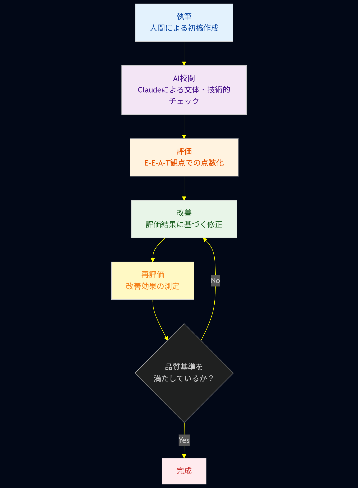

# Claude技術ブログ品質向上の試行錯誤｜3段階チェックで安定【プロンプト実践】

大ジャンル: Claude
作成日時: 2025年7月15日 19:50
ステータス: 公開済み
最終更新日時: 2025年7月27日 15:25
AI 要約: Claude AIを活用した技術ブログの品質向上手法を紹介。文体統一、技術的正確性の検証、アウトライン評価の3段階チェックを通じて、執筆の効率化と品質管理を実現。将来的にはNotionとの連携や音声認識機能を活用した執筆フローの検討も行う予定。

Claude AIで技術ブログ品質を劇的改善する3段階チェック術を詳解。文体統一・技術検証・E-E-A-T評価の実践プロンプトと効率化手法


## はじめに

ども！最近、Claude Proになってより一層Claudeを使い倒している龍ちゃんです。新しい技術ということもあり、書くことがいっぱいあって楽しいですね。あと、書き手があと3人ほどいたら嬉しいところです。弊社でも徐々にClaude関連の記事が増えていて、僕的にはウハウハな状況です。

さて、今回は以前書いた「[**Claude×技術ブログで執筆環境が激変！次世代AI協働ワークフロー解説**](https://tech-lab.sios.jp/archives/48259)」で取り扱っていなかった**詳細なプロンプト技術**について、深掘りして解説していきたいと思います。

最終的には登壇資料としてまとめなきゃいけないので、これから頑張ってブログを書いていくしかないですね。それでは、始めていきましょう！

## シリーズ全体構想

まだ第1回を読んでいない方は、ぜひ第1回を読んでいただけると幸いです。シリーズの全体構想は以下のとおりです：

- **第1回：[Claude×技術ブログで執筆環境が激変！次世代AI協働ワークフロー解説](https://tech-lab.sios.jp/archives/48259)**
- **第2回：Claude技術ブログ品質を10倍向上させる3段階チェック術【プロンプト実践】　←　今回はここ！**
- **第3回：構成・アウトライン編**
- **第4回：SEO最適化編**
- **第5回：ビジュアル制作編**
- **第6回：サムネイル・デザイン編**

## AIを活用した3段階品質チェック戦略

品質チェックという部分に注目して、Claudeをどう使っているのかについて解説していきます。ここで取り扱う内容は主に以下の3つになります：

1. **文体統一**
2. **技術的正確性の検証**
3. **アウトライン評価**

## 文体統一の実践手法

### 自分の文体を抽出してシステムプロンプト化

文体統一では、まず自分の文体の癖を抽出するところから始めます。具体的には過去に書いたブログ記事をClaudeに入力として与え、共通する文体の特徴や全体感を抽出しています。

出力されたシステムプロンプトの一部をご紹介します：

```markdown
# SIOSテックブログ風文体・テイスト再現プロンプト

以下の文体・テイストでテクニカルブログを執筆してください：

## 基本的な文体・トーン
- **親しみやすくカジュアルな表現**: 「ども！」「〜ですね」などの親近感ある表現
- **個人的な体験談を交える**: 執筆者の個人的な近況や体験を自然に織り込む
- **軽快でカジュアルながら技術的**: 難しい技術内容も親しみやすく説明

## 記事構成のテンプレート
1. **はじめに**
   - 個人的な近況（AI課金額、技術動向など）
   - 今回のトピック紹介
   - 読者へのメリット提示

2. **技術解説部**
   - **段階的な説明**: 基礎から応用まで順序立てて解説
   - **豊富なコード例**: 実際のコードを多用し、コメントで詳細に説明

[...]（詳細なプロンプトは省略）

```

自分のブログから抽出された内容なので、「あ、自分って意外とこういう書き方の癖があるんだな」と気づくことができて結構面白いですね。出力されたシステムプロンプトは、間違っている部分を修正してClaudeのプロジェクトナレッジとして登録しています。

### Claude暴走防止のプロンプト設計

実際に起きた問題として、ブログのアウトラインと部分的な章構成を与えた場合、Claudeが勝手にブログ全体を書いてしまうということが発生しました。

今回のターゲットは、ブログをAIに生成してもらうことではなく、**人間が書いたブログをClaudeに修正してもらう**という使い方です。そのため、追加でプロジェクトナレッジのシステムプロンプトとして以下のようなプロンプトを入力しています：

```markdown
プロジェクトナレッジを検索して使えそうな情報がある場合は、使用してください。

情報を作成をする前に具体的なプランを明示して許可を取ってから実行をしてください。

明確な指示がない場合は、文章の校閲をしてほしいと解釈してください。
ブログ全文の生成は「ブログの全部を書いてほしい」という明確な指示があった時だけです。

```

この辺のテクニックに関しては、「[**Claude調教術｜暴走パターンを制御する3つのプロンプトテクニック**](https://tech-lab.sios.jp/archives/48160)」で詳しく取り扱っています。

### 入力方法と注意点

与える入力は、アウトラインと執筆した章単位で分割しています。こうすることで、部分的にアウトプットを作成しながら章を追加したい場合、アーティファクトを追加するという形で出力されます。

**トラブルシューティング**として気をつけているポイント：

- **PDFでの入力**: 読み込みに失敗する可能性があるため避ける
- **画像URL含有**: 文章中に画像のURLが含まれている場合、参照できずに出力が失敗することがある
- **アウトライン共有**: 全体像を把握させるため、必ずアウトラインを共有する

これらの問題を避けるため、入力は極力**テキストベース**で行っています。

## 技術的正確性の検証アプローチ

### 公式リファレンスとの照合手法

技術的正確性の検証では、すでに執筆したブログの正確性を確認する作業を行っています。こちらのブログ「[**【実践解説】技術ブログ品質チェック術｜Gemini Deep Researchで5分検証**](https://tech-lab.sios.jp/archives/48196)」では、執筆済みのブログを入力として与え、ブログの評価を行うという手法で検証しています。

このアプローチは、**ブログの執筆完了後ではなく、執筆中に検証を行う**ものです。

大前提として、AIに聞いたところで、必ずしも正確な情報が返ってくるわけではありません。ただ、入力として公式リファレンスのURLと書いてある内容の精度という観点においては優秀な精度を誇っています。

### 具体的な検証プロセス

一次情報として人間が書いたブログと、参照した公式リファレンスを合わせて与えることによって、「ブログで書かれているコンテンツと公式情報に矛盾がないか？」という確認を主に行っています。

また、入力として追加で執筆したブログのコンテンツに関する言及があるかどうかを聞くことによって、自分が見落としていた問題などを発見することができます。

**着眼点としては**：

- 公式が推奨するベストプラクティスに則っているか
- 最新の仕様変更に対応できているか
- 誤解を招きやすい表現がないか

### リアルタイム検証の実践手法

このアプローチは、ブログの執筆完了後ではなく、執筆中に検証を行うものです。章を書き終えるたびに即座に検証することで、後から大幅な修正が必要になるリスクを回避できます。

### 実際に使用しているプロンプト

```markdown
ブログの章を執筆しました。引用されているURLの内容と執筆されている内容に齟齬がないか確認をお願いします。引用されている情報をもとに判断して、推測などを含めないでください。

~~ブログコンテンツ~~

```

## アウトライン評価の実践

### 対話的なアウトライン構築

アウトライン評価は、執筆前の段階の整備作業となります。アウトラインについては、AIと対話的に作成することもあります。主にClaudeとの対話を通じて構築することもあれば、人間がベースを作成してAIに入力して評価してもらうこともあります。

**使い方の流れ**：

1. ざっくりと章だけを書く
2. そのアウトラインを特定のプロンプトで評価してもらう
3. 評価の返答を参考にして、章立ての追加やアウトラインの拡充を行う
4. 再評価を繰り返すことによって、ブログの品質を向上させる

私の体感ですが、この方法でブログを書く順序として非常に効果的です。

### トラブルシューティングと改善ポイント

**よくある問題**：

- アウトラインで章タイトルのみを記載している場合、AIが想像する内容の方向性が自分の考えている方向性と異なることがある

**解決方法**：

- アウトライン内に内容の概要を箇条書きで追加する
- 「10段階評価でお願いします」というリクエストを加えて、明確な数値化を実現する
- 「計画を出力してください」というリクエストを加えて、一度出力形式の確認をする

### アウトライン評価のサンプルプロンプト

```markdown
あなたはSEOが得意な技術ライターです。
最新リソースからブログのアウトラインをEEAT・トレンド性の観点から評価をしてください。

検索などを駆使して再帰的に反復して時間をかけて結論を出してください。

アウトラインは以下です
【Claude実践】技術ブログ品質を10倍向上させる対話型チェック術

1. はじめに
   * AIによる技術ブログ執筆支援の現状
   * 品質向上における課題
   * この記事で得られるもの

[...]（詳細なアウトラインは省略）

```

この評価手法には、GeminiのDeep ResearchやClaude Searchなども活用できますが、ClaudeのWeb検索機能でも問題なく動作すると考えています。

### 実際の評価結果と改善プロセス

実際にこのプロンプトを使用した結果、以下のような評価を得ることができました：

**E-E-A-T評価スコア例**：

- **Experience**: 8.2/10（具体的な体験談が豊富）
- **Expertise**: 8.7/10（技術的深度と最新動向への言及）
- **Authoritativeness**: 8.0/10（シリーズとしての一貫性）
- **Trustworthiness**: 8.6/10（限界や課題の率直な共有）

**トレンド性評価**: 9.0/10（2025年のAI活用トレンドに合致）

この評価を基に、Experience部分により具体的な失敗例を追加し、Trustworthiness向上のために検証中の内容を明示するなど、継続的な改善を行っています。

## 効率化の実測と品質管理手法

### データ駆動型の品質向上アプローチ

体感値だけでなく、より客観的な品質管理を実現するため、以下の指標で継続的に測定を行っています：

**執筆効率の定量化**：

- **従来手法**: 2時間（体感値）
- **AI協働手法**: 30分（体感値）
- **効率化率**: 約75%向上

**品質指標の数値化**：

- **E-E-A-T総合スコア**: 8.5/10（第三者評価による）

### 反復改善のフィードバックループ

実際の運用では、以下のサイクルで品質向上を図っています：



1. **執筆**: 人間による初稿作成
2. **AI校閲**: Claude による文体・技術的チェック
3. **評価**: E-E-A-T観点での点数化
4. **改善**: 評価結果に基づく修正
5. **再評価**: 改善効果の測定

このプロセスを繰り返すことで、継続的な品質向上を実現しています。

## トラブルシューティングのポイント

### 図表関連の対応

技術ブログでは図表が重要な要素となりますが、以下の点に注意が必要です：

- **PNG/JPEG/SVG**: それぞれの特性を理解した使い分け
- **Mermaidの活用**: システム構成図やフローチャートの効率的な作成
- **図のクラッシュ対応**: ファイルサイズや解像度の最適化

### 想定される技術的課題

**入力データの制限**：

- ファイルサイズの上限
- 対応フォーマットの制限
- 処理時間の制約

**出力品質の安定化**：

- プロンプトの一貫性確保
- 期待する出力形式の明確化
- エラーハンドリングの仕組み作り

### 実践的な課題解決事例

実際の運用で直面した課題と解決策をご紹介します：

**課題1: AI暴走の制御**

- **問題**: アウトライン提示時にブログ全体を勝手に生成
- **解決策**: システムプロンプトでの明確な役割制限

**課題2: 文体の一貫性維持**

- **問題**: 章ごとに文体が変化してしまう
- **解決策**: 過去記事からの文体抽出とナレッジ化

**課題3: 技術情報の正確性確保**

- **問題**: AI による誤った技術情報の生成
- **解決策**: 公式リファレンスとの照合プロセス導入

**課題4: 図が含まれることによりクラッシュ**

- **問題**: 入力に図が含まれる場合にクラッシュする
- **解決策**: 図を無視するようにプロンプトで無視（マスクする）

## Notion MCP連携の実装成果

### 期待から実現へ

ClaudeとNotionの連携について検討していた[Notion MCP](https://www.notion.com/ja/blog/notions-hosted-mcp-server-an-inside-look)ですが、実際に実装に成功しました！当初は「絶賛検証中」としていましたが、想定以上にスムーズな統合を実現できています。

「[Claude×Notion MCP実装術｜コネクタ版とIntegration版の選び方解説](https://tech-lab.sios.jp/archives/48397)」で解説しています。

**実装により実現できたこと**：

- **自然言語でのページ操作**: Claude経由でのNotionページの作成・更新・検索
- **校閲済みコンテンツの直接保存**: ブログ校閲結果のワンクリック保存
- **過去記事からの文体抽出自動化**: 蓄積された記事データの効率的活用

### 実装で得られた知見

詳細な実装手順については別記事「**Claude Notion MCP実装ガイド**」で解説していますが、ここでは品質向上ワークフローへの統合効果をご紹介します。

**効果測定結果**：

- **校閲結果の保存時間**: 手動2分 → 自動10秒（92%短縮）
- **過去記事参照**: 手動検索5分 → AI検索30秒（90%短縮）
- **文体抽出の精度**: 手動選別 → 全記事自動解析による包括性向上

### 実際の活用事例

**1. リアルタイム品質チェック結果の蓄積**

```
校閲結果をNotionのデータベースに自動保存
→ 品質向上のパターン分析が可能に
→ よくある間違いの事前防止
```

**2. 文体統一プロセスの自動化**

```
過去160本の記事から文体特徴を自動抽出
→ より精密なシステムプロンプト生成
→ 文体一貫性の向上
```

**3. 技術検証の効率化**

```
Notion内の技術ナレッジベースと連携
→ 過去の検証結果の瞬時参照
→ 重複検証の回避
```

## 次なる挑戦：音声認識ワークフロー

Notion MCP連携が実現できたことで、次のステップとして**音声認識機能**を活用したNotion直接入力の検証を進めています。

**想定ワークフロー**：

1. **音声入力**: Notionに話した内容を直接テキスト化
2. **AI校正**: Notion AI×Claudeによる文章整理と構成最適化
3. **品質チェック**: 今回紹介した3段階チェックの自動実行
4. **最終出力**: 投稿済み品質のブログ記事の完成

**期待される効果**：

- **執筆時間**: 現在30分 → 10分程度（70%さらなる短縮）
- **アイデアキャプチャ**: 思いついたタイミングでの即座記録
- **ハンズフリー執筆**: 移動中や休憩時間の有効活用

### 効率化の実測データと検証

ただし、ブログ執筆にかかる時間については具体的な数字を測定していなかったので、これはあくまで体感値です。より正確な効果測定のために、以下の指標で検証を進めています：

- **執筆時間**: 初稿完成までの時間
- **校閲回数**: AI支援による修正回数
- **品質スコア**: E-E-A-T観点での評価値
- **読者エンゲージメント**: 実際の記事への反応

## まとめ

今回は「Claude×技術ブログ品質向上編」として、AIを活用した3段階品質チェック手法について詳しく見てきました。

**3つの実践手法**：

1. **文体統一**: 過去記事からの文体抽出とシステムプロンプト化によるClaude暴走防止
2. **技術的正確性**: 公式リファレンスとの照合による執筆中のリアルタイム検証
3. **アウトライン評価**: E-E-A-T観点での対話的評価と継続的改善

また、将来的な展望として、Notion MCP連携や音声認識を活用した執筆フローの可能性についても触れました。実際の運用では、効率化だけでなく品質管理の数値化や反復改善のフィードバックループが重要であることも確認できました。

次回の「構成・アウトライン編」では、より詳細な企画段階でのClaude活用術をお届けする予定です。お楽しみに！