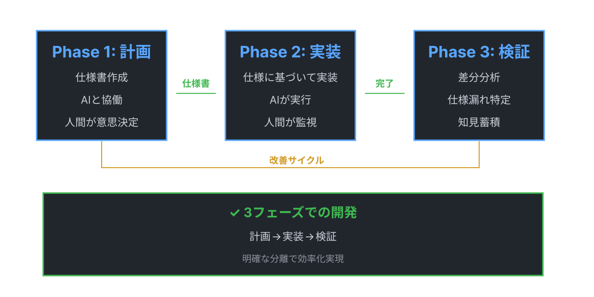
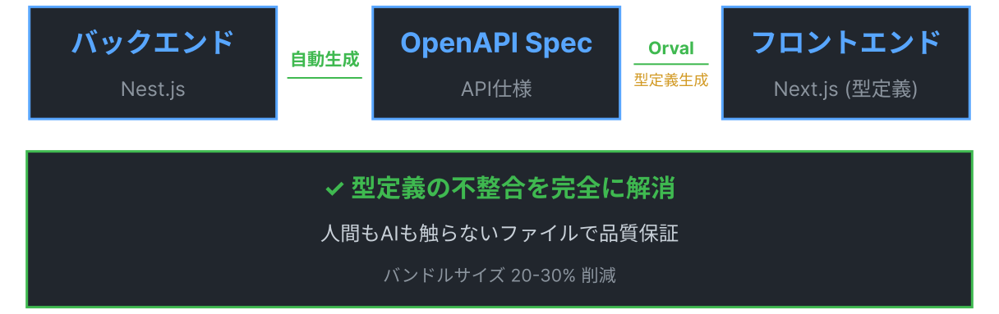
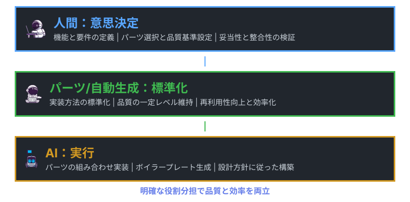

<!--_class: title-->

# AI開発手法セミナー

## 仕様書ベース開発で効率的に
### フロント・バック並行開発を実現

---

# 本日のゴール

<div class="highlight">
仕様書ベース + 自動化パイプライン で
フロント・バック開発を効率化
</div>

## 今日持ち帰っていただくこと

1. **3フェーズ開発手法**（計画→実装→検証）
2. **自動化パイプライン**（型定義の自動同期）
3. **効率化 + 成長の二重効果**

---

<!-- _class: subTitle-->

# Part 1: 問題提起

## なぜVibe Codingでは限界があるのか

---

# そもそもの問題：仕様を明確にしない開発文化

<div class="box red">

## よくある開発の現場
- 「とりあえず作ってみよう」で突っ走る
- 要望だけで仕様が明確になっていない
- 「作りながら考える」スタイル
- 開発中に「あれ？これってどうするんだっけ？」が頻発

</div>

<div class="highlight">
仕様が明確でない = ゴールが定まっていない
</div>

---

# なぜ危険なのか

<div class="box red">

## 人間同士の開発でも問題

- 開発中に方針がブレる
- 手戻りが多発（「やっぱりこうしよう」）
- 完成したけど要件を満たしていない
- チームメンバー間での認識齟齬

</div>

**→ これは人間同士の開発でも問題。AIを使うとさらに悪化する**

---

# Vibe Codingでよく起きる失敗パターン

<div class="box red">

## 1. 技術選定を任せる危険性
- 具体例：SWRを全CRUD操作に使用しようとした
- CRUDの4つのうち、SWRが最適なのはRead（データ取得）のみ
- AIは統一性を重視してしまう

</div>

<div class="box red">

## 2. 型定義の齟齬問題
- Vibe Codingでは各環境で独立して型定義を生成
- フロントとバックで型定義がずれる
- 参照エラーが頻発

</div>

---

# Vibe Codingの根本的な問題

<div class="highlight">
二重の問題構造
</div>

<div class="box red">

1. **仕様が明確でない**（人間が決めていない）
2. **曖昧なまま AIに丸投げ**（AIが勝手に解釈）

</div>

**人間なら「これ、仕様決まってないですよね？」と気づけるが、**
**AIは黙って実装してしまう**

---

# 問題の構造まとめ

```
仕様を明確にしない文化
    ↓
要望だけで突っ走る
    ↓
Vibe Codingで雑なプロンプト
    ↓
AIが自由に解釈して実装
    ↓
意図したものができない
```

<div class="highlight">
解決策: 仕様書ベース開発 + 自動化パイプライン
</div>

---

<!-- _class: subTitle-->

# Part 2: 3フェーズ開発手法

## 計画→実装→検証の明確な分離

---

# 3フェーズ開発の全体フロー



---

# Phase 1: 計画フェーズ

<div class="box blue">

**目的**: 何を作るか、どう作るかを決定

**人間が意思決定、AIがドキュメント化を支援**

- 型定義・API仕様・アーキテクチャ設計
- 機能要件・非機能要件の明確化
- ❌ 実装コード記述禁止（設計のみ）

</div>

---

# AIとの協働フロー

<div class="box green">

## 4ステップ

1. **要件の整理**: 何を作りたいかを箇条書きで整理
2. **AIとの対話**: 仕様書の作成を依頼
3. **レビューと修正**: 作成された仕様書を人間の視点でレビュー
4. **反復改善**: 不足部分や曖昧な部分を繰り返し修正

</div>

> **詳細は参考記事**: [AI協働で仕様書アレルギー克服！](https://tech-lab.sios.jp/archives/49148)

---

# Phase 2: 実装フェーズ

<div class="box blue">

## 役割分担
- **人間の役割**: 監視役に徹し、暴走時に小さなプロンプトで修正
- **AIの役割**: 定義された仕様書に従って実装

</div>

<div class="highlight">
説明は全て計画フェーズで作った仕様書に含まれている
仕様書を入力として与えるだけで実装が進む
</div>

---

# Phase 3: 検証フェーズ

<div class="box green">

**目的**: 仕様書の不備を特定、次回の改善へ

**やること**
1. 計画と実装の差分分析
2. 仕様漏れの特定（バグより仕様漏れが多い）
3. 知見の蓄積

**プロンプト例**
「計画と実装の差異をまとめてください」

</div>

---

# 実際の開発効果：驚異的な時間短縮

<div class="box green">

## 小規模システムの例
- バックエンドのエンドポイント2つ
- フロントエンドの画面1つ
- **開発時間：約30分で完了**

</div>

---

# Before/After比較


---

# 副次的効果：エンジニアとしての成長

<div class="box blue">

**1. 仕様書作成スキルの向上**
- AIの仕様書から構造・フォーマットを学習

**2. レビュー観点の育成**
- 検証フェーズで計画の不備を分析

**3. 設計思考の強化**
- アーキテクチャ全体を俯瞰する視点

</div>

---

<!-- _class: subTitle-->

# Part 3: 自動化パイプライン

## 型定義同期で品質保証

---

# なぜ自動化パイプラインが必要か

<div class="box red">

## 問題：型定義の齟齬
- フロントとバックで型定義がずれる
- AIは各環境で独立して型定義を生成

</div>

<div class="box green">

## 解決策：自動生成パイプライン
人間もAIも触らないファイルを作成

**Nest.js → OpenAPI Spec → Orval → Next.js**

</div>

---

# 自動生成パイプラインの構築



---

# パーツ提供の思想



> **詳細は参考記事**: [AIと爆速開発！Next.js×Nest.js型定義同期](https://tech-lab.sios.jp/archives/49157)

---

# 実際の効果

<div class="box green">

**型定義の不整合が完全に解消**
- フロント・バック並行開発が可能に
- 型定義の再定義が不要

**プロジェクト全体の品質向上**
- バンドルサイズ20-30%削減
- ファイル構造が整理され可読性向上

</div>

---

<!-- _class: subTitle-->

# Part 4: 実践の勘所

## 意思決定を握る3原則

---

# 意思決定を握る3原則

<div class="box blue">

**原則1：計画ドキュメントでの明文化**
技術選定理由・実装方針・暗黙知を言語化

**原則2：パーツによる実行の標準化**
コンポーネント・API接続・開発ツールを標準化

**原則3：検証による継続的改善**
差分分析・問題点蓄積・次回プロジェクトへ適用

</div>

---

# プロジェクト構成の最適化

```
/
├── CLAUDE.md                    # プロジェクト全体のガイドライン
├── docs/                        # 計画・設計フェーズ
│   ├── CLAUDE.md                # 計画フェーズ専用ルール
│   ├── features/                # 新機能計画
│   ├── bugs/                    # バグ調査・修正計画
│   └── research/                # 検証結果・知見
└── application/                 # 実装フェーズ
    ├── backend/
    │   └── CLAUDE.md            # バックエンド実装ルール
    └── frontend/
        └── CLAUDE.md            # フロントエンド実装ルール
```

---

# 各フェーズ用のCLAUDE.md

<div class="box blue">

**ディレクトリごとの責任範囲**
- フロントエンド：自動生成ファイル変更禁止、ライブラリ制限
- バックエンド：API仕様変更手順、DBスキーマルール
- docs：ドキュメントフォーマット、必須項目

</div>

<div class="box yellow">

**AIに触らせないファイル**
DO NOT EDITコメント + CLAUDE.mdでリスト化
**注意**: 時々無視されるので即座に指摘

</div>

---

# 仕様書の適切な分量バランス

<div class="box red">

## 問題
- **長すぎる** → AIが無視する確率が上がる
- **短すぎる** → 時間がかかる

</div>

<div class="box green">

## 具体的な目安
- エンドポイント2つ + 対応する画面1つ程度
- プロジェクト依存で適切な分量を見極める

</div>

---

# 仕様書ベース開発で陥る3つの落とし穴

<div class="box red">

**落とし穴1：ドメイン知識の明示化不足**
暗黙知はAIに伝わらない → コアドキュメントで明文化

**落とし穴2：AIがドキュメントを無視**
重要な制約はドキュメント + プロンプトで二重指示

**落とし穴3：仕様書の分量バランスミス**
目安：エンドポイント2つ + 画面1つ程度

</div>

---

# AIから学ぶ実践テクニック

<div class="box green">

## AIと協働することで得られる3つの学習効果

1. **仕様書スキル**
   - AIが返す仕様書から構造・フォーマットを学ぶ

2. **レビュー観点**
   - 不足箇所に気づく感覚、設計整合性の確認視点

3. **意思決定力**
   - 技術選定の言語化、トレードオフ思考の訓練

</div>

---

<!-- _class: subTitle-->

# Part 5: まとめ

## 効率化 + 成長の二重効果

---

# 重要ポイントの整理

<div class="box blue" style="display: grid; grid-template-columns: 1fr 1fr; gap: 40px;">

<div>

**1. 技術選定の主導権**
AIへの委任リスク回避

**2. 計画ドキュメント明文化**
暗黙知の言語化

**3. 意思決定と実行の分離**
役割分担の最適化

</div>

<div>

**4. パーツ化で標準化**
品質保証と再利用性

**5. 継続的改善**
学習重視のアプローチ

</div>

</div>

---

# 結論

<div class="highlight">
人間が意思決定を行い、AIが実行を担当する
</div>

<div class="box blue">

## 人間の強み
- 経験に基づく技術的判断
- コンテキストを考慮した柔軟な意思決定

</div>

<div class="box green">

## AIの強み
- 高速で大量のコード生成
- 定められたパターンに従った正確な実装

</div>

---

# 効率化 + 成長の二重効果

<div class="box green">

## 効率化の効果
- 開発時間: 1週間 → 2日（71%削減）
- 手戻り: 平均3-4回 → 1回（75%削減）
- バンドルサイズ: 20-30%削減

</div>

<div class="box blue">

## 成長の効果
- 仕様書作成スキルの向上
- レビュー観点の育成
- 設計思考の強化
- 技術的意思決定の経験蓄積

</div>

---

# 今日から始める3ステップ

<div class="box green">

**Step 1: 小さく始める**
1つの機能で試す → 計画ドキュメント作成 → AIレビュー

**Step 2: 自動化パイプライン導入**
OpenAPI Spec自動生成 → Orval型定義生成 → CLAUDE.md設定

**Step 3: 継続的改善**
差分分析 → 問題点をドキュメント反映 → 次回適用

</div>

---

# 実践への提案

<div class="highlight">
まず「計画ドキュメント」の作成から始めましょう
</div>

<div class="box blue">

- 初期段階では作成コストが高く感じられるかもしれない
- 中長期的には開発効率と成果物の品質において大幅な改善効果が期待できる

</div>

---

# Q&A

<div class="box blue">

**Q1: 既存プロジェクトにも適用できますか？**

A1: はい。既存コードのドキュメント化から始めて、新機能追加時に3フェーズ開発を導入するのが効果的です。

**Q2: 仕様書作成に時間がかかりすぎませんか？**

A2: 初回は時間がかかりますが、実装中の手戻りが減るため、トータルでは時間短縮になります。2回目以降はテンプレートを再利用できます。

</div>

---

# 参考資料

## ブログ記事（SIOS Tech Lab）

**3フェーズ開発手法**
- [Claude Code革命！3フェーズ開発で効率的な開発](https://tech-lab.sios.jp/archives/49140)
- [AI協働で仕様書アレルギー克服！](https://tech-lab.sios.jp/archives/49148)
- [Claude Code仕様書ベースでハマる6つの落とし穴！](https://tech-lab.sios.jp/archives/49154)

**自動化パイプライン**
- [AIと爆速開発！Next.js×Nest.js型定義同期](https://tech-lab.sios.jp/archives/49157)
- [Orval SWRの自動生成をやめた理由](https://tech-lab.sios.jp/archives/49591)

---

# ありがとうございました

<div class="highlight">
皆さんのAI協働開発プロジェクトの成功を応援しています！
</div>

## 本日のポイント

1. **仕様書ベース開発**で意思決定を明確に
2. **自動化パイプライン**で品質保証
3. **効率化 + 成長**の二重効果

**質問があればお気軽にどうぞ！**
