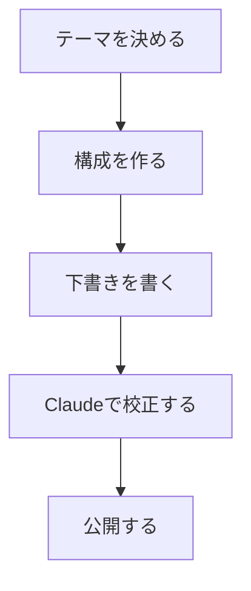

<!--_class: title-->

# 今日から使える Claude 活用で技術ブログ執筆を 3 倍速に

---

# 自己紹介

<!--_class: twoColumns-->

<div>

**フロントエンドエンジニア・AI 活用**

**追加領域**

- Figma 連携による デザインシステム構築
- 社内業務改善 AI システム開発

**執筆実績**

- 3 年弱で技術記事 165 本執筆

🔗 **GitHub**: [github.com](https://github.com/Ryunosuke-Tanaka-sti)

</div>

<div>


</div>

---

# 本日のゴール

## 今日から使える 3 つのテクニック

<div class="box blue">

1. 🎯 **ブログ全文から SEO タイトルを瞬時生成**
2. 📊 **図表作成を自動化**
3. 🤖 **AI を第一読者にした品質チェック**

</div>

<div class="highlight">
特別なスキルは不要！ChatGPTを使ったことがあればOK
</div>

---

<style scoped>
  table { table-layout: fixed; width: 100%; display:table; font-size: 24px; }
</style>

# Claude とは？

## ChatGPT との違い

| 項目     | ChatGPT        | Claude                 |
| -------- | -------------- | ---------------------- |
| **特徴** | 知識が幅広い   | 文章が自然             |
| **得意** | 一般的な質問   | 長文作成・校正         |
| **料金** | 無料枠が少ない | 無料でもそこそこ使える |

<div class="highlight">
一言で言うと：Claude は『文章を書くプロ』
</div>

---

# 無料版でできること

<div class="box yellow">

- 📝 1 日約 30 回まで会話可能
- ✏️ 文章生成・校正・翻訳
- 💻 コード生成・解説
- 📊 図表作成（テキスト形式）

</div>

<div class="highlight">
今日紹介するテクニックは、セミナー終了後すぐに無料で試せます！
</div>

---

<!-- _class: subTitle-->

# 実演 1：ブログコンテンツからタイトルを生成

---

# 実演 1：ブログコンテンツからタイトルを生成

## なぜタイトルが重要か

<div class="box red">

- 🔍 **検索結果の 1 位表示率**: 28.5%
- 👁️ **ユーザーの注目度**: 最初に見られる要素
- 📈 **CTR 向上**: 良いタイトルでクリック率 2-3 倍

**課題：** 魅力的なタイトルを考えるのに 1 時間以上かかる

</div>

<div class="highlight">
実績：タイトル生成時間を1時間→5分に短縮（92%削減）
</div>

---

# 実演 1：ブログコンテンツからタイトルを生成

<!--_class: twoColumns-->

<div>

## 間違ったアプローチ（Before）

### ❌ 記事概要だけでタイトル生成

**問題点：**

- 記事の具体的な内容が不明
- 差別化要素が伝わらない
- 似たようなタイトルばかり生成される

```text
以下の記事のタイトルを5つ考えてください。

記事内容：Reactでダークモードを実装する方法
```

</div>

<div>

## 正しいアプローチ（After）

### ✅ ブログ全文を投入してタイトル生成

**改善点：**

- 記事の内容に基づいた情報
- 特化した部分の表面化
- ブログ記事ごとのユニークなタイトル

</div>

---

# 実演 1：ブログコンテンツからタイトルを生成

<div class="important">

**人間がやること**: ブログ全文をプロンプトに貼り付けるだけ
**Claude がやること**: 以下を自動で分析・抽出

- 使用技術スタック
- 想定読者レベル（初心者/上級者）
- 解決する問題
- 他記事との差別化要素
- タイトル考案
- SEO 観点での順位付け

</div>

---

# 実演 1：ブログコンテンツからタイトルを生成

## 行動計画プロンプトの構造

<div class="demo">

### Goal/Plan/Tips の基本フレームワーク

- **Goal**: 何を達成したいのか明確に定義
- **Plan**: 具体的な手順を段階的に示す
- **Tips**: 品質向上のための制約や注意点

</div>

---

# 実演 1：ブログコンテンツからタイトルを生成

### 実用的プロンプト

```text
あなたは、SEOに精通したライターです。

Goal：ブログ用タイトル・メタディスクリプションの作成

Plan：
- 添付ファイルからコンテンツの把握
- タイトルを55~60文字以内で考案
- SEO的に優れているという観点で順位付け
- 複数案を提案

Tips：
- 誇大広告は避けてください
- 技術名を明確に含める
- 実践的な価値を伝える

[ここにブログ全文を貼り付け]
```

---

# 実演 1：ブログコンテンツからタイトルを生成

<!--_class: twoColumns-->

<div>

## 実際の成功事例

### 事例 1: Claude 制御記事

「Claude 調教術｜暴走パターンを制御する 3 つのプロンプトテクニック」

### 事例 2: Azure 技術記事

「Azure SWA×Next.js 認証 API 統合を実践解説【DevContainer〜本番まで】」

</div>

<div>

## 品質管理のポイント

- ❌ 「完全ガイド」「決定版」は誇大広告
- ✅ 「実践編」「入門編」に調整
- ✅ 技術名の正確性を確認

</div>

---

<!-- _class: subTitle-->

# 実演 2：図表作成を自動化

---

# 実演 2：図表作成を自動化

## Mermaid とは？

<div class="box blue">

- 📝 **テキストで図を作成**するツール
- 🔄 **リアルタイム生成**
- 💾 **PNG/SVG 出力**可能
- 🆓 **完全無料**で使用可能

</div>

<mark>メリット：デザインスキル不要で美しい図が作れる</mark>

---

# 実演 2：図表作成を自動化

## 実演：フローチャート作成

<div class="demo">

### プロンプト例

```text
以下のフローをMermaidのフローチャートで作成してください。

フロー：
1. テーマを決める
2. 構成を作る
3. 下書きを書く
4. Claudeで校正する
5. 公開する

※日本語で表示してください
```

</div>

---

# 実演 2：図表作成を自動化

## 生成されたコード



### Mermaid Live Editor で確認

1. <https://mermaid.live/> にアクセス
2. コードを貼り付け
3. リアルタイムで図が生成
4. PNG/SVG でダウンロード

---

# 実演 2：図表作成を自動化

## 便利な図表パターン 3 選

<div class="box green">

### 1. フローチャート

- プロセスの可視化

### 2. シーケンス図

- システム間の通信

### 3. 円グラフ

- データの比率表示

</div>

<div class="highlight">
どんな図表もテキストで指示するだけ！
</div>

---

<!-- _class: subTitle-->

# 実演 3：AI を第一読者にした品質チェック

---

# なぜ AI を第一読者にするのか

## 従来のアプローチの問題

- 👥 他のエンジニアは忙しい
- ⏰ 手動でのファクトチェックに時間がかかる

## AI を第一読者にするメリット

- 🔍 **5~10 分で網羅的なファクトチェック**
- 🌐 **数百のサイトを並行調査**
- 📝 **引用元明記の詳細レポート**

<div class="highlight">
人間の最終確認は必須だが、初期チェックをAIが担うことで効率化！
</div>

---

# Gemini Deep Research で 5 分検証

## STEP 1: PDF ファイルの準備

- 📝 Notion でブログを PDF エクスポート
- 📁 1000 ～ 5000KB のファイルサイズ

## STEP 2: プロンプト作成

- 🎯 「技術的ブログとして多角的な評価から判断して」
- 🔍 「公式リファレンスのみを参照してベストプラクティスか調査」

## STEP 3: 結果の活用

- 📈 5 ～ 30 分で詳細レポート生成 → 🔔 完了通知（別作業が可能）
- 📝 引用元明記の改善提案

---

# 実演：Gemini Deep Research でファクトチェック

## 実際の動作例

<div class="demo">

### 基本プロンプト

```text
添付した資料の内容をもとにファクトチェックして、
技術的ブログとして多角的な評価から判断して
```

### 目的別プロンプト

```text
● 技術記事：「技術仕様、API情報、コード例の正確性を重点的に」
● 差別化チェック：「この他社の記事との差別化ってどういうところ？」
● 公式リファレンス準拠：「公式リファレンスのみを参照してベストプラクティスか調査」
```

</div>

---

# 実演：Gemini Deep Research でファクトチェック

<div>

## AI エージェントの内部処理

1. 本文抽出
2. 記載情報の精査計画を立案

3. 公式ドキュメントや技術サイトを調査
4. 情報の正確性・最新性を評価
5. 改善提案を含む詳細レポート作成

<div class="highlight">
プロンプトはシンプルでも、AI が意図を理解して包括的な調査計画を実行
</div>

---

# よくある判定ミスと対処法

## 1. レポートに納得がいかない場合

**原因：** ブログ内容が不足して主張が AI に伝わっていない
**対処法：** ブログ側を加筆して情報を補完

## 2. 「リンクがない」と判定された場合

**対処法：** 「リンクは含まれていると思います。再度確認をしてください」

## 3. 「情報が古い」と指摘された場合

**対処法：** 自分が参照した最新情報を共有して修正を求める

---

<!-- _class: subTitle-->

# Claude 暴走を制御する 3 つのテクニック

---

# よくある Claude 暴走パターン 3 選

## 1. 過剰な Artifact 生成問題

**❌ 問題：** 簡単なコードを求めたのに 300 行の高機能版が生成
**✅ 解決：** 「Goal：初心者でもわかる 50 行程度のシンプルなコード」

## 2. スレッド肥大化問題

**❌ 問題：** 軽い質問が詳細回答の連鎖でスレッド上限に
**✅ 解決：** 「まずは概要だけ教えて、詳しく知りたくなったら追加で質問するから」

## 3. 人間追いつけない問題

**❌ 問題：** AI の処理速度 vs 人間の理解速度のギャップ
**✅ 解決：** 「つまり、Pod は家でコンテナは住人のような関係ですね？」

---

# Claude 調教術

## 制御テクニック 1：成果物制御

### Goal の定義（最も効果的）

```text
テンプレート:
[要求内容]
Goal：[具体的な最終目標と制約]

実例:
Chakra UIのモーダルでJSON文字列を表示したい
Goal：初心者でもわかるようにコード内にコメント多めで
```

### 成果物の否定

- 「成果物を作らずに、考え方だけ教えて」
- 「Artifact は不要で、チャットで答えて」
- 「禁止事項：Artifact 生成」

---

# Claude 調教術

## 制御テクニック 2：会話継続テクニック

### スレッド肥大化対策

**❌ 問題：** 軽い質問が詳細回答の連鎖でスレッド上限に

**✅ 対処法：**

- 🏠 **新スレッド移行**：要約資料作成 → 新スレッドに引き継ぎ
- 🤖 **AI 役割分散**：複数の Claude 専門分野で分担
- 📝 **Artifact 分割**：大きな成果物を小さく分解

### 実用例

「まずは概要だけ教えて、詳しく知りたくなったら追加で質問するから」

---

# Claude 調教術

## 制御テクニック 3：ペース調整テクニック

### 人間主導の学習プロセス

**❌ 問題：** AI の処理速度 vs 人間の理解速度のギャップ

**✅ 対処法：**

1. 🌐 **概観作成**：まず全体像を把握
2. 🎯 **狙い撃ち質問**：段階的に特定分野を深掘り
3. 💬 **説明要求**：不明な部分の解説を求める
4. ✅ **理解度確認**：「つまり、Pod は家でコンテナは住人のような関係ですね？」

---

# Claude 調教術

## 継続的な活用のヒント

- ✅ よく使うプロンプトはテンプレート化
- ✅ 1 つの記事で複数の機能を組み合わせ
- ✅ 結果を評価して改善サイクルを回す

---

<!-- _class: subTitle-->

# まとめ

---

# 本日の振り返り

## 習得した 3 つのテクニック

1. 🎯 **ブログコンテンツベースの SEO タイトル生成**

   - ブログ全文を投入して 1 時間 →5 分に短縮

2. 📊 **図表作成の自動化**

   - Mermaid でテキストから美しい図表に生成

3. 🤖 **AI を第一読者にした品質チェック**
   - Gemini Deep Research で 5 分で網羅的なファクトチェック

---

# 公開資料

1. 📋 **プロンプトテンプレート集**

   - SEO タイトル生成用
   - Mermaid 図表作成用
   - 品質チェック用

2. 🚀 **クイックスタートガイド**

   - 今すぐ始める 3 ステップ

3. ✅ **実践チェックリスト**
   - 継続的な改善のために

---

# 今日から始めよう

## 次のアクション

1. ⚡ **今すぐ Claude にアクセス**

2. 🎯 **配布テンプレートを実践**

3. 📈 **成果を測定**

<div class="highlight">
あなたの技術ブログ執筆が3倍速くなることをお祈りしています！🚀
</div>

---

<!-- _class: subTitle-->

# さらなる活用

---

# Claude×Notion MCP でワークフロー革新

## 🔗 MCP とは？

- **Model Context Protocol** - AI ツール間の新しい接続規格
- Claude から Notion を直接操作可能
- リアルタイムでの情報同期・更新

## 💡 実現できること

- 📝 **Claude から直接 Notion ページ作成**
- 🔄 **既存ページの自動更新・編集**
- 🔍 **Notion 情報の検索・要約**

---

# 音声認識でブログを書く革新的手法

1. **音声でアイデアを話す**

   - キーボードを叩かずに自然に発話
   - 思考の流れをそのまま音声化

2. **AI が文字起こし・補正**

   - 音声認識から Notion AI ＋ Claude で補正

3. **効率的な編集・仕上げ**
   - 大枠は AI が作成済み
   - 細かい調整のみ手動で実施

---

# 音声認識でブログを書く革新的手法

- 🖐️ **指の疲労ゼロ**  
  長編ブログでも筋肉痛なし

- ⚡ **思考速度で執筆**  
  タイピング速度の制約を突破

- 🗣️ **自然な文体**  
  話し言葉をベースにした親しみやすい文章

<div class="highlight">
試験的取り組みとして導入中！まとまったらブログで詳細公開予定
</div>

---

# Q&A

### ご質問をお聞かせください

**今日学んだテクニックについて**
**Claude の使い方について**
**その他、技術ブログ執筆について**

---

## ありがとうございました

## 連絡先・リソース

- 📧 フォローアップ質問歓迎
- 🔗 配布資料の QR コード
- 📚 参考リンク集

**皆さんの技術ブログライフがより豊かになりますように！**
