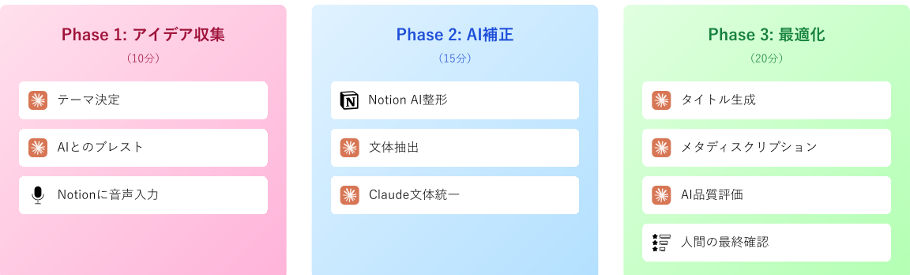

<!--_class: title-->

# Notion MCP × 音声認識 × Claude で実現する次世代ブログ執筆環境

---

# 自己紹介

<!--_class: twoColumns-->

<div>

**フロントエンドエンジニア・AI 活用**

**追加領域**

- Figma 連携による デザインシステム構築
- 社内業務改善 AI システム開発

**執筆実績**

- 3 年弱で技術記事 165 本執筆

🔗 **GitHub**: [github.com](https://github.com/Ryunosuke-Tanaka-sti)

</div>

<div>


</div>

---

# 本日のゴール

## AI 時代の執筆環境を今日から構築

<div class="important">

1. 🔧 **Notion MCP 接続で Claude と執筆環境を統合**
2. 🎙️ **音声認識で思考速度のブログ執筆**
3. ✏️ **文体補正で一貫性のある文章へ**
4. 🔍 **AI Research 機能で執筆後評価まで自動化**

</div>

<div class="highlight">
環境構築から実践まで、今日から使える完全ガイド
</div>

---

# 次世代ブログ執筆の全体像

## 従来 vs AI 活用の比較

<style scoped>
  table { table-layout: fixed; width: 100%; display:table; font-size: 18px; }
</style>

| フェーズ         | 従来の方法             | AI 活用後            | 削減率 |
| ---------------- | ---------------------- | -------------------- | ------ |
| **アイデア出し** | 30-60 分（構成メモ）   | 5-10 分（音声入力）  | 80%    |
| **下書き作成**   | 3-4 時間（タイピング） | 10-15 分（音声 →AI） | 95%    |
| **文体統一**     | 1-2 時間（手動修正）   | 5 分（Claude）       | 96%    |
| **タイトル生成** | 30-60 分（試行錯誤）   | 5 分（Claude）       | 90%    |
| **品質チェック** | 2-3 時間（自己確認）   | 10 分（AI 評価）     | 93%    |

<div class="highlight">
トータル：12時間 → 1時間（92%削減）
</div>

---

# 統合ワークフローの全体像



<div class="highlight" style="margin-top: 20px;">
12時間かかっていた執筆作業が、3つのフェーズで体系化され1時間に短縮！
</div>

---

<style scoped>
  table { table-layout: fixed; width: 100%; display:table; font-size: 20px; }
</style>

# 本日の流れ（45 分）

| 時間     | 内容                     | 実演 |
| -------- | ------------------------ | ---- |
| 0-5 分   | 導入・全体ワークフロー   | -    |
| 5-10 分  | Notion MCP 環境構築      | ✅   |
| 10-15 分 | 音声認識 ×Notion AI 整形 | ✅   |
| 15-20 分 | Claude による文体補正    | ✅   |
| 20-30 分 | タイトル生成と AI 評価   | ✅   |
| 30-35 分 | 実践演習                 | ✅   |
| 35-40 分 | ベストプラクティス       | -    |
| 40-45 分 | Q&A                      | -    |

---

<!-- _class: subTitle-->

# Part 1: Notion MCP 環境構築

---

# Notion MCP とは？

## Model Context Protocol (MCP)の概要

<div class="important">

- 🔗 **AI ツール間の新しい接続規格**
- 📝 **Claude から Notion を直接操作可能**
- 🔄 **リアルタイムでの情報同期・更新**
- 🛡️ **安全な API 接続でデータを保護**

</div>

<div class="highlight">
従来: Claude → コピペ → Notion<br>
MCP後: Claude ⇔ Notion（直接操作）
</div>

---

<style scoped>
  table { table-layout: fixed; width: 100%; display:table; font-size: 20px; }
</style>

# 2 つの接続方式

## 比較表

| 項目             | コネクタ版         | Integration 版       |
| ---------------- | ------------------ | -------------------- |
| **セットアップ** | 簡単（5 分）       | やや複雑（15 分）    |
| **アクセス範囲** | ワークスペース全体 | 選択したページのみ   |
| **セキュリティ** | 標準               | 高（細かい制御可能） |
| **推奨用途**     | 個人利用           | チーム・企業利用     |

<div class="highlight">
今日はコネクタ版で素早く環境構築！
</div>

---

<!-- _class: subTitle-->

# Part 2: 音声認識で思考速度の執筆を実現

---

# なぜ音声入力なのか？


---

# 音声認識の実践環境

<!--_class: twoColumns-->

<div >

### スマホアプリ

- **iOS**: 標準音声入力（精度高い）
- **Android**: Gboard 音声入力
- **共通**: Notion アプリで直接入力

</div>

<div class="important">

### PC 環境

- **Windows**: 音声認識（Win + H）
- **Mac**: 音声入力（Fn キー 2 回）
- **Chrome**: 音声入力拡張機能
- **ちょっといいマイク**

</div>

---

# 音声でアイデアをダンプする技術

## 実際の音声入力例

```md
今日は React の useEffect について解説します。useEffect は副作用を扱うフックで、
まあ、その、API コールとかタイマーとか、そういうのを扱うときに使いますね。えーっと、第二引数の依存配列が重要で...
```

<div class="demo">

### 音声入力のコツ

- 完璧を求めない（後で修正前提）
- 「えー」「あの」もそのまま話す
- 5-10 分でしゃべり続ける（思いついたそばから）
- 思いついたことをそのまま言葉に

</div>

---

# 音声認識テキストの特徴と課題

## よくある問題パターン

<style scoped>
  table { table-layout: fixed; width: 100%; display:table; font-size: 20px; }
</style>

| 問題点           | 具体例           | 影響         |
| ---------------- | ---------------- | ------------ |
| **句読点の欠如** | 全て繋がった文章 | 読みにくい   |
| **話し言葉**     | 「えー」「あの」 | 冗長になる   |
| **論理構造**     | 思いつきの順序   | 構成が不明確 |
| **専門用語**     | 誤認識される     | 修正が必要   |

<div class="highlight">
これらの問題を Notion AI で解決！
</div>

---

# Notion AI による第一次補正

## 効果的な使い方

### STEP 1: 音声入力テキストを選択

- Notion ページに音声入力したテキスト全体を選択
- 右クリックまたは「/」コマンドで AI を呼び出し

### STEP 2: 「文章を改善する」を選択

<div class="demo">

### Notion AI の改善オプション

- **文章を改善する** → 基本的な整形
- **文法とスペルを修正** → 誤字脱字の修正
- **もっと簡潔に** → 冗長な部分を削除

</div>

---

# Notion AI 補正の実例

## Before（音声入力そのまま）

```md
えーとですね今日は React の useEffect について
説明したいと思います useEffect っていうのは
副作用を扱うためのフックで API コールとか
タイマーとかそういうのを扱うときに使います
```

## After（Notion AI 補正後）

```md
今日は React の useEffect について説明します。
useEffect は副作用を扱うためのフックで、
API コールやタイマーなどの処理を行う際に
使用します。
```

---

<!-- _class: subTitle-->

# Part 3: Claude による高度な文体補正

---

# なぜ Claude での文体補正が必要か？

## Notion AI の限界と Claude の強み

<style scoped>
  table { table-layout: fixed; width: 100%; display:table; font-size: 18px; }
</style>

| 項目                 | Notion AI | Claude    |
| -------------------- | --------- | --------- |
| **基本的な文法修正** | ✅ 得意   | ✅ 得意   |
| **文体の統一**       | △ 限定的  | ✅ 高精度 |
| **技術的な正確性**   | △ 一般的  | ✅ 専門的 |
| **読者意識の反映**   | ❌ 困難   | ✅ 可能   |
| **構成の最適化**     | ❌ 困難   | ✅ 可能   |

<div class="highlight">
Claude は技術ブログ特有の文体を理解し、一貫性のある文章に変換
</div>

---

# 文体抽出の重要性

## なぜ文体を抽出するのか？

### 課題：個人の文体は無意識に形成される

- 自分の文体を言語化するのは困難
- 気分や体調で文体がブレる
- 一貫性の維持が難しい

### 解決策：既存ブログからの文体抽出

<div class="important">

- **客観的な分析**：AI が文体の特徴を抽出
- **再現性**：同じ文体で継続的に執筆
- **品質向上**：良い部分を強化、改善点を修正

</div>

---

# 文体抽出の実践方法

## STEP 1: サンプル記事の選定

### 選定基準

- 自分が満足している記事を 3-5 本
- ジャンルが近い記事
- 最近書いた記事（文体の変化を考慮）

---

# 文体抽出の実践方法

## STEP 2: 文体抽出プロンプト

<div class="demo">

```text
以下の3本のブログ記事から、私の文体の特徴を抽出してください：

[記事1の全文]
[記事2の全文]
[記事3の全文]

抽出項目：
1. 文章の長さとリズム
2. 使用する言い回しや口癖
3. 技術説明のスタイル
4. 読者への語りかけ方
5. 構成パターン
```

</div>

---

# 文体抽出結果の活用

## STEP 3: 文体抽出プロンプト

<div class="demo">

### 抽出された文体特徴

```text
あなたの文体の特徴：

1. **親しみやすい語りかけ**
   - 「〜ですよね」「〜じゃないですか」
   - 読者との共感を重視

2. **実体験ベースの説明**
   - 「私も最初は〜でした」
   - 失敗談を交えた解説

~~~省略~~~
```

</div>

---

# MCP を活用した文体補正

## 文体補正の実践

<div class="demo">

### 文体統一プロンプト

```text
Notion ページ ID [xxx] の内容を、以下の文体で統一してください：

プロジェクトナレッジを参照して

修正後、直接 Notion ページを更新してください。
```

</div>

---

# 文体補正の Before / After

## Before（Notion AI 補正後）

```md
まず第一段階では、Claude と会話しながらアウトラインを作成します。
アウトラインの精査もしてもらい、どんな内容を書くかを決めていきます。
```

## After（Claude 文体補正後）

```md
まず最初に行うのは、Claude との会話を通じたアウトライン作成です。
これは従来の執筆方法でも重要な工程でしたが、音声入力を前提とするとより一層重要になってきます。
```

---

# 高度な文体補正テクニック　プロジェクトナレッジの活用

### 文体ガイドラインの登録

<div class="important">

1. **文体抽出結果**
2. **よく使うフレーズ集**
3. **NG ワード・表現**
4. **技術用語の表記ルール**

</div>

### 継続的な改善

- 良い文章ができたら追加
- 読者フィードバックを反映
- 定期的に文体を見直し

---

# 文体補正ワークフローまとめ

<div class="highlight">
トータル 20-30 分で、思考速度の入力が洗練された技術記事に！
</div>

---

<!-- _class: subTitle-->

# Part 4: タイトル生成と AI 評価

---

# SEO を意識したタイトル生成

## なぜ Claude でタイトル生成？

- 🎯 **記事全文を理解した上でのタイトル提案**
- 📊 **複数案から選択可能**
- ⏱️ **1 時間 →5 分に短縮**
- 🔍 **SEO 要素を自動考慮**

---

# タイトル生成プロンプト

<div class="demo">

### 効果的なプロンプト構造

```text
あなたは、SEOに精通したライターです。

Goal：技術ブログ用タイトル・メタディスクリプションの作成

Plan：
- Notionページ [ID] の内容を分析
- ターゲット読者と解決する課題を特定
- 55-60文字以内でタイトルを5案作成
- 各案にSEOスコアと理由を付記

制約：
- 技術用語は正確に
- 誇大表現は避ける（「完全版」「決定版」NG）
- 具体的な価値を明示
```

</div>

---

# メタディスクリプション生成

## 検索結果での表示を最適化

<div class="success">

### メタディスクリプションの要素

- 120-160 文字以内
- 記事の要約と読む価値
- ターゲット読者の明示
- 行動喚起（CTA）

</div>

### 生成例

```md
React の useEffect 完全理解ガイド。依存配列の落とし穴から
クリーンアップ処理まで、実践的なコード例で解説。
初心者が陥りやすいミスを回避し、パフォーマンスを
最適化する手法を学べます。
```

---

# AI Research による執筆後評価

## なぜ評価が必要か？

### 執筆後の不安

- 技術情報の正確性
- 最新情報との乖離
- 他記事との差別化
- 読者価値の有無

## Claude Research 機能の活用

<div class="highlight">
Gemini Deep ResearchのノウハウをClaude Researchで実現
</div>

---

# Claude Research 実践

<div class="demo">

### 評価プロンプト

```text
以下のNotionページ [ID] の技術ブログ記事を評価してください：

評価観点：
1. 技術的正確性（公式ドキュメントと照合）
2. 2025年7月時点での最新性
3. 類似記事との差別化ポイント
4. 初心者への配慮度
5. 実践的価値

各項目を5点満点で評価し、改善提案を3つ挙げてください。
```

</div>

---

# Research 結果の活用

## 典型的な評価結果と対応

<style scoped>
  table { table-layout: fixed; width: 100%; display:table; font-size: 24px;  }
</style>

| 指摘事項                     | 対応方法                       |
| ---------------------------- | ------------------------------ |
| 「最新 API に未対応」        | 公式ドキュメントを確認して更新 |
| 「説明が専門的すぎる」       | 初心者向けの補足を追加         |
| 「実践例が不足」             | CodeSandbox のデモを追加       |
| 「エラーハンドリング未記載」 | try-catch やエラー境界を追記   |

<div class="highlight">
AIの指摘を参考に、人間が最終判断
</div>

---

<!-- _class: subTitle-->

# Part 5: ベストプラクティス

---

# ツール連携の最適化

<!-- _class: twoColumns-->

<div>

### 🎙️ 音声入力

- **場所にとらわれない入力**
  - （スマホ or PC）
- Notion アプリで直接入力
- 5-10 分のセッションで区切る

### 🤖 AI 処理

- **Notion AI**: 即座に使える基本補正
- **Claude**: 高度な文体統一と構成
- **並行処理**: タイトルと本文を同時生成

</div>

<div>

### 📊 品質管理

- **Claude**: 技術的検証
- **Claude Research**
- **Gemini DeepResearch**
- **最終的には人間の判断**
  - AI も人間も間違うことがある

</div>

---

# よくある失敗パターンと対策

<!--_class: twoColumns-->

<div>

## 1. 完璧主義の罠

### ❌ 失敗パターン

- 音声入力で言い直しを繰り返す
- AI の出力を何度も修正させる

### ✅ 対策

- 「後で直す」前提で進める
- 80%の品質で次のステップへ

</div>

<div>

## 2. ツールの使いすぎ

### ❌ 失敗パターン

- すべてのツールを毎回使う
- 過度な最適化

### ✅ 対策

- 記事の性質に応じて取捨選択
- 時間制限を設ける

</div>

---

# 成功のための 5 つのポイント


---

# Part 6: 実践演習

---

# 今すぐ試せる実践演習

## 演習 1：Notion MCP 接続テスト

```text
以下を順番に試してください：

1. "Notionの最近更新されたページを3つ表示"
2. "新しいページを作成して、タイトルは「テスト記事」"
3. "作成したページに「Hello Claude MCP」と記入"
```

## 演習 2：音声入力練習

1. スマホの音声入力で 1 分間話す
2. Notion AI で整形
3. Claude で技術ブログ風に変換

---

# ミニワークショップ：5 分で記事の骨子作成

## 実践手順

### 1. テーマ設定（30 秒）

### 2. アウトライン音声入力（2 分）

### 3. AI 補正（2 分）

### 4. 振り返り（30 秒）

- 従来の方法との違いを実感

---

# 継続的な改善サイクル


---

# よくあるトラブルと対策

## Q1: Notion MCP が動作しない

- Node.js v18 以上がインストールされているか
- 設定ファイルの JSON が正しいか
- API キーが有効か

## Q2: 音声認識の精度が低い

- 専門用語は事前に辞書登録
- ゆっくり明瞭に発音
- 段落ごとに区切って入力
- 高いマイクを買いましょう

---

# よくあるトラブルと対策

## Q3: AI の出力が期待と違う

- Goal/Plan/Tips の構造を使用
- 制約条件を明確に記述

---

<!-- _class: subTitle-->

# まとめと Q&A

---

# 本日のまとめ

✅ **Notion MCP 接続完了**

- Claude から Notion を直接操作可能に

✅ **音声入力ワークフロー確立**

- 思考速度での執筆が実現

✅ **AI 協働の品質管理**

- タイトル生成から評価まで自動化

✅ **実践的なプロンプト集**

- すぐに使えるテンプレート習得

---

# 配布資料

**本日の内容はすべてブログで公開されています。**


---

# Q&A

### ご質問をお待ちしています~

<div class="important">

**よくある質問カテゴリ**

- 🔧 環境構築について
- 🎙️ 音声入力のコツ
- 🤖 AI プロンプトの書き方
- 📊 効果測定の方法
- 🔒 セキュリティ面の配慮

</div>

<div class="highlight">
どんな質問でもお気軽にどうぞ！
</div>

---

# さらなる発展

## 上級者向けの活用法

<div class="success">

### 🚀 Integration 版への移行

- チーム共有時のセキュリティ強化
- ページ単位でのアクセス制御

### 🔄 他ツールとの連携

- GitHub 連携で技術記事管理
- Slack 通知で執筆リマインダー

### 📈 分析ダッシュボード構築

- 執筆時間の可視化
- AI 利用率のトラッキング

</div>

---

## ありがとうございました！

### 連絡先・フォローアップ

- 📧 質問・相談随時受付
- 🔗 コミュニティ参加歓迎
- 📚 追加資料は後日配布

<div class="highlight">
AIと共に、より良い技術発信を！🚀
</div>

**#NotionMCP #Claude #技術ブログ #AI 執筆**

---

<!-- _class: subTitle-->

# Notion MCP Integration 版　接続

---

# 事前準備：Node.js 環境

## 必要なツール

- Node.js v18 以上
- Claude Desktop アプリ
- Notion アカウント

## インストール確認コマンド

```bash
# Node.jsバージョン確認
node --version

# npm確認
npm --version
```

---

# STEP 1: Notion MCP サーバーインストール

<div class="demo">

### コマンド実行

```bash
# Notion MCPサーバーをグローバルインストール
npm install -g @modelcontextprotocol/server-notion

# インストール場所確認（Windows）
where npx

# インストール場所確認（Mac/Linux）
which npx
```

### 重要：パスをメモしておく

例: `C:\Program Files\nodejs\npx.cmd`

</div>

---

# STEP 2: Notion API キー取得

## 手順

1. **Notion My Integrations にアクセス**

   - https://www.notion.so/my-integrations

2. **新しいインテグレーション作成**

   - 名前: `Claude MCP`
   - 基本情報を入力

3. **シークレットキーをコピー**
   - `secret_xxx...` の形式
   - 一度しか表示されないので注意！

---

# STEP 3: Claude Desktop 設定

## 設定ファイルの場所

<div class="success">

### Windows

```
%APPDATA%\Claude\claude_desktop_config.json
```

### Mac

```
~/Library/Application Support/Claude/claude_desktop_config.json
```

</div>

---

# 設定ファイルの記述

<div class="demo">

```json
{
  "mcpServers": {
    "notion": {
      "command": "C:\\Program Files\\nodejs\\npx.cmd",
      "args": ["@modelcontextprotocol/server-notion"],
      "env": {
        "NOTION_API_KEY": "secret_xxxxxxxxxxxxx"
      }
    }
  }
}
```

</div>

<div class="highlight">
⚠️ パスとAPIキーは自分の環境に合わせて変更
</div>

---

# STEP 4: 接続確認

## 手順

1. **Claude Desktop を完全に終了**

   - タスクトレイからも終了

2. **Claude Desktop を再起動**

3. **MCP アイコンを確認**

   - 入力欄の横に 🔌 アイコンが表示

4. **テストコマンド実行**

   ```md
   Notion のページ一覧を表示してください
   ```

---

# トラブルシューティング

### ❌ MCP アイコンが表示されない

- 設定ファイルの JSON 構文を確認
- パスの区切り文字を確認（Windows: `\\`）

### ❌ 「ツールが見つかりません」エラー

- Node.js が正しくインストールされているか確認
- npm のグローバルパスを確認

### ❌ Notion API エラー

- API キーが正しいか確認
- Notion ワークスペースへのアクセス権限を確認
