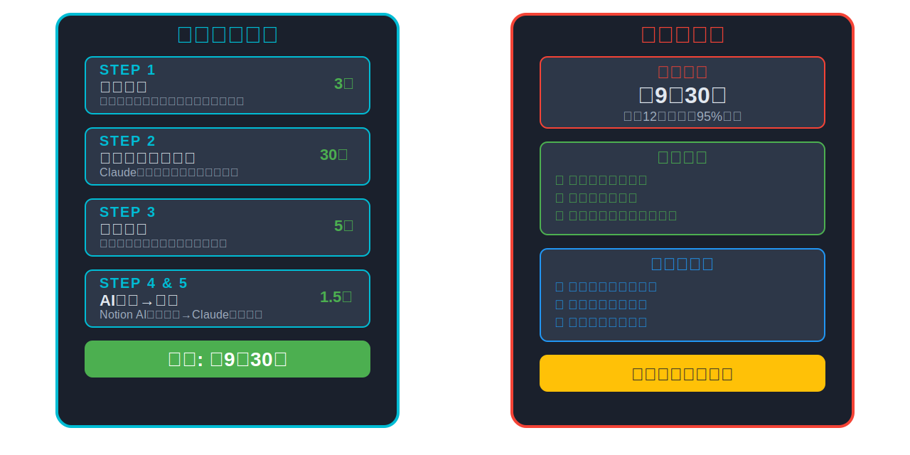
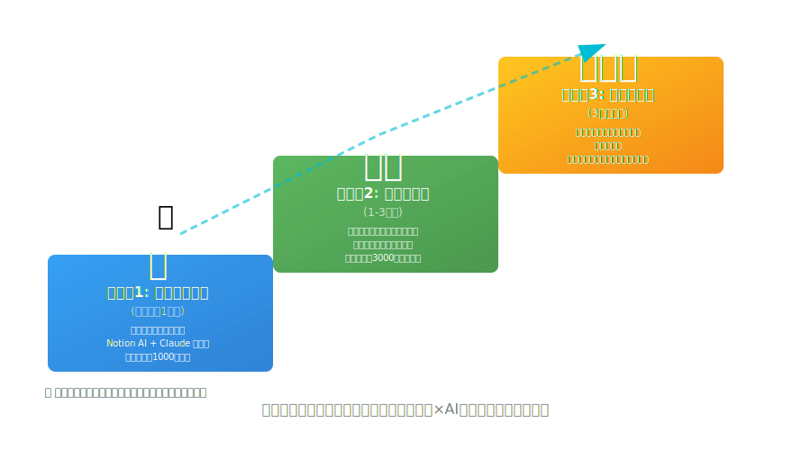

<!--_class: title-->

# 音声認識×AI文体補正で実現する技術ブログ執筆の革新

## ～1時間で高品質な記事を完成させる方法～

---

<!--_class: twoColumns-->

<div>

# 自己紹介

## フロントエンドエンジニア・AI 活用

- Figma による デザイン構築
- 社内業務改善 AI システム開発
- 3 年弱で技術記事 165 本執筆

## 本日の資料

🔗 [**GitHub**:Ryunosuke-Tanaka-sti](https://github.com/Ryunosuke-Tanaka-sti/claude_and_blog_seminar)
🔗 [**登壇資料**](https://ryunosuke-tanaka-sti.github.io/claude_and_blog_seminar/)

</div>

<div>


</div>

---

# ブログと自分との付き合い方

## なぜブログを書くのか？

<div class="important">

- 📝 **強制されているわけでもノルマがあるわけでもない**
- 💪 **書くの結構大変で何度か挫折したこともある**

</div>

---

# ブログと自分との付き合い方

## それでも続ける理由

<div class="box blue">

**ストレス発散の意味合い**
- 上司からの注意や同僚の指摘でもやっとしたことを文章に
- 書いているうちに自分なりに納得することがある

</div>

<div class="box green">

**自己学習のアウトプット**
- ブログを書く過程で新たな気づきが生まれる
- 後輩の教育が楽になる（「そこブログに書いたことあるわ〜」とリンク共有）

</div>


---

# 本日のゴール

## 音声で思考をそのまま技術記事に

<div class="important">

1. 🎙️ **音声認識で執筆時間を95%削減**
2. 🤖 **AI文体補正で一貫性のある文章へ**
3. 📊 **タイトル・メタディスクリプションの自動生成**
4. 🔍 **第一読者視点のAI評価で品質保証**

</div>

<div class="highlight">
今日から使えるガイド
</div>

---

<!-- _class: imageCenter -->

# なぜ音声執筆が革新的なのか？


---

# 実績：12時間→1時間の実現

<style scoped>
  table { table-layout: fixed; width: 100%; display:table; font-size: 24px; }
</style>

| フェーズ         | 従来の方法             | 音声×AI後           | 削減率 |
| ---------------- | ---------------------- | ------------------- | ------ |
| **アイデア出し** | 30-60 分（構成メモ）   | 5-10 分（音声入力） | 80%    |
| **下書き作成**   | 3-4 時間（タイピング） | 10-15 分（音声→AI） | 95%    |
| **文体統一**     | 1-2 時間（手動修正）   | 5 分（Claude）      | 96%    |
| **タイトル生成** | 30-60 分（試行錯誤）   | 5 分（Claude）      | 90%    |
| **品質チェック** | 2-3 時間（自己確認）   | 10 分（AI 評価）    | 93%    |

<div class="highlight">
トータル：12時間 → 1時間（92%削減）
</div>

---

<!-- _class: imageCenter -->

# 音声執筆ワークフローの全体像



---

<style scoped>
  table { table-layout: fixed; width: 100%; display:table; font-size: 20px; }
</style>

# 本日の流れ（45 分）

| 時間     | 内容                             | 実演 |
| -------- | -------------------------------- | ---- |
| 0-5 分   | 導入・音声執筆のメリット         | -    |
| 5-10 分  | AI第一読者システム開始           | ✅   |
| 10-20 分 | 音声認識×Notion AI 実践          | ✅   |
| 20-30 分 | Claude による高度な文体補正      | ✅   |
| 30-33 分 | AI評価結果確認                  | ✅   |
| 33-35 分 | タイトル・メタディスクリプション生成 | ✅   |
| 35-40 分 | ベストプラクティス               | -    |
| 40-45 分 | Q&A                              | -    |

---

<!-- _class: subTitle-->

# Part 1: AI第一読者システムの開始

---

# なぜAI第一読者が革新的なのか？

## 従来の記事レビューの課題

<div class="important">

- 👥 **他のエンジニアは忙しい**
- ⏰ **手動ファクトチェックに数時間**
- 💸 **専門家への相談コスト**
- 📅 **専門家の空き時間に依存**

</div>

<div class="highlight">
この現状をAI第一読者システムで改善！
</div>

---

# AI第一読者の圧倒的メリット

<style scoped>
  table { table-layout: fixed; width: 100%; display:table; font-size: 20px; }
</style>

| 項目 | 従来の方法 | AI第一読者手法 |
|------|------------|----------------|
| **時間** | 数時間〜半日 | 5〜30分 |
| **網羅性** | 人間の見落としリスク | AIの包括的チェック |
| **継続性** | 一回限り | 定期的な自動チェック |
| **コスト** | 専門家への相談コスト | AIサービス利用料のみ |
| **アクセス性** | 専門家の空き時間に依存 | 24時間いつでも利用可能 |

<div class="highlight">
90%以上の時間削減と24時間対応を実現！
</div>

---

# 🎬 ライブデモ：AI第一読者評価の開始

<div class="highlight">
ここから実際にAIを第一読者にした記事評価を開始します！
</div>

---

# AI第一読者評価の実践手順

## STEP 1: PDF準備とプロンプト設定

<div class="demo">

**プロンプト実演**
```
【ここでライブAI評価プロンプトを実演】

添付した資料の内容をもとにファクトチェックして、
技術的ブログとして多角的な評価から判断して

評価観点：
1. 技術的正確性（公式ドキュメントと照合）
2. 2025年時点での最新性
3. 類似記事との差別化ポイント
4. 初心者への配慮度
5. 実践的価値
```

</div>

---

# AI第一読者による内部処理プロセス

1. **本文抽出と理解**
2. **記載情報の精査計画を立案**
3. **公式ドキュメントや技術サイトを調査**
4. **情報の正確性・最新性を評価**
5. **改善提案を含む詳細レポート作成**

<div class="important">

**特徴**：
- 🔍 **数百のサイトを並行調査**
- 📝 **引用元明記の詳細レポート**
- ⚡ **5〜30分で完了通知**

</div>

---

# AI評価開始！執筆プロセスを並行進行

<div class="highlight">
AI評価をバックグラウンドで開始しました！<br>
評価完了まで音声執筆プロセスを進めます
</div>

<div class="important">

並行処理のメリット：

- AI評価：5〜30分で自動実行
- 人間：執筆作業に集中可能
- 効率：待ち時間ゼロで作業継続

</div>

---

<!-- _class: subTitle-->

# Part 2: アウトライン生成

---

# アウトライン生成の2つのアプローチ

<!-- _class: twoColumns-->

<div>

## 対話型アプローチ ⭐
- **Claude と段階的に構造を組み立て**
- 計画重視・論理的思考タイプ向け
- **ネタが決まっていないときのネタ探し**
</div>

<div>

## 抽出型アプローチ
- まず話してしまう→後から構造化
- 直感重視・アイデア発散タイプ向け
- 音声入力との相性が抜群

</div>


---

<div class="highlight">
まずは対話型で論理構築、書きたいことが明確なら抽出型で！
</div>


---

# 🎬 ライブデモ：対話型アウトライン生成

<div class="highlight">
Claudeとの対話でアウトラインを段階的に構築します！
</div>

---

# 対話型アウトライン生成の実演

## 実演テーマ：「Vue.js 3でのコンポジション API活用法」

### STEP 1: 初期アイデアをClaude に相談

<div class="demo">

**Claude への初回相談**
```
Vue.js 3のコンポジション APIについてブログ記事を書こうと思っています。
どんな角度で書くのが読者に価値がありそうでしょうか？

読者想定：
- Vue.js 2の経験はある
- コンポジション APIは名前を聞いたことがある程度
- 実践的な使い方を知りたい
```

</div>

---

# STEP 2: Claude からの提案と深掘り

<div class="demo">

**Claude の提案例**
```
以下の角度が読者に価値がありそうです：

1. Options API vs Composition API の実践的比較
2. リファクタリング手順：既存コードの段階的移行
3. TypeScript との組み合わせ方
4. パフォーマンス改善の具体例
5. よくあるアンチパターンと対策

この中で特に書きたい内容はありますか？
```

**あなたの返答例**
```
2番のリファクタリング手順が良さそうです。
実際のプロジェクトでOptions APIからComposition APIに
移行した経験があるので、具体的な手順を示せます。
```

</div>

---

# STEP 3: 詳細構成を段階的に構築

<div class="demo">

**Claude との構成確定**
```
リファクタリング手順にフォーカスした構成を提案します：

## 提案構成
1. なぜComposition APIに移行するか（メリット・動機）
2. 移行前の準備（環境・計画立案）
3. 段階的リファクタリング手順
   - 単純なコンポーネントから開始
   - 複雑なロジックの分離
   - 共通ロジックの抽出
4. 移行時によくある問題と対策
5. 移行後のメンテナンス性向上の実例

各セクションの詳細を決めていきますか？
```

</div>

**所要時間**: 対話3-5分 + 構成確定1分 = **4-6分**


---

# アウトライン生成の2つのアプローチ

<!-- _class: twoColumns-->

<div>

## 対話型アプローチ 
- **Claude と段階的に構造を組み立て**
- 計画重視・論理的思考タイプ向け
- **ネタが決まっていないときのネタ探し**
</div>

<div>

## 抽出型アプローチ ⭐
- まず話してしまう→後から構造化
- 直感重視・アイデア発散タイプ向け
- 音声入力との相性が抜群

</div>


---

# 抽出型アウトライン生成

## 実演テーマ：「Marpプレゼン資料作成」

### STEP 1: 思いついたことを自由に話す（3分）

<div class="demo">

```
【ここでライブ音声入力を実演】
```

</div>

**ポイント**: 完璧を求めず、思考の流れそのままに

---

# 🎬 ライブデモ：音声アウトライン生成

<div class="highlight">
ここから実際に音声入力でアウトライン生成を実演します！
</div>

---

# STEP 2: Claude でアウトライン抽出

## プロンプト実演

<div class="demo">

```
【ここでライブアウトライン抽出プロンプトを実演】
```

</div>

---

# 抽出されたアウトライン例


**所要時間**: 音声3分 + Claude処理30秒 = **3分30秒**

<div class="highlight">
ライブデモでリアルタイム生成されたアウトラインがここに表示されます！
</div>

---

# 対話型 vs 抽出型の使い分け

<!--_class: twoColumns-->

<div>

## 対話型が適している場面
- **ネタが曖昧**な時
- **専門外の分野**を書く時  
- **読者ニーズが不明**な時
- **論理構成重視**の記事

**メリット**:
- Claude の知見を活用
- 客観的な視点を得られる
- 論理的な構成を構築

</div>

<div>

## 抽出型が適している場面  
- **書きたいことが明確**
- **体験談ベース**の記事
- **アイデアが豊富**な時
- **感情・体験重視**の記事

**メリット**:
- 思考の流れをそのまま活用
- 個人的な体験を重視
- スピード重視の執筆

</div>

---

<div class="highlight">
記事の性質と自分の状況に応じて使い分けることが重要！
</div>

---

<!-- _class: subTitle-->

# Part 3: 音声執筆→AI補正

---

<!-- _class: imageCenter -->

# 音声執筆の実践テクニック


---

# 🎬 ライブデモ：音声執筆実演

<div class="highlight">
ここから実際にアウトラインの1章を音声で執筆します！
</div>

---

# 音声執筆実演：生成されたアウトラインの第1章


<div class="demo">

**音声入力の様子をリアルタイム実演**

- 画面分割：左側に音声認識結果、右側にメモ
- 思考の流れそのままを言葉にする過程
- 「あー、これも説明した方がいいかな」という迷いも含めて
- 具体的なコード例も口頭で説明

</div>

- 音声認識の精度
- 自然な話し言葉の流れ
- アイデアの連鎖の様子

---

# 音声入力結果の例


> 抽出型の方なんですけど、抽出型の方はですね。もう先にも全部しゃべってしまって。えっと。もうしゃべった内容から、あの、どんな内容があるのかっていうのをクローズとクローズ抜出のかっていう方法で。
で、この方の何がいいかっていうと、まあ書くネタが決まってる場合ですね。まあ決まってるとですね、あの頭の中にざっくりした情報があるので、それはもうバーとしゃべってしまうんですよね。

**問題点**：
- 句読点がない
- 話し言葉の冗長性・誤字のオンパレード
- 構成が整理されていない

---

# Notion AI による第一次補正

>抽出型の方法は、まず先に全部話してしまうアプローチです。話した内容から、どんなトピックがあるのかをClaudeに抽出してもらう方法です。この方法の利点は、書くネタが決まっている場合に効果的です。頭の中にざっくりとした情報があるので、それをすべて話してしまいます。そして、その話した内容を元にClaudeにアウトラインを作ってもらいます。つまり、思いついたことをどんどん話してしまい、無駄な情報が入っても構わないので、執筆するような勢いで書きたいことをすべて話してしまうという方法です。

## Notion での補正手順

### 1. 音声入力テキストを選択
### 2. 右クリック→「AIで改善」
### 3. 「文章を改善する」を選択


---

<!-- _class: subTitle-->

# Part 3: Claude による文体統一・完成

---

# なぜClaude での文体統一が必要か？

## Notion AI の限界と Claude の強み

<style scoped>
  table { table-layout: fixed; width: 100%; display:table; font-size: 18px; }
</style>

| 項目 | Notion AI | Claude |
|------|-----------|---------|
| **基本的な文法修正** | ✅ 得意 | ✅ 得意 |
| **技術ブログ特有の文体** | ❌ 限定的 | ✅ 高精度 |
| **読者意識の反映** | ❌ 困難 | ✅ 可能 |
| **技術的正確性** | ❌ 一般的 | ✅ 専門的 |
| **一貫性のある構成** | ❌ 困難 | ✅ 可能 |

<div class="highlight">
Claude は技術ブログの文脈を理解し、プロレベルの文章に変換
</div>

---

# 🎬 ライブデモ：Claude 文体補正

<div class="highlight">
ここから実際にNotion AI補正済みテキストをClaudeで文体統一します！
</div>

---

# 文体統一の実践プロンプトを作る方法

## STEP 1: 既存記事のテキスト準備

<div class="demo">

**自分の執筆済みブログ記事を用意**
```markdown
【執筆済みの技術ブログ記事のテキストをコピー】

例：技術解説記事、体験談記事、ハウツー記事など
- できるだけ質の高い記事を選ぶ
- 2-3記事分あると特徴をより正確に抽出可能
```

</div>

---
# 文体統一の実践プロンプトを作る方法

## STEP 2: 文体抽出プロンプト実行

<div class="demo">

**Claude への指示プロンプト**
```
僕が書いたブログです。このブログを執筆するための文体や表現の特徴などを抽出してください。
最終的にプロンプトとして出力してください。

【ここに執筆済み記事のテキストを貼り付け】

以下の要素を分析して抽出してください：
1. 文の長さ・リズム
2. 専門用語の説明レベル
3. 読者への語りかけ方
4. 具体例の使い方
5. 段落構成の特徴
```

</div>

---
# 文体統一の実践プロンプトを作る方法

## STEP 3: 抽出された文体プロンプトの活用

<div class="demo">

**Claude が生成する文体統一プロンプト例**
```
【あなたの文体の特徴】
- 文章は簡潔で読みやすく、1文あたり30-50字程度
- 専門用語は必ず初回使用時に説明を付ける
- 「〜ですね」「〜ます」調で親しみやすい語りかけ
- 具体例やコード例を積極的に使用
- 箇条書きと段落のバランスが良い構成

【文体統一指示】
以下の文章をこの文体に統一してください。
読者は技術に詳しくない人も含むことを想定して調整してください。
```

</div>

---

# 文体統一の実践プロンプトを作る方法


<div class="important">

**ポイント**：
- 一度作ったプロンプトは保存して繰り返し利用
- 記事ジャンルごとに微調整版を作成
- 定期的に見直し・アップデート

</div>

---

# Claude 文体統一結果：Before/After

<style scoped>
  .comparison { font-size: 0.9em; }
  blockquote { margin: 10px 0; padding: 10px; }
</style>

<div class="comparison">

**Before（音声入力＋Notion AI後）**
> タイピングで打つよりも圧倒的に早いことです。タイピングは疲れますが、人間が話す方が断然速いと個人的に思っています。キーボードが使える環境でなくてもブログを書けるのも大きな利点です。

**After（Claude文体補正後）**  
> タイピングより圧倒的に早いことです。私の実感では、音声入力は約3倍の効率で情報を入力できます。長時間のタイピングを維持するのは難しいですが、口で話す方は疲労も少なく継続性があります。

</div>

<div class="highlight">
✅ 具体的数値追加 ✅ 冗長性削減 ✅ 読者視点の強化
</div>

---


# 完成した記事の品質

## Before（音声入力直後） vs After（Claude統一後）

### 改善された点

1. **構造化**：適切な見出しとマークダウン記法
2. **技術精度**：正確なコード例と解説
3. **読みやすさ**：適切な改行と段落分け
4. **一貫性**：統一された文体とトーン
5. **完成度**：そのまま公開できるレベル

<div class="highlight">
音声入力5分 + Notion AI 30秒 + Claude 1分 = 6分30秒で完成
</div>

---

<!-- _class: subTitle-->

# Part 4: AI第一読者評価結果の確認

---

# 🎬 ライブデモ：AI評価結果の確認

<div class="highlight">
執筆完了！セミナー冒頭で開始したAI第一読者評価の結果を確認します
</div>

---

# よくある判定ミスと対処法

<!--_class: twoColumns-->

<div>

## 1. レポートに納得がいかない場合

**原因**:
ブログ内容が不足して主張がAIに伝わっていない

**対処法**:
ブログ側を加筆して情報を補完

## 2. 「リンクがない」判定

**対処法**:
AIと殴り合いましょう
リンクは含まれているんで確認してください。
最終手段は文章を抜き出してそのまま送ると勝てます

</div>

<div>

## 3. 「情報が古い」指摘

**原因**:
最新リソースを参照していない可能性がある

**対処法**: 
最新リソースを別のAIか自力で探して送り付ける

## 4. ハルシネーションリスク

**対処法**:
AIと殴り合いましょう
というか人間もAIも嘘をつくので変わりません
**最終確認は必ず人間が実施**。AIの言葉を100%信じない

</div>

---

<!-- _class: subTitle-->

# Part 5: タイトル・メタディスクリプション生成

---

# 🎬 ライブデモ：SEOタイトル生成

<div class="highlight">
最後に完成記事からSEO最適化タイトルを生成して完了です！
</div>

---

# SEO最適化タイトル生成の実践

## Claude による高度なタイトル生成

<div class="demo">

**プロンプト実演**
```
【ここでライブタイトル生成プロンプトを実演】

あなたは、SEOに精通したライターです。

Goal：技術ブログ用タイトル・メタディスクリプションの作成
Plan：
- 記事全文を分析し内容を把握
- 55-60文字以内でタイトルを5案作成
- 各案にSEOスコアと理由を付記

制約：
- 技術用語は正確に記載
- 誇大表現は避ける（「完全版」「決定版」NG）
```

</div>

---

# タイトル生成結果の例

<div class="demo">

```markdown
【ここでClaude が生成したタイトル案がリアルタイムで表示される】

## 提案タイトル（5案）

1. 【SEO:95点】Marpプレゼン資料作成を音声入力で3倍高速化する方法
2. 【SEO:92点】音声認識×Claude文体補正でMarp資料を効率作成  
3. 【SEO:90点】話すだけでMarpスライド完成！音声入力活用術
4. 【SEO:88点】Marpプレゼン作成時間75%削減：音声からAI補正まで
5. 【SEO:85点】Claude×音声認識で変わるMarp資料作成【実践手順付き】

## メタディスクリプション
音声認識とAI文体補正を組み合わせたMarpプレゼン資料作成手法を実演解説。従来手法と比較して作業時間を大幅短縮する具体的なワークフローと実際の成果を詳しく紹介します。
```

</div>

**所要時間**: Claude処理30秒 + 選択30秒 = **1分**

<div class="highlight">
完成！音声入力からAI評価まで全工程完了🎉
</div>

---

<!-- _class: subTitle-->

# Part 6: ベストプラクティス・注意点

---

# 音声執筆の成功のための5つのポイント

<div class="highlight">
実践的なコツで効率を最大化！
</div>

---

# 音声執筆の成功ポイント（1）

## 1. 🎯 完璧主義を捨てる

<div class="box blue">

- 音声入力では「後で直す」前提で進める
- 80%の品質で次のステップへ
- 言い直しに時間をかけすぎない

</div>

---

# 音声執筆の成功ポイント（2）

## 2. 📱 環境に合わせた使い分け

<div class="box green">

- **移動中**：アイデア出し・アウトライン
- **自宅**：本格的な音声執筆
- **オフィス**：テキスト修正・最終調整

</div>

---

# 音声執筆の成功ポイント（3）

## 3. 🔄 段階的な品質向上

<div class="box yellow">

- 音声入力→Notion AI→Claude の順番を守る
- 各段階で異なる目的を意識
- 一度に完璧を求めない

</div>

---

# 音声執筆の成功ポイント（4）

## 4. 🎙️ 音声の質を意識する

<div class="box blue">

- 静かな環境で録音
- はっきりとした発音を心がける
- 専門用語は事前に辞書登録

</div>

---

# 音声執筆の成功ポイント（5）

## 5. 📊 効果測定と改善

<div class="box green">

- 執筆時間の記録と比較
- 記事の品質向上を数値化
- 定期的なワークフロー見直し

</div>

---

# よくある失敗パターンと対策

<!--_class: twoColumns-->

<div>

## ❌ 失敗パターン1：音声で完璧を求める

**症状**：言い間違いのたびに止めて修正
**対策**：「えー」「あの」も含めて続ける

## ❌ 失敗パターン2：AIに丸投げ

**症状**：音声入力後、全てAIに任せる
**対策**：自分の意図を明確にプロンプトで指示

</div>

<div>

## ❌ 失敗パターン3：ツールの過度な使い分け

**症状**：毎回全てのツールを使う
**対策**：記事の性質に応じて取捨選択

## ❌ 失敗パターン4：環境への配慮不足

**症状**：周囲を気にせず大声で話す
**対策**：場所に応じた音量・時間帯の調整

</div>

---

# 音声執筆に向いている記事・向いていない記事

<!--_class: twoColumns-->

<div>

## ✅ 音声執筆に向いている

<div class="box green">

1. **体験談ベースの記事**
  自然な語りが活きる
2. **解説記事**
  教える感覚で話しやすい
3. **比較記事**
  感性優先「AとBの違いは...」
4. **初心者向け記事**
  優しく語りかける文体

</div>

</div>

<div>

## ❌ 音声執筆に向いていない

<div class="box red">

1. **リファレンス記事**
  正確性重視、構造化が必要
2. **API仕様書**
  厳密な技術仕様
3. **コードレビュー**
  詳細な技術検証が必要
4. **学術論文調**
  堅い文体が求められる記事

</div>

</div>

---

<div class="highlight">
自分の記事タイプを見極めて使い分けることが重要
</div>

---

# 継続的な改善のコツ

<!--_class: twoColumns-->

<div>

## 📊 効果測定

- **執筆時間の記録**：従来手法との比較
- **記事品質の評価**：読者反応・PV数
- **自分の変化**：文章力・アイデア力の向上

## 🔄 改善サイクル

1. **実践**：新しい記事で音声執筆
2. **振り返り**：うまくいった点・課題
3. **調整**：プロンプトやワークフローの最適化
4. **共有**：成功パターンの蓄積

</div>

<div>

## 📚 スキルアップ

- **文体の改善**：良い記事の文体を学習
- **音声技術の向上**：話すスキル自体の向上
- **AI活用の深化**：より効果的なプロンプト作成

## 🎯 継続のコツ

- **小さく始める**：1記事の一部から試す
- **習慣化**：毎日5分の音声練習
- **仲間作り**：同じ手法を試す人との交流

</div>

---

<!-- _class: subTitle-->

# Part 7: Q&A・次のステップ

---

# よくある質問

<!--_class: twoColumns-->

<div>

## Q1: 音声認識の精度が低い場合は？

**A**: 以下の方法で改善できます
- マイク環境の改善（イヤホンマイク推奨）
- ゆっくり明瞭に発音
- 短いセンテンスで区切る

## Q2: 会社のセキュリティ制約

**A**: 段階的な導入がおすすめ
- まずは個人ブログで練習
- 社内用途はローカル音声認識ツール活用
- Claude の代わりに社内AI活用

</div>

<div>

## Q3: 音声入力が恥ずかしい場合は？

**A**: 環境選択と慣れが重要
- 一人になれる場所で練習
- 小声でも認識可能
- 「独り言」感覚で始める

## Q4: どのくらいで慣れますか？

**A**: 個人差はありますが
- 1週間：基本操作に慣れる
- 1ヶ月：自然に話せるようになる
- 3ヶ月：効率的なワークフロー確立

</div>

---

<!-- _class: imageCenter -->

# 次のステップ・発展的活用



---


<div class="highlight">
最初の一歩が一番重要！完璧でなくても始めることが大切
</div>

---

<!-- _class: imageCenter -->

# まとめ：音声×AI執筆で得られるもの


---
<!-- _class: twoColumns -->

# 配布資料・参考リンク

<div>

🔗 [**GitHub リポジトリ**](https://github.com/Ryunosuke-Tanaka-sti/claude_and_blog_seminar)
🔗 [**詳細記事一覧**](https://tech-lab.sios.jp/archives/tag/claudex%e6%8a%80%e8%a1%93%e3%83%96%e3%83%ad%e3%82%b0)

**関連記事**
- 音声認識執筆の詳細手法
- アウトライン生成テクニック  
- Claude プロンプト集
- 文体統一の実践例

</div>

<div>


</div>

---

# Q&A タイム

<div class="important">

**よくある質問カテゴリ**
- 🎙️ 音声入力のコツ・環境設定
- 🤖 AI プロンプトの書き方
- ⏱️ 時間短縮の実現方法
- 📝 文体統一のテクニック
- 🔧 ツール選択・環境構築

</div>

<div class="highlight">
音声×AIで、あなたの技術発信が劇的に変わります！🚀
</div>

**#音声執筆 #Claude #技術ブログ #AI活用 #生産性向上**

---

# ありがとうございました！


<div class="highlight">
話すだけで思考が記事になる時代の始まり
</div>

### 📱 今日から実践！

- **スマホの音声入力設定確認**
- **Notion AI + Claude で文体統一**
- **5分間の音声アウトライン練習**

### 🚀 継続的なサポート

- 📧 質問・相談随時受付
- 🔗 コミュニティ参加歓迎  
- 📚 追加資料は GitHub で公開

